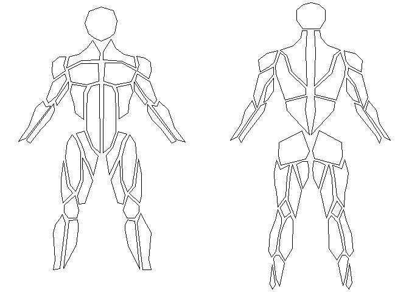
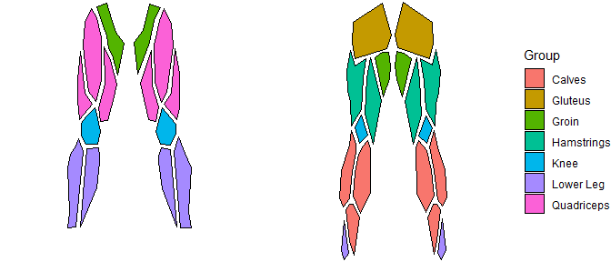
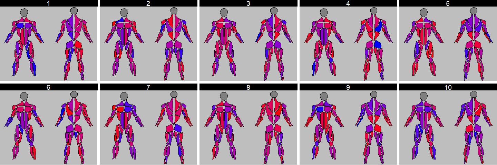
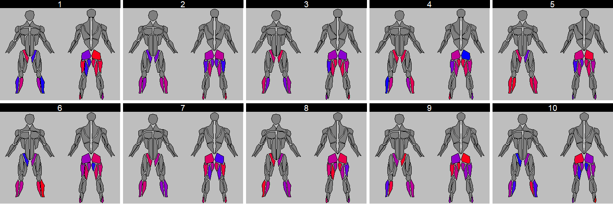
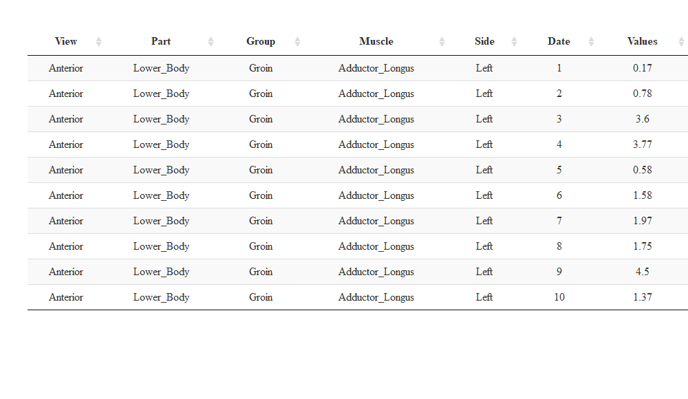

Using body diagrams in Shiny Apps
================
[Jose Fernandez](https://github.com/josedv82)
31 December, 2020

-   [Introduction](#introduction)
-   [Getting the data](#getting-the-data)
-   [Static Avatars](#static-avatars)
-   [Adding data from athletes](#adding-data-from-athletes)
-   [Interactive Visualizations](#interactive-visualizations)
-   [Notes](#notes)

<br /> <br />

Introduction
============

Integrating body diagrams (or body avatars) within athlete and teams reports is a common practice. For example, avatars are frequently used in [body soreness questionaires](https://content.sciendo.com/view/journals/hukin/69/1/article-p125.xml?language=en) as well by technology devices such as [this one](https://www.tmg-bodyevolution.com/2254-2/) or [this one](https://www.researchgate.net/figure/Screenshot-of-a-few-tabs-of-a-users-profile-of-Skulpt-showing-the-body-fat-percentage_fig5_327545611).

Given that open source reporting platforms such as R Shiny are gaining momentum in Sport Science, I thought it would be a good idea to highlight a few minimal examples on how to embed this type of visualizations within Shiny apps or markdown reports.

<br /> <br />

Getting the data
================

Body diagrams use 2D shapes to represent different parts of the body. These shapes are built with polygons. Therefore, the first thing we will need is the x,y coordinates for each polygon in the figure we want to use. There are a few options to get this data, 1) do it manually, which is likely going to be really hard, 2) get the coordinates from a known source, for example a few years ago I created an avatar for powerBI, you can find find it [here](https://synoptic.design/). Go to `gallery > body areas` to open it. Option number 3) is the one I will expand on as it is the fastest.

The avatar I want to use is actually uploaded on the internet. Since it is a .svg file I can scrape the website to find the coordinates for each polygon programmatically using `{rvest}`. Example below:

``` r
#get the website with the svg file
    web <- paste0("http://svgur.com/i/7bP.svg")

    #find the points
    points <- xml2::read_html(web) %>%
      rvest::html_nodes(xpath =  "//polygon") %>% #find the node with the polygons
      rvest::html_attr('points') #get the coordinates for each polygon

    #repeat to get ids (names) of the polygons
    id <- xml2::read_html(web) %>%
      rvest::html_nodes(xpath =  "//polygon") %>% #find the node with the polygons
      rvest::html_attr("id") #get the ids

    
    #jong id + points into one dataset
  svg <- dplyr::tibble(id, points) %>%
    mutate(points = gsub("\\,", " ", points)) %>%
    separate(points, into = c("x1", "y1", "x2", "y2", "x3", "y3", "x4", "y4", "x5", "y5", "x6", "y6", "x7", "y7", "x8", "y8", "x9", "y9", "x10", "y10")) %>%
    pivot_longer(!id, names_to = "coord", values_to = "values") 
    
    
 str(svg)
```

    ## tibble [1,360 x 3] (S3: tbl_df/tbl/data.frame)
    ##  $ id    : chr [1:1360] "Left_Pec_Mayoris" "Left_Pec_Mayoris" "Left_Pec_Mayoris" "Left_Pec_Mayoris" ...
    ##  $ coord : chr [1:1360] "x1" "y1" "x2" "y2" ...
    ##  $ values: chr [1:1360] "144" "116" "142" "149" ...

<br /> <br />

That returns a data frame with the id (muscle name), x coordinates and y coordinates. There is still a little bit of data cleaning involved after that which I've done manually as it is just one off. But the same could be done programmatically. Overall the next chunk provides the final datase to get the polygon's coordinates and a few other variables useful for filtering later.

``` r
map <- read.csv("C:/Users/jfernandez/OneDrive - Houston Astros, LLC/Desktop/svggmap.csv")

mapa <- map %>%
  mutate(coord = gsub('[0-9]+', '', coord)) %>%
  na.omit() %>%
  group_by(Id) %>%
  mutate(y = lead(values)) %>%
  filter(coord != "y") %>%
  select(Id, View, Part, Group, Muscle, Side, x = values, y) 

str(map)
```

    ## 'data.frame':    1360 obs. of  8 variables:
    ##  $ Id    : int  1 1 1 1 1 1 1 1 1 1 ...
    ##  $ View  : Factor w/ 2 levels "Anterior","Posterior": 1 1 1 1 1 1 1 1 1 1 ...
    ##  $ Part  : Factor w/ 2 levels "Lower_Body","Upper_Body": 1 1 1 1 1 1 1 1 1 1 ...
    ##  $ Group : Factor w/ 14 levels "Abdominals","Arm",..: 7 7 7 7 7 7 7 7 7 7 ...
    ##  $ Muscle: Factor w/ 34 levels "Adductor_Longus",..: 1 1 1 1 1 1 1 1 1 1 ...
    ##  $ Side  : Factor w/ 3 levels "Left","None",..: 1 1 1 1 1 1 1 1 1 1 ...
    ##  $ coord : Factor w/ 20 levels "x1","x10","x2",..: 1 11 3 13 4 14 5 15 6 16 ...
    ##  $ values: int  146 284 150 320 164 284 169 259 176 245 ...

<br /> <br />

Static Avatars
==============

After that we can start plotting the avatars. Below is a basic example of what it looks like.

``` r
  mapa %>%

  ggplot(aes(x = x, y = y, group = Id)) +
  geom_polygon(color = "black", fill = "white") +
  xlim(min(mapa$x), max(mapa$x)) + 
  scale_y_reverse(limits=c(max(mapa$y), min(mapa$y)), expand=c(0.01,0.01)) +
  theme_void() +
  theme(legend.position = "none")
```



<br /> <br />

Since we added a few more variables, we can easily filter in various ways, for example, show only lower body muscles.

``` r
  mapa %>%
  filter(Part == "Lower_Body") %>%

  ggplot(aes(x = x, y = y, group = Id, fill = Group)) +
  geom_polygon(color = "black") +
  xlim(min(mapa$x), max(mapa$x)) + 
  scale_y_reverse(limits=c(max(mapa$y), min(mapa$y)), expand=c(0.01,0.01)) +
  theme_void()
```



<br /> <br />

Adding data from athletes
=========================

Obviously the usefulness comes from using this chart to visualize athlete's data from different assessments. To do this I am going to create some dummy muscle data.

``` r
Group = c("Groin", "Groin", 
          "Arm", "Arm", 
          "Arm", "Arm",
          "Hamstrings", "Hamstrings", 
          "Forearm", "Forearm", 
          "Arm", "Arm",
          "Arm", "Arm",
          "Back", "Back",
          "Forearm", "Forearm", 
          "Forearm", "Forearm", 
          "Forearm", "Forearm", 
          "Calves", "Calves",
          "Calves", "Calves",
          "Gluteus", "Gluteus", 
          "Knee", "Knee",
          "Knee", "Knee",
          "Back", "Back",
          "Neck", "Neck",
          "Abdominals", "Abdominals",
          "Pectoralis", "Pectoralis",
          "Lower Leg", "Lower Leg",
          "Abdominals", "Abdominals",
          "Quadriceps", "Quadriceps",
          "Hamstrings", "Hamstrings", 
          "Lower Leg", "Lower Leg",
          "Calves", "Calves",
          "Lower Leg", "Lower Leg",
          "Back", "Back",
          "Arm", "Arm",
          "Arm", "Arm",
          "Quadriceps", "Quadriceps",
          "Quadriceps", "Quadriceps")

Muscle = c("Adductor_Longus", "Adductor_Longus", 
           "Biceps_Brachii_Long_Head", "Biceps_Brachii_Long_Head",
           "Biceps_Brachii_Short_Head", "Biceps_Brachii_Short_Head",
           "Biceps_Femoris", "Biceps_Femoris",
           "Brachioradialis", "Brachioradialis",
           "Deltoids_Back", "Deltoids_Back",
           "Deltoids_Front", "Deltoids_Front",
           "Erector_Spinae", "Erector_Spinae",
           "Extensor_Digitorum", "Extensor_Digitorum",
           "Flexor_Carpi", "Flexor_Carpi",
           "Flexor_Digitorum", "Flexor_Digitorum",
           "Gastroc_Lateralis", "Gastroc_Lateralis",
           "Gastroc_Medialis", "Gastroc_Medialis",
           "Gluteus_Max", "Gluteus_Max",
           "Knee_Back", "Knee_Back",
           "Knee_Front", "Knee_Front",
           "Latissimus_Dorsi", "Latissimus_Dorsi",
           "Neck", "Neck",
           "Oblique", "Oblique",
           "Pectoral_Mayoris", "Pectoral_Mayoris",
           "Peroneus_Longus", "Peroneus_Longus",
           "Rectus_Abdominis", "Rectus_Abdominis",
           "Rectus_Femoris", "Rectus_Femoris",
           "Semitendinosus", "Semitendinosus",
           "Shin", "Shin",
           "Soleus", "Soleus",
           "Tibialis_Anterior", "Tibialis_Anterior",
           "Trapezius", "Trapezius",
           "Triceps_Lateral", "Triceps_Lateral",
           "Triceps_Medial", "Triceps_Medial",
           "Vastus_Lateralis", "Vastus_Lateralis",
           "Vastus_Medialis", "Vastus_Medialis")

Side = c("Right", "Left", "Right", "Left", "Right", "Left", "Right", "Left", "Right", "Left", "Right", "Left", "Right", "Left", "Right", "Left", "Right", "Left", "Right", "Left", "Right", "Left", "Right", "Left", "Right", "Left", "Right", "Left", "Right", "Left", "Right", "Left", "Right", "Left", "Right", "Left", "Right", "Left", "Right", "Left", "Right", "Left", "Right", "Left", "Right", "Left","Right", "Left", "Right", "Left", "Right", "Left", "Right", "Left", "Right", "Left", "Right", "Left", "Right", "Left", "Right", "Left", "Right", "Left")

`x1` = runif(n = 64, min = 0, max = 5)
`x2` = runif(n = 64, min = 0, max = 5)
`x3` = runif(n = 64, min = 0, max = 5)
`x4` = runif(n = 64, min = 0, max = 5)
`x5` = runif(n = 64, min = 0, max = 5)
`x6` = runif(n = 64, min = 0, max = 5)
`x7` = runif(n = 64, min = 0, max = 5)
`x8` = runif(n = 64, min = 0, max = 5)
`x9` = runif(n = 64, min = 0, max = 5)
`x10` = runif(n = 64, min = 0, max = 5)


muscles_dat <- data.frame(Group, Muscle, Side, 
                          `x1`,
                          `x2`,
                          `x3`,
                          `x4`,
                          `x5`,
                          `x6`,
                          `x7`,
                          `x8`,
                          `x9`,
                          `x10`)
```

<br /> <br />

Now we can join our polygon data with the results from our dummy dataset. Below I created two datasets.

``` r
#all muscle groups

full <- full_join(mapa, muscles_dat, by = c("Group", "Muscle", "Side")) %>%
  pivot_longer(!Id:y, names_to = "Date", values_to = "Values") %>% 
  mutate(Date = as.numeric(gsub("[^0-9.-]", "", Date)))

# only a few muscle groups
full2 <- muscles_dat %>% 
  filter(Group %in%  c("Gluteus", "Hamstrings", "Lower Leg", "Groin")) %>%
  full_join(mapa, by = c("Group", "Muscle", "Side")) %>%
  select(Id, View, Part, Group, Muscle, Side, x, y, everything()) %>%
  pivot_longer(!Id:y, names_to = "Date", values_to = "Values") %>% 
  mutate(Date = as.numeric(gsub("[^0-9.-]", "", Date)))
```

<br /> <br />

And then, we can start using the results from our assessments to color the polygons. For example:

``` r
ggplot(data = full, aes(x = x, y = y, group = Id, fill = Values)) +
  geom_polygon(color = "black") +
  xlim(min(full$x), max(full$x)) + 
  scale_y_reverse(limits=c(max(full$y), min(full$y)), expand=c(0.01,0.01)) +
  scale_fill_gradient(low="blue", high="red") +
  facet_wrap(~Date, ncol = 5) +
  theme_void() +
  theme(legend.position = "none",
        panel.background = element_rect(fill = "gray", color = "transparent"),
        strip.background = element_rect(fill = "black"),
        strip.text = element_text(color = "white", size = 14))
```



<br /> <br />

Very likely we won't have data for all those muscle groups but just a few common ones. If a muscle has no data it won't be colored.

``` r
ggplot(data = full2, aes(x = x, y = y, group = Id, fill = Values)) +
  geom_polygon(color = "black") +
  xlim(min(full$x), max(full$x)) + 
  scale_y_reverse(limits=c(max(full$y), min(full$y)), expand=c(0.01,0.01)) +
  scale_fill_gradient(low="blue", high="red") +
  facet_wrap(~Date, ncol = 5) +
  theme_void() +
  theme(legend.position = "none",
        panel.background = element_rect(fill = "gray", color = "transparent"),
        strip.background = element_rect(fill = "black"),
        strip.text = element_text(color = "white", size = 14))
```



<br /> <br />

Interactive Visualizations
==========================

We've seen how simple it is to visualize static avatars. However, one of the strength of using shiny or markdown is the interactivity. Let's make out avatars interactive. Starting with a simple plotly showing a tooltip when hovering over a muscle.

``` r
dat <- full %>%
  filter(Date == "10") %>%
  mutate(Values = round(Values, 2))


plot <- ggplot(data = dat, aes(x = x, y = y, group = Id, fill = Values)) +
  geom_polygon(aes(text = paste("Group: ", Group, "<br>", "Part: ", Part, "<br>", "Muscle: ", Muscle, "<br>", "Side: ", Side, "<br>", "Value: ", Values)), color = "black") +
  xlim(min(mapa$x), max(mapa$x)) + 
  scale_y_reverse(limits=c(max(mapa$y), min(mapa$y)), expand=c(0.01,0.01)) +
  scale_fill_gradient(low="red", high="green") +
  theme_void() +
  theme(legend.position = "none",
        panel.background = element_rect(fill = "gray", color = "transparent"),
        strip.background = element_rect(fill = "black"),
        strip.text = element_text(color = "white", size = 12))

ggplotly(plot, tooltip = "text")
```


<br /> <br />

We could take a bit further an add an animation. For example the code below adds a slider to let users navigate through the different assessments.

``` r
plot <- ggplot(data = full, aes(x = x, y = y, group = Id, fill = Values)) +
  geom_polygon(aes(frame = Date), color = "black") +
  xlim(min(full$x), max(full$x)) + 
  scale_y_reverse(limits=c(max(full$y), min(full$y)), expand=c(0.01,0.01)) +
  scale_fill_gradient(low="blue", high="red") +
  theme_void() +
  theme(legend.position = "none",
        panel.background = element_rect(fill = "gray", color = "transparent"))

plot <- ggplotly(plot) %>% animation_opts(transition = 1, easing = "elastic-in")

plot
```


<br /> <br />

There are even more interesting ways to use tooltips, for example, `{highcharter}` is a very powerful library that let us embbed a micro chart within a tooltip, which can be very useful to visually the current status of a muscle (or muscle group) and its longitudinal trend.

``` r
library(highcharter)

muscle <- full %>%
  mutate(Date = as.numeric(Date)) %>%
  mutate(Values = round(Values, 2))

muscle2 <- full %>%
  mutate(Date = as.numeric(Date)) %>%
  select(Id, Date, Values) %>%
  nest(-Id) %>%
  mutate(
    ttdata = 
    data %>%
    map(mutate_mapping, hcaes(x = Date, y = Values), drop = T) %>%
    map(list_parse)
    ) %>%
  select(-data)

gptot <- left_join(muscle, muscle2)

hchart(gptot, "polygon", hcaes(x, y, group = Id, name = Muscle, value = Values)) %>% 
  hc_yAxis(reversed = T) %>%
  hc_tooltip(
    useHTML = TRUE,
    headerFormat = "<b>{point.key}</b>",
    pointFormatter = tooltip_chart(accesor = "ttdata",
                                   hc_opts = list(
                                   chart = list(type = "spline"),
                                   yAxis = list(title = list(text = "Value")),
                                   xAxis = list(title = list(text = "Date"))
                                   ))) %>%
    hc_add_theme(hc_theme_null()) %>%
    hc_legend(enabled = F)
```


*For more on `{highcharter}` check Tom Bishop's [cookbook](https://www.tmbish.me/lab/highcharter-cookbook/#getting-the-data) as it is a really good resource.*

<br /> <br />

Taking advantage or libraries such as `{crosstalk}` we can also use an avatar as a filter (or input) to control other charts or create a dynamic dashboard. If you click any of the muscle groups below, it will update the other two charts.

``` r
library(crosstalk)

full <- full %>% mutate(Date = as.numeric(Date), Values = round(Values,2))

data_ct <- SharedData$new(full, key = ~Id)

#body diagram
plot <- ggplot(data = data_ct, aes(x = x, y = y, group = Id), fill = "black") +
  geom_polygon(aes(text = paste("Group: ", Group, "<br>", "Muscle: ", Muscle, "<br>", "Side: ", Side)), color = "white") +
  scale_y_reverse() +
  theme_void() +
  theme(legend.position = "none",
        panel.background = element_rect(fill = "transparent", color = "transparent"),
        panel.border = element_blank(),
        plot.background = element_blank())

plot <- ggplotly(plot, tooltip = "text")
plot <- highlight(plot, on = "plotly_click", color = "red", dynamic = F)

#line graph
plot2 <- ggplot(data = data_ct, aes(x = Date, y = Values, group = Id), fill = "black") +
  geom_line(color = "transparent") +
  geom_point(aes(text = paste("Value: ", Values)), color = "transparent") +
  theme_void() +
  theme(legend.position = "none",
        panel.background = element_rect(fill = "transparent", color = "transparent"),
        panel.border = element_blank(),
        plot.background = element_blank())

plot2 <- ggplotly(plot2, tooltip = "text")
plot2 <- highlight(plot2, on = "plotly_click", color = "red", dynamic = F)

#data table
tab <- DT::datatable(data_ct,
                     rownames= FALSE,
                     options = list(dom = 't',
                                    columnDefs = list(list(visible=FALSE, targets=c(0, 6, 7)),
                                                      list(className = 'dt-center', targets = 0:9))))
```

<!--html_preserve-->

<script type="application/json" data-for="htmlwidget-c12bcf8078fcfd603356">{"x":{"data":[{"x":[185,185,185,185,185,185,185,185,185,185,182,182,182,182,182,182,182,182,182,182,161,161,161,161,161,161,161,161,161,161,164,164,164,164,164,164,164,164,164,164,165,165,165,165,165,165,165,165,165,165,178,178,178,178,178,178,178,178,178,178,180,180,180,180,180,180,180,180,180,180,182,182,182,182,182,182,182,182,182,182,185],"y":[-169,-169,-169,-169,-169,-169,-169,-169,-169,-169,-154,-154,-154,-154,-154,-154,-154,-154,-154,-154,-160,-160,-160,-160,-160,-160,-160,-160,-160,-160,-171,-171,-171,-171,-171,-171,-171,-171,-171,-171,-218,-218,-218,-218,-218,-218,-218,-218,-218,-218,-207,-207,-207,-207,-207,-207,-207,-207,-207,-207,-185,-185,-185,-185,-185,-185,-185,-185,-185,-185,null,null,null,null,null,null,null,null,null,null,-169],"text":"Group:  Abdominals <br> Muscle:  Oblique <br> Side:  Left","key":["41"],"type":"scatter","mode":"lines","line":{"width":1.88976377952756,"color":"rgba(255,255,255,1)","dash":"solid"},"fill":"toself","fillcolor":"rgba(51,51,51,1)","hoveron":"fills","set":"SharedDataa4b62ebc","showlegend":false,"xaxis":"x","yaxis":"y","hoverinfo":"text","_isSimpleKey":true,"_isNestedKey":false,"frame":null},{"x":[100,100,100,100,100,100,100,100,100,100,98,98,98,98,98,98,98,98,98,98,93,93,93,93,93,93,93,93,93,93,96,96,96,96,96,96,96,96,96,96,117,117,117,117,117,117,117,117,117,117,113,113,113,113,113,113,113,113,113,113,113,113,113,113,113,113,113,113,113,113,100],"y":[-206,-206,-206,-206,-206,-206,-206,-206,-206,-206,-190,-190,-190,-190,-190,-190,-190,-190,-190,-190,-169,-169,-169,-169,-169,-169,-169,-169,-169,-169,-154,-154,-154,-154,-154,-154,-154,-154,-154,-154,-159,-159,-159,-159,-159,-159,-159,-159,-159,-159,-169,-169,-169,-169,-169,-169,-169,-169,-169,-169,-219,-219,-219,-219,-219,-219,-219,-219,-219,-219,-206],"text":"Group:  Abdominals <br> Muscle:  Oblique <br> Side:  Right","key":["42"],"type":"scatter","mode":"lines","line":{"width":1.88976377952756,"color":"rgba(255,255,255,1)","dash":"solid"},"fill":"toself","fillcolor":"rgba(51,51,51,1)","hoveron":"fills","set":"SharedDataa4b62ebc","showlegend":false,"xaxis":"x","yaxis":"y","hoverinfo":"text","_isSimpleKey":true,"_isNestedKey":false,"frame":null},{"x":[155,155,155,155,155,155,155,155,155,155,159,159,159,159,159,159,159,159,159,159,160,160,160,160,160,160,160,160,160,160,160,160,160,160,160,160,160,160,160,160,152,152,152,152,152,152,152,152,152,152,141,141,141,141,141,141,141,141,141,141,142,142,142,142,142,142,142,142,142,142,155],"y":[-159,-159,-159,-159,-159,-159,-159,-159,-159,-159,-171,-171,-171,-171,-171,-171,-171,-171,-171,-171,-205,-205,-205,-205,-205,-205,-205,-205,-205,-205,-241,-241,-241,-241,-241,-241,-241,-241,-241,-241,-269,-269,-269,-269,-269,-269,-269,-269,-269,-269,-280,-280,-280,-280,-280,-280,-280,-280,-280,-280,-154,-154,-154,-154,-154,-154,-154,-154,-154,-154,-159],"text":"Group:  Abdominals <br> Muscle:  Rectus_Abdominis <br> Side:  Left","key":["47"],"type":"scatter","mode":"lines","line":{"width":1.88976377952756,"color":"rgba(255,255,255,1)","dash":"solid"},"fill":"toself","fillcolor":"rgba(51,51,51,1)","hoveron":"fills","set":"SharedDataa4b62ebc","showlegend":false,"xaxis":"x","yaxis":"y","hoverinfo":"text","_isSimpleKey":true,"_isNestedKey":false,"frame":null},{"x":[124,124,124,124,124,124,124,124,124,124,136,136,136,136,136,136,136,136,136,136,137,137,137,137,137,137,137,137,137,137,126,126,126,126,126,126,126,126,126,126,117,117,117,117,117,117,117,117,117,117,117,117,117,117,117,117,117,117,117,117,118,118,118,118,118,118,118,118,118,118,124],"y":[-158,-158,-158,-158,-158,-158,-158,-158,-158,-158,-154,-154,-154,-154,-154,-154,-154,-154,-154,-154,-280,-280,-280,-280,-280,-280,-280,-280,-280,-280,-268,-268,-268,-268,-268,-268,-268,-268,-268,-268,-238,-238,-238,-238,-238,-238,-238,-238,-238,-238,-205,-205,-205,-205,-205,-205,-205,-205,-205,-205,-172,-172,-172,-172,-172,-172,-172,-172,-172,-172,-158],"text":"Group:  Abdominals <br> Muscle:  Rectus_Abdominis <br> Side:  Right","key":["48"],"type":"scatter","mode":"lines","line":{"width":1.88976377952756,"color":"rgba(255,255,255,1)","dash":"solid"},"fill":"toself","fillcolor":"rgba(51,51,51,1)","hoveron":"fills","set":"SharedDataa4b62ebc","showlegend":false,"xaxis":"x","yaxis":"y","hoverinfo":"text","_isSimpleKey":true,"_isNestedKey":false,"frame":null},{"x":[192,192,192,192,192,192,192,192,192,192,189,189,189,189,189,189,189,189,189,189,204,204,204,204,204,204,204,204,204,204,217,217,217,217,217,217,217,217,217,217,220,220,220,220,220,220,220,220,220,220,210,210,210,210,210,210,210,210,210,210,192],"y":[-135,-135,-135,-135,-135,-135,-135,-135,-135,-135,-148,-148,-148,-148,-148,-148,-148,-148,-148,-148,-176,-176,-176,-176,-176,-176,-176,-176,-176,-176,-190,-190,-190,-190,-190,-190,-190,-190,-190,-190,-183,-183,-183,-183,-183,-183,-183,-183,-183,-183,-150,-150,-150,-150,-150,-150,-150,-150,-150,-150,-135],"text":"Group:  Arm <br> Muscle:  Biceps_Brachii_Long_Head <br> Side:  Left","key":["6"],"type":"scatter","mode":"lines","line":{"width":1.88976377952756,"color":"rgba(255,255,255,1)","dash":"solid"},"fill":"toself","fillcolor":"rgba(51,51,51,1)","hoveron":"fills","set":"SharedDataa4b62ebc","showlegend":false,"xaxis":"x","yaxis":"y","hoverinfo":"text","_isSimpleKey":true,"_isNestedKey":false,"frame":null},{"x":[58,58,58,58,58,58,58,58,58,58,61,61,61,61,61,61,61,61,61,61,73,73,73,73,73,73,73,73,73,73,88,88,88,88,88,88,88,88,88,88,85,85,85,85,85,85,85,85,85,85,67,67,67,67,67,67,67,67,67,67,58],"y":[-181,-181,-181,-181,-181,-181,-181,-181,-181,-181,-189,-189,-189,-189,-189,-189,-189,-189,-189,-189,-176,-176,-176,-176,-176,-176,-176,-176,-176,-176,-146,-146,-146,-146,-146,-146,-146,-146,-146,-146,-135,-135,-135,-135,-135,-135,-135,-135,-135,-135,-151,-151,-151,-151,-151,-151,-151,-151,-151,-151,-181],"text":"Group:  Arm <br> Muscle:  Biceps_Brachii_Long_Head <br> Side:  Right","key":["5"],"type":"scatter","mode":"lines","line":{"width":1.88976377952756,"color":"rgba(255,255,255,1)","dash":"solid"},"fill":"toself","fillcolor":"rgba(51,51,51,1)","hoveron":"fills","set":"SharedDataa4b62ebc","showlegend":false,"xaxis":"x","yaxis":"y","hoverinfo":"text","_isSimpleKey":true,"_isNestedKey":false,"frame":null},{"x":[187,187,187,187,187,187,187,187,187,187,187,187,187,187,187,187,187,187,187,187,203,203,203,203,203,203,203,203,203,203,207,207,207,207,207,207,207,207,207,207,202,202,202,202,202,202,202,202,202,202,187],"y":[-150,-150,-150,-150,-150,-150,-150,-150,-150,-150,-165,-165,-165,-165,-165,-165,-165,-165,-165,-165,-192,-192,-192,-192,-192,-192,-192,-192,-192,-192,-186,-186,-186,-186,-186,-186,-186,-186,-186,-186,-179,-179,-179,-179,-179,-179,-179,-179,-179,-179,-150],"text":"Group:  Arm <br> Muscle:  Biceps_Brachii_Short_Head <br> Side:  Left","key":["8"],"type":"scatter","mode":"lines","line":{"width":1.88976377952756,"color":"rgba(255,255,255,1)","dash":"solid"},"fill":"toself","fillcolor":"rgba(51,51,51,1)","hoveron":"fills","set":"SharedDataa4b62ebc","showlegend":false,"xaxis":"x","yaxis":"y","hoverinfo":"text","_isSimpleKey":true,"_isNestedKey":false,"frame":null},{"x":[72,72,72,72,72,72,72,72,72,72,90,90,90,90,90,90,90,90,90,90,90,90,90,90,90,90,90,90,90,90,73,73,73,73,73,73,73,73,73,73,72],"y":[-184,-184,-184,-184,-184,-184,-184,-184,-184,-184,-150,-150,-150,-150,-150,-150,-150,-150,-150,-150,-163,-163,-163,-163,-163,-163,-163,-163,-163,-163,-193,-193,-193,-193,-193,-193,-193,-193,-193,-193,-184],"text":"Group:  Arm <br> Muscle:  Biceps_Brachii_Short_Head <br> Side:  Right","key":["7"],"type":"scatter","mode":"lines","line":{"width":1.88976377952756,"color":"rgba(255,255,255,1)","dash":"solid"},"fill":"toself","fillcolor":"rgba(51,51,51,1)","hoveron":"fills","set":"SharedDataa4b62ebc","showlegend":false,"xaxis":"x","yaxis":"y","hoverinfo":"text","_isSimpleKey":true,"_isNestedKey":false,"frame":null},{"x":[398,398,398,398,398,398,398,398,398,398,383,383,383,383,383,383,383,383,383,383,370,370,370,370,370,370,370,370,370,370,372,372,372,372,372,372,372,372,372,372,386,386,386,386,386,386,386,386,386,386,393,393,393,393,393,393,393,393,393,393,398],"y":[-93,-93,-93,-93,-93,-93,-93,-93,-93,-93,-98,-98,-98,-98,-98,-98,-98,-98,-98,-98,-110,-110,-110,-110,-110,-110,-110,-110,-110,-110,-132,-132,-132,-132,-132,-132,-132,-132,-132,-132,-122,-122,-122,-122,-122,-122,-122,-122,-122,-122,-115,-115,-115,-115,-115,-115,-115,-115,-115,-115,-93],"text":"Group:  Arm <br> Muscle:  Deltoids_Back <br> Side:  Left","key":["13"],"type":"scatter","mode":"lines","line":{"width":1.88976377952756,"color":"rgba(255,255,255,1)","dash":"solid"},"fill":"toself","fillcolor":"rgba(51,51,51,1)","hoveron":"fills","set":"SharedDataa4b62ebc","showlegend":false,"xaxis":"x","yaxis":"y","hoverinfo":"text","_isSimpleKey":true,"_isNestedKey":false,"frame":null},{"x":[496,496,496,496,496,496,496,496,496,496,513,513,513,513,513,513,513,513,513,513,523,523,523,523,523,523,523,523,523,523,521,521,521,521,521,521,521,521,521,521,505,505,505,505,505,505,505,505,505,505,499,499,499,499,499,499,499,499,499,499,496],"y":[-93,-93,-93,-93,-93,-93,-93,-93,-93,-93,-99,-99,-99,-99,-99,-99,-99,-99,-99,-99,-111,-111,-111,-111,-111,-111,-111,-111,-111,-111,-132,-132,-132,-132,-132,-132,-132,-132,-132,-132,-121,-121,-121,-121,-121,-121,-121,-121,-121,-121,-112,-112,-112,-112,-112,-112,-112,-112,-112,-112,-93],"text":"Group:  Arm <br> Muscle:  Deltoids_Back <br> Side:  Right","key":["14"],"type":"scatter","mode":"lines","line":{"width":1.88976377952756,"color":"rgba(255,255,255,1)","dash":"solid"},"fill":"toself","fillcolor":"rgba(51,51,51,1)","hoveron":"fills","set":"SharedDataa4b62ebc","showlegend":false,"xaxis":"x","yaxis":"y","hoverinfo":"text","_isSimpleKey":true,"_isNestedKey":false,"frame":null},{"x":[209,209,209,209,209,209,209,209,209,209,212,212,212,212,212,212,212,212,212,212,211,211,211,211,211,211,211,211,211,211,203,203,203,203,203,203,203,203,203,203,191,191,191,191,191,191,191,191,191,191,194,194,194,194,194,194,194,194,194,194,192,192,192,192,192,192,192,192,192,192,209],"y":[-144,-144,-144,-144,-144,-144,-144,-144,-144,-144,-131,-131,-131,-131,-131,-131,-131,-131,-131,-131,-115,-115,-115,-115,-115,-115,-115,-115,-115,-115,-107,-107,-107,-107,-107,-107,-107,-107,-107,-107,-103,-103,-103,-103,-103,-103,-103,-103,-103,-103,-119,-119,-119,-119,-119,-119,-119,-119,-119,-119,-130,-130,-130,-130,-130,-130,-130,-130,-130,-130,-144],"text":"Group:  Arm <br> Muscle:  Deltoids_Front <br> Side:  Left","key":["15"],"type":"scatter","mode":"lines","line":{"width":1.88976377952756,"color":"rgba(255,255,255,1)","dash":"solid"},"fill":"toself","fillcolor":"rgba(51,51,51,1)","hoveron":"fills","set":"SharedDataa4b62ebc","showlegend":false,"xaxis":"x","yaxis":"y","hoverinfo":"text","_isSimpleKey":true,"_isNestedKey":false,"frame":null},{"x":[86,86,86,86,86,86,86,86,86,86,69,69,69,69,69,69,69,69,69,69,66,66,66,66,66,66,66,66,66,66,67,67,67,67,67,67,67,67,67,67,77,77,77,77,77,77,77,77,77,77,87,87,87,87,87,87,87,87,87,87,83,83,83,83,83,83,83,83,83,83,86],"y":[-130,-130,-130,-130,-130,-130,-130,-130,-130,-130,-144,-144,-144,-144,-144,-144,-144,-144,-144,-144,-131,-131,-131,-131,-131,-131,-131,-131,-131,-131,-114,-114,-114,-114,-114,-114,-114,-114,-114,-114,-105,-105,-105,-105,-105,-105,-105,-105,-105,-105,-105,-105,-105,-105,-105,-105,-105,-105,-105,-105,-120,-120,-120,-120,-120,-120,-120,-120,-120,-120,-130],"text":"Group:  Arm <br> Muscle:  Deltoids_Front <br> Side:  Right","key":["16"],"type":"scatter","mode":"lines","line":{"width":1.88976377952756,"color":"rgba(255,255,255,1)","dash":"solid"},"fill":"toself","fillcolor":"rgba(51,51,51,1)","hoveron":"fills","set":"SharedDataa4b62ebc","showlegend":false,"xaxis":"x","yaxis":"y","hoverinfo":"text","_isSimpleKey":true,"_isNestedKey":false,"frame":null},{"x":[392,392,392,392,392,392,392,392,392,392,371,371,371,371,371,371,371,371,371,371,363,363,363,363,363,363,363,363,363,363,368,368,368,368,368,368,368,368,368,368,380,380,380,380,380,380,380,380,380,380,392,392,392,392,392,392,392,392,392,392,392],"y":[-123,-123,-123,-123,-123,-123,-123,-123,-123,-123,-137,-137,-137,-137,-137,-137,-137,-137,-137,-137,-176,-176,-176,-176,-176,-176,-176,-176,-176,-176,-198,-198,-198,-198,-198,-198,-198,-198,-198,-198,-156,-156,-156,-156,-156,-156,-156,-156,-156,-156,-137,-137,-137,-137,-137,-137,-137,-137,-137,-137,-123],"text":"Group:  Arm <br> Muscle:  Triceps_Lateral <br> Side:  Left","key":["61"],"type":"scatter","mode":"lines","line":{"width":1.88976377952756,"color":"rgba(255,255,255,1)","dash":"solid"},"fill":"toself","fillcolor":"rgba(51,51,51,1)","hoveron":"fills","set":"SharedDataa4b62ebc","showlegend":false,"xaxis":"x","yaxis":"y","hoverinfo":"text","_isSimpleKey":true,"_isNestedKey":false,"frame":null},{"x":[502,502,502,502,502,502,502,502,502,502,522,522,522,522,522,522,522,522,522,522,531,531,531,531,531,531,531,531,531,531,525,525,525,525,525,525,525,525,525,525,512,512,512,512,512,512,512,512,512,512,501,501,501,501,501,501,501,501,501,501,502],"y":[-124,-124,-124,-124,-124,-124,-124,-124,-124,-124,-137,-137,-137,-137,-137,-137,-137,-137,-137,-137,-178,-178,-178,-178,-178,-178,-178,-178,-178,-178,-199,-199,-199,-199,-199,-199,-199,-199,-199,-199,-154,-154,-154,-154,-154,-154,-154,-154,-154,-154,-137,-137,-137,-137,-137,-137,-137,-137,-137,-137,-124],"text":"Group:  Arm <br> Muscle:  Triceps_Lateral <br> Side:  Right","key":["62"],"type":"scatter","mode":"lines","line":{"width":1.88976377952756,"color":"rgba(255,255,255,1)","dash":"solid"},"fill":"toself","fillcolor":"rgba(51,51,51,1)","hoveron":"fills","set":"SharedDataa4b62ebc","showlegend":false,"xaxis":"x","yaxis":"y","hoverinfo":"text","_isSimpleKey":true,"_isNestedKey":false,"frame":null},{"x":[392,392,392,392,392,392,392,392,392,392,392,392,392,392,392,392,392,392,392,392,383,383,383,383,383,383,383,383,383,383,378,378,378,378,378,378,378,378,378,378,382,382,382,382,382,382,382,382,382,382,392],"y":[-143,-143,-143,-143,-143,-143,-143,-143,-143,-143,-167,-167,-167,-167,-167,-167,-167,-167,-167,-167,-183,-183,-183,-183,-183,-183,-183,-183,-183,-183,-188,-188,-188,-188,-188,-188,-188,-188,-188,-188,-160,-160,-160,-160,-160,-160,-160,-160,-160,-160,-143],"text":"Group:  Arm <br> Muscle:  Triceps_Medial <br> Side:  Left","key":["63"],"type":"scatter","mode":"lines","line":{"width":1.88976377952756,"color":"rgba(255,255,255,1)","dash":"solid"},"fill":"toself","fillcolor":"rgba(51,51,51,1)","hoveron":"fills","set":"SharedDataa4b62ebc","showlegend":false,"xaxis":"x","yaxis":"y","hoverinfo":"text","_isSimpleKey":true,"_isNestedKey":false,"frame":null},{"x":[500,500,500,500,500,500,500,500,500,500,510,510,510,510,510,510,510,510,510,510,518,518,518,518,518,518,518,518,518,518,509,509,509,509,509,509,509,509,509,509,500,500,500,500,500,500,500,500,500,500,500],"y":[-143,-143,-143,-143,-143,-143,-143,-143,-143,-143,-158,-158,-158,-158,-158,-158,-158,-158,-158,-158,-188,-188,-188,-188,-188,-188,-188,-188,-188,-188,-183,-183,-183,-183,-183,-183,-183,-183,-183,-183,-168,-168,-168,-168,-168,-168,-168,-168,-168,-168,-143],"text":"Group:  Arm <br> Muscle:  Triceps_Medial <br> Side:  Right","key":["64"],"type":"scatter","mode":"lines","line":{"width":1.88976377952756,"color":"rgba(255,255,255,1)","dash":"solid"},"fill":"toself","fillcolor":"rgba(51,51,51,1)","hoveron":"fills","set":"SharedDataa4b62ebc","showlegend":false,"xaxis":"x","yaxis":"y","hoverinfo":"text","_isSimpleKey":true,"_isNestedKey":false,"frame":null},{"x":[441,441,441,441,441,441,441,441,441,441,410,410,410,410,410,410,410,410,410,410,412,412,412,412,412,412,412,412,412,412,445,445,445,445,445,445,445,445,445,445,439,439,439,439,439,439,439,439,439,439,441],"y":[-177,-177,-177,-177,-177,-177,-177,-177,-177,-177,-187,-187,-187,-187,-187,-187,-187,-187,-187,-187,-202,-202,-202,-202,-202,-202,-202,-202,-202,-202,-246,-246,-246,-246,-246,-246,-246,-246,-246,-246,-201,-201,-201,-201,-201,-201,-201,-201,-201,-201,-177],"text":"Group:  Back <br> Muscle:  Erector_Spinae <br> Side:  Left","key":["17"],"type":"scatter","mode":"lines","line":{"width":1.88976377952756,"color":"rgba(255,255,255,1)","dash":"solid"},"fill":"toself","fillcolor":"rgba(51,51,51,1)","hoveron":"fills","set":"SharedDataa4b62ebc","showlegend":false,"xaxis":"x","yaxis":"y","hoverinfo":"text","_isSimpleKey":true,"_isNestedKey":false,"frame":null},{"x":[452,452,452,452,452,452,452,452,452,452,483,483,483,483,483,483,483,483,483,483,481,481,481,481,481,481,481,481,481,481,448,448,448,448,448,448,448,448,448,448,454,454,454,454,454,454,454,454,454,454,452],"y":[-177,-177,-177,-177,-177,-177,-177,-177,-177,-177,-187,-187,-187,-187,-187,-187,-187,-187,-187,-187,-202,-202,-202,-202,-202,-202,-202,-202,-202,-202,-246,-246,-246,-246,-246,-246,-246,-246,-246,-246,-203,-203,-203,-203,-203,-203,-203,-203,-203,-203,-177],"text":"Group:  Back <br> Muscle:  Erector_Spinae <br> Side:  Right","key":["18"],"type":"scatter","mode":"lines","line":{"width":1.88976377952756,"color":"rgba(255,255,255,1)","dash":"solid"},"fill":"toself","fillcolor":"rgba(51,51,51,1)","hoveron":"fills","set":"SharedDataa4b62ebc","showlegend":false,"xaxis":"x","yaxis":"y","hoverinfo":"text","_isSimpleKey":true,"_isNestedKey":false,"frame":null},{"x":[402,402,402,402,402,402,402,402,402,402,395,395,395,395,395,395,395,395,395,395,396,396,396,396,396,396,396,396,396,396,409,409,409,409,409,409,409,409,409,409,440,440,440,440,440,440,440,440,440,440,440,440,440,440,440,440,440,440,440,440,415,415,415,415,415,415,415,415,415,415,408,408,408,408,408,408,408,408,408,408,402],"y":[-97,-97,-97,-97,-97,-97,-97,-97,-97,-97,-121,-121,-121,-121,-121,-121,-121,-121,-121,-121,-136,-136,-136,-136,-136,-136,-136,-136,-136,-136,-183,-183,-183,-183,-183,-183,-183,-183,-183,-183,-173,-173,-173,-173,-173,-173,-173,-173,-173,-173,-162,-162,-162,-162,-162,-162,-162,-162,-162,-162,-133,-133,-133,-133,-133,-133,-133,-133,-133,-133,-103,-103,-103,-103,-103,-103,-103,-103,-103,-103,-97],"text":"Group:  Back <br> Muscle:  Latissimus_Dorsi <br> Side:  Left","key":["37"],"type":"scatter","mode":"lines","line":{"width":1.88976377952756,"color":"rgba(255,255,255,1)","dash":"solid"},"fill":"toself","fillcolor":"rgba(51,51,51,1)","hoveron":"fills","set":"SharedDataa4b62ebc","showlegend":false,"xaxis":"x","yaxis":"y","hoverinfo":"text","_isSimpleKey":true,"_isNestedKey":false,"frame":null},{"x":[491,491,491,491,491,491,491,491,491,491,498,498,498,498,498,498,498,498,498,498,497,497,497,497,497,497,497,497,497,497,484,484,484,484,484,484,484,484,484,484,453,453,453,453,453,453,453,453,453,453,453,453,453,453,453,453,453,453,453,453,478,478,478,478,478,478,478,478,478,478,485,485,485,485,485,485,485,485,485,485,491],"y":[-97,-97,-97,-97,-97,-97,-97,-97,-97,-97,-122,-122,-122,-122,-122,-122,-122,-122,-122,-122,-138,-138,-138,-138,-138,-138,-138,-138,-138,-138,-183,-183,-183,-183,-183,-183,-183,-183,-183,-183,-173,-173,-173,-173,-173,-173,-173,-173,-173,-173,-162,-162,-162,-162,-162,-162,-162,-162,-162,-162,-134,-134,-134,-134,-134,-134,-134,-134,-134,-134,-104,-104,-104,-104,-104,-104,-104,-104,-104,-104,-97],"text":"Group:  Back <br> Muscle:  Latissimus_Dorsi <br> Side:  Right","key":["38"],"type":"scatter","mode":"lines","line":{"width":1.88976377952756,"color":"rgba(255,255,255,1)","dash":"solid"},"fill":"toself","fillcolor":"rgba(51,51,51,1)","hoveron":"fills","set":"SharedDataa4b62ebc","showlegend":false,"xaxis":"x","yaxis":"y","hoverinfo":"text","_isSimpleKey":true,"_isNestedKey":false,"frame":null},{"x":[434,434,434,434,434,434,434,434,434,434,441,441,441,441,441,441,441,441,441,441,440,440,440,440,440,440,440,440,440,440,441,441,441,441,441,441,441,441,441,441,419,419,419,419,419,419,419,419,419,419,412,412,412,412,412,412,412,412,412,412,402,402,402,402,402,402,402,402,402,402,421,421,421,421,421,421,421,421,421,421,432,432,432,432,432,432,432,432,432,432,434],"y":[-57,-57,-57,-57,-57,-57,-57,-57,-57,-57,-57,-57,-57,-57,-57,-57,-57,-57,-57,-57,-96,-96,-96,-96,-96,-96,-96,-96,-96,-96,-158,-158,-158,-158,-158,-158,-158,-158,-158,-158,-131,-131,-131,-131,-131,-131,-131,-131,-131,-131,-102,-102,-102,-102,-102,-102,-102,-102,-102,-102,-92,-92,-92,-92,-92,-92,-92,-92,-92,-92,-84,-84,-84,-84,-84,-84,-84,-84,-84,-84,-70,-70,-70,-70,-70,-70,-70,-70,-70,-70,-57],"text":"Group:  Back <br> Muscle:  Trapezius <br> Side:  Left","key":["59"],"type":"scatter","mode":"lines","line":{"width":1.88976377952756,"color":"rgba(255,255,255,1)","dash":"solid"},"fill":"toself","fillcolor":"rgba(51,51,51,1)","hoveron":"fills","set":"SharedDataa4b62ebc","showlegend":false,"xaxis":"x","yaxis":"y","hoverinfo":"text","_isSimpleKey":true,"_isNestedKey":false,"frame":null},{"x":[452,452,452,452,452,452,452,452,452,452,460,460,460,460,460,460,460,460,460,460,462,462,462,462,462,462,462,462,462,462,472,472,472,472,472,472,472,472,472,472,491,491,491,491,491,491,491,491,491,491,481,481,481,481,481,481,481,481,481,481,474,474,474,474,474,474,474,474,474,474,452,452,452,452,452,452,452,452,452,452,454,454,454,454,454,454,454,454,454,454,452],"y":[-57,-57,-57,-57,-57,-57,-57,-57,-57,-57,-57,-57,-57,-57,-57,-57,-57,-57,-57,-57,-70,-70,-70,-70,-70,-70,-70,-70,-70,-70,-83,-83,-83,-83,-83,-83,-83,-83,-83,-83,-92,-92,-92,-92,-92,-92,-92,-92,-92,-92,-101,-101,-101,-101,-101,-101,-101,-101,-101,-101,-131,-131,-131,-131,-131,-131,-131,-131,-131,-131,-158,-158,-158,-158,-158,-158,-158,-158,-158,-158,-96,-96,-96,-96,-96,-96,-96,-96,-96,-96,-57],"text":"Group:  Back <br> Muscle:  Trapezius <br> Side:  Right","key":["60"],"type":"scatter","mode":"lines","line":{"width":1.88976377952756,"color":"rgba(255,255,255,1)","dash":"solid"},"fill":"toself","fillcolor":"rgba(51,51,51,1)","hoveron":"fills","set":"SharedDataa4b62ebc","showlegend":false,"xaxis":"x","yaxis":"y","hoverinfo":"text","_isSimpleKey":true,"_isNestedKey":false,"frame":null},{"x":[398,398,398,398,398,398,398,398,398,398,396,396,396,396,396,396,396,396,396,396,387,387,387,387,387,387,387,387,387,387,385,385,385,385,385,385,385,385,385,385,389,389,389,389,389,389,389,389,389,389,396,396,396,396,396,396,396,396,396,396,399,399,399,399,399,399,399,399,399,399,404,404,404,404,404,404,404,404,404,404,404,404,404,404,404,404,404,404,404,404,398],"y":[-383,-383,-383,-383,-383,-383,-383,-383,-383,-383,-399,-399,-399,-399,-399,-399,-399,-399,-399,-399,-428,-428,-428,-428,-428,-428,-428,-428,-428,-428,-459,-459,-459,-459,-459,-459,-459,-459,-459,-459,-469,-469,-469,-469,-469,-469,-469,-469,-469,-469,-460,-460,-460,-460,-460,-460,-460,-460,-460,-460,-429,-429,-429,-429,-429,-429,-429,-429,-429,-429,-408,-408,-408,-408,-408,-408,-408,-408,-408,-408,-398,-398,-398,-398,-398,-398,-398,-398,-398,-398,-383],"text":"Group:  Calves <br> Muscle:  Gastroc_Lateralis <br> Side:  Left","key":["25"],"type":"scatter","mode":"lines","line":{"width":1.88976377952756,"color":"rgba(255,255,255,1)","dash":"solid"},"fill":"toself","fillcolor":"rgba(51,51,51,1)","hoveron":"fills","set":"SharedDataa4b62ebc","showlegend":false,"xaxis":"x","yaxis":"y","hoverinfo":"text","_isSimpleKey":true,"_isNestedKey":false,"frame":null},{"x":[495,495,495,495,495,495,495,495,495,495,499,499,499,499,499,499,499,499,499,499,507,507,507,507,507,507,507,507,507,507,509,509,509,509,509,509,509,509,509,509,504,504,504,504,504,504,504,504,504,504,499,499,499,499,499,499,499,499,499,499,495,495,495,495,495,495,495,495,495,495,489,489,489,489,489,489,489,489,489,489,495],"y":[-383,-383,-383,-383,-383,-383,-383,-383,-383,-383,-402,-402,-402,-402,-402,-402,-402,-402,-402,-402,-427,-427,-427,-427,-427,-427,-427,-427,-427,-427,-459,-459,-459,-459,-459,-459,-459,-459,-459,-459,-468,-468,-468,-468,-468,-468,-468,-468,-468,-468,-461,-461,-461,-461,-461,-461,-461,-461,-461,-461,-428,-428,-428,-428,-428,-428,-428,-428,-428,-428,-401,-401,-401,-401,-401,-401,-401,-401,-401,-401,-383],"text":"Group:  Calves <br> Muscle:  Gastroc_Lateralis <br> Side:  Right","key":["26"],"type":"scatter","mode":"lines","line":{"width":1.88976377952756,"color":"rgba(255,255,255,1)","dash":"solid"},"fill":"toself","fillcolor":"rgba(51,51,51,1)","hoveron":"fills","set":"SharedDataa4b62ebc","showlegend":false,"xaxis":"x","yaxis":"y","hoverinfo":"text","_isSimpleKey":true,"_isNestedKey":false,"frame":null},{"x":[417,417,417,417,417,417,417,417,417,417,412,412,412,412,412,412,412,412,412,412,407,407,407,407,407,407,407,407,407,407,402,402,402,402,402,402,402,402,402,402,400,400,400,400,400,400,400,400,400,400,409,409,409,409,409,409,409,409,409,409,420,420,420,420,420,420,420,420,420,420,421,421,421,421,421,421,421,421,421,421,417],"y":[-394,-394,-394,-394,-394,-394,-394,-394,-394,-394,-400,-400,-400,-400,-400,-400,-400,-400,-400,-400,-410,-410,-410,-410,-410,-410,-410,-410,-410,-410,-430,-430,-430,-430,-430,-430,-430,-430,-430,-430,-457,-457,-457,-457,-457,-457,-457,-457,-457,-457,-476,-476,-476,-476,-476,-476,-476,-476,-476,-476,-454,-454,-454,-454,-454,-454,-454,-454,-454,-454,-403,-403,-403,-403,-403,-403,-403,-403,-403,-403,-394],"text":"Group:  Calves <br> Muscle:  Gastroc_Medialis <br> Side:  Left","key":["27"],"type":"scatter","mode":"lines","line":{"width":1.88976377952756,"color":"rgba(255,255,255,1)","dash":"solid"},"fill":"toself","fillcolor":"rgba(51,51,51,1)","hoveron":"fills","set":"SharedDataa4b62ebc","showlegend":false,"xaxis":"x","yaxis":"y","hoverinfo":"text","_isSimpleKey":true,"_isNestedKey":false,"frame":null},{"x":[477,477,477,477,477,477,477,477,477,477,473,473,473,473,473,473,473,473,473,473,474,474,474,474,474,474,474,474,474,474,485,485,485,485,485,485,485,485,485,485,495,495,495,495,495,495,495,495,495,495,491,491,491,491,491,491,491,491,491,491,486,486,486,486,486,486,486,486,486,486,477],"y":[-394,-394,-394,-394,-394,-394,-394,-394,-394,-394,-402,-402,-402,-402,-402,-402,-402,-402,-402,-402,-454,-454,-454,-454,-454,-454,-454,-454,-454,-454,-475,-475,-475,-475,-475,-475,-475,-475,-475,-475,-457,-457,-457,-457,-457,-457,-457,-457,-457,-457,-428,-428,-428,-428,-428,-428,-428,-428,-428,-428,-406,-406,-406,-406,-406,-406,-406,-406,-406,-406,-394],"text":"Group:  Calves <br> Muscle:  Gastroc_Medialis <br> Side:  Right","key":["28"],"type":"scatter","mode":"lines","line":{"width":1.88976377952756,"color":"rgba(255,255,255,1)","dash":"solid"},"fill":"toself","fillcolor":"rgba(51,51,51,1)","hoveron":"fills","set":"SharedDataa4b62ebc","showlegend":false,"xaxis":"x","yaxis":"y","hoverinfo":"text","_isSimpleKey":true,"_isNestedKey":false,"frame":null},{"x":[396,396,396,396,396,396,396,396,396,396,400,400,400,400,400,400,400,400,400,400,408,408,408,408,408,408,408,408,408,408,401,401,401,401,401,401,401,401,401,401,396,396,396,396,396,396,396,396,396,396,392,392,392,392,392,392,392,392,392,392,396],"y":[-466,-466,-466,-466,-466,-466,-466,-466,-466,-466,-466,-466,-466,-466,-466,-466,-466,-466,-466,-466,-480,-480,-480,-480,-480,-480,-480,-480,-480,-480,-523,-523,-523,-523,-523,-523,-523,-523,-523,-523,-508,-508,-508,-508,-508,-508,-508,-508,-508,-508,-472,-472,-472,-472,-472,-472,-472,-472,-472,-472,-466],"text":"Group:  Calves <br> Muscle:  Soleus <br> Side:  Left","key":["55"],"type":"scatter","mode":"lines","line":{"width":1.88976377952756,"color":"rgba(255,255,255,1)","dash":"solid"},"fill":"toself","fillcolor":"rgba(51,51,51,1)","hoveron":"fills","set":"SharedDataa4b62ebc","showlegend":false,"xaxis":"x","yaxis":"y","hoverinfo":"text","_isSimpleKey":true,"_isNestedKey":false,"frame":null},{"x":[493,493,493,493,493,493,493,493,493,493,498,498,498,498,498,498,498,498,498,498,502,502,502,502,502,502,502,502,502,502,498,498,498,498,498,498,498,498,498,498,494,494,494,494,494,494,494,494,494,494,487,487,487,487,487,487,487,487,487,487,493],"y":[-466,-466,-466,-466,-466,-466,-466,-466,-466,-466,-466,-466,-466,-466,-466,-466,-466,-466,-466,-466,-472,-472,-472,-472,-472,-472,-472,-472,-472,-472,-507,-507,-507,-507,-507,-507,-507,-507,-507,-507,-522,-522,-522,-522,-522,-522,-522,-522,-522,-522,-481,-481,-481,-481,-481,-481,-481,-481,-481,-481,-466],"text":"Group:  Calves <br> Muscle:  Soleus <br> Side:  Right","key":["56"],"type":"scatter","mode":"lines","line":{"width":1.88976377952756,"color":"rgba(255,255,255,1)","dash":"solid"},"fill":"toself","fillcolor":"rgba(51,51,51,1)","hoveron":"fills","set":"SharedDataa4b62ebc","showlegend":false,"xaxis":"x","yaxis":"y","hoverinfo":"text","_isSimpleKey":true,"_isNestedKey":false,"frame":null},{"x":[224,224,224,224,224,224,224,224,224,224,221,221,221,221,221,221,221,221,221,221,213,213,213,213,213,213,213,213,213,213,250,250,250,250,250,250,250,250,250,250,262,262,262,262,262,262,262,262,262,262,246,246,246,246,246,246,246,246,246,246,237,237,237,237,237,237,237,237,237,237,186,186,186,186,186,186,186,186,186,186,224],"y":[-185,-185,-185,-185,-185,-185,-185,-185,-185,-185,-194,-194,-194,-194,-194,-194,-194,-194,-194,-194,-193,-193,-193,-193,-193,-193,-193,-193,-193,-193,-255,-255,-255,-255,-255,-255,-255,-255,-255,-255,-260,-260,-260,-260,-260,-260,-260,-260,-260,-260,-233,-233,-233,-233,-233,-233,-233,-233,-233,-233,-201,-201,-201,-201,-201,-201,-201,-201,-201,-201,null,null,null,null,null,null,null,null,null,null,-185],"text":"Group:  Forearm <br> Muscle:  Brachioradialis <br> Side:  Left","key":["12"],"type":"scatter","mode":"lines","line":{"width":1.88976377952756,"color":"rgba(255,255,255,1)","dash":"solid"},"fill":"toself","fillcolor":"rgba(51,51,51,1)","hoveron":"fills","set":"SharedDataa4b62ebc","showlegend":false,"xaxis":"x","yaxis":"y","hoverinfo":"text","_isSimpleKey":true,"_isNestedKey":false,"frame":null},{"x":[32,32,32,32,32,32,32,32,32,32,42,42,42,42,42,42,42,42,42,42,53,53,53,53,53,53,53,53,53,53,57,57,57,57,57,57,57,57,57,57,64,64,64,64,64,64,64,64,64,64,28,28,28,28,28,28,28,28,28,28,17,17,17,17,17,17,17,17,17,17,32],"y":[-231,-231,-231,-231,-231,-231,-231,-231,-231,-231,-198,-198,-198,-198,-198,-198,-198,-198,-198,-198,-186,-186,-186,-186,-186,-186,-186,-186,-186,-186,-196,-196,-196,-196,-196,-196,-196,-196,-196,-196,-194,-194,-194,-194,-194,-194,-194,-194,-194,-194,-253,-253,-253,-253,-253,-253,-253,-253,-253,-253,-259,-259,-259,-259,-259,-259,-259,-259,-259,-259,-231],"text":"Group:  Forearm <br> Muscle:  Brachioradialis <br> Side:  Right","key":["11"],"type":"scatter","mode":"lines","line":{"width":1.88976377952756,"color":"rgba(255,255,255,1)","dash":"solid"},"fill":"toself","fillcolor":"rgba(51,51,51,1)","hoveron":"fills","set":"SharedDataa4b62ebc","showlegend":false,"xaxis":"x","yaxis":"y","hoverinfo":"text","_isSimpleKey":true,"_isNestedKey":false,"frame":null},{"x":[361,361,361,361,361,361,361,361,361,361,350,350,350,350,350,350,350,350,350,350,345,345,345,345,345,345,345,345,345,345,329,329,329,329,329,329,329,329,329,329,338,338,338,338,338,338,338,338,338,338,358,358,358,358,358,358,358,358,358,358,366,366,366,366,366,366,366,366,366,366,361],"y":[-184,-184,-184,-184,-184,-184,-184,-184,-184,-184,-203,-203,-203,-203,-203,-203,-203,-203,-203,-203,-226,-226,-226,-226,-226,-226,-226,-226,-226,-226,-256,-256,-256,-256,-256,-256,-256,-256,-256,-256,-251,-251,-251,-251,-251,-251,-251,-251,-251,-251,-214,-214,-214,-214,-214,-214,-214,-214,-214,-214,-201,-201,-201,-201,-201,-201,-201,-201,-201,-201,-184],"text":"Group:  Forearm <br> Muscle:  Extensor_Digitorum <br> Side:  Left","key":["20"],"type":"scatter","mode":"lines","line":{"width":1.88976377952756,"color":"rgba(255,255,255,1)","dash":"solid"},"fill":"toself","fillcolor":"rgba(51,51,51,1)","hoveron":"fills","set":"SharedDataa4b62ebc","showlegend":false,"xaxis":"x","yaxis":"y","hoverinfo":"text","_isSimpleKey":true,"_isNestedKey":false,"frame":null},{"x":[532,532,532,532,532,532,532,532,532,532,543,543,543,543,543,543,543,543,543,543,548,548,548,548,548,548,548,548,548,548,564,564,564,564,564,564,564,564,564,564,555,555,555,555,555,555,555,555,555,555,536,536,536,536,536,536,536,536,536,536,527,527,527,527,527,527,527,527,527,527,532],"y":[-184,-184,-184,-184,-184,-184,-184,-184,-184,-184,-202,-202,-202,-202,-202,-202,-202,-202,-202,-202,-227,-227,-227,-227,-227,-227,-227,-227,-227,-227,-256,-256,-256,-256,-256,-256,-256,-256,-256,-256,-251,-251,-251,-251,-251,-251,-251,-251,-251,-251,-216,-216,-216,-216,-216,-216,-216,-216,-216,-216,-203,-203,-203,-203,-203,-203,-203,-203,-203,-203,-184],"text":"Group:  Forearm <br> Muscle:  Extensor_Digitorum <br> Side:  Right","key":["19"],"type":"scatter","mode":"lines","line":{"width":1.88976377952756,"color":"rgba(255,255,255,1)","dash":"solid"},"fill":"toself","fillcolor":"rgba(51,51,51,1)","hoveron":"fills","set":"SharedDataa4b62ebc","showlegend":false,"xaxis":"x","yaxis":"y","hoverinfo":"text","_isSimpleKey":true,"_isNestedKey":false,"frame":null},{"x":[373,373,373,373,373,373,373,373,373,373,381,381,381,381,381,381,381,381,381,381,378,378,378,378,378,378,378,378,378,378,351,351,351,351,351,351,351,351,351,351,345,345,345,345,345,345,345,345,345,345,341,341,341,341,341,341,341,341,341,341,373],"y":[-193,-193,-193,-193,-193,-193,-193,-193,-193,-193,-189,-189,-189,-189,-189,-189,-189,-189,-189,-189,-204,-204,-204,-204,-204,-204,-204,-204,-204,-204,-248,-248,-248,-248,-248,-248,-248,-248,-248,-248,-261,-261,-261,-261,-261,-261,-261,-261,-261,-261,-252,-252,-252,-252,-252,-252,-252,-252,-252,-252,-193],"text":"Group:  Forearm <br> Muscle:  Flexor_Carpi <br> Side:  Left","key":["22"],"type":"scatter","mode":"lines","line":{"width":1.88976377952756,"color":"rgba(255,255,255,1)","dash":"solid"},"fill":"toself","fillcolor":"rgba(51,51,51,1)","hoveron":"fills","set":"SharedDataa4b62ebc","showlegend":false,"xaxis":"x","yaxis":"y","hoverinfo":"text","_isSimpleKey":true,"_isNestedKey":false,"frame":null},{"x":[520,520,520,520,520,520,520,520,520,520,511,511,511,511,511,511,511,511,511,511,515,515,515,515,515,515,515,515,515,515,543,543,543,543,543,543,543,543,543,543,548,548,548,548,548,548,548,548,548,548,551,551,551,551,551,551,551,551,551,551,520],"y":[-193,-193,-193,-193,-193,-193,-193,-193,-193,-193,-189,-189,-189,-189,-189,-189,-189,-189,-189,-189,-205,-205,-205,-205,-205,-205,-205,-205,-205,-205,-250,-250,-250,-250,-250,-250,-250,-250,-250,-250,-262,-262,-262,-262,-262,-262,-262,-262,-262,-262,-252,-252,-252,-252,-252,-252,-252,-252,-252,-252,-193],"text":"Group:  Forearm <br> Muscle:  Flexor_Carpi <br> Side:  Right","key":["21"],"type":"scatter","mode":"lines","line":{"width":1.88976377952756,"color":"rgba(255,255,255,1)","dash":"solid"},"fill":"toself","fillcolor":"rgba(51,51,51,1)","hoveron":"fills","set":"SharedDataa4b62ebc","showlegend":false,"xaxis":"x","yaxis":"y","hoverinfo":"text","_isSimpleKey":true,"_isNestedKey":false,"frame":null},{"x":[207,207,207,207,207,207,207,207,207,207,207,207,207,207,207,207,207,207,207,207,214,214,214,214,214,214,214,214,214,214,226,226,226,226,226,226,226,226,226,226,243,243,243,243,243,243,243,243,243,243,249,249,249,249,249,249,249,249,249,249,207],"y":[-191,-191,-191,-191,-191,-191,-191,-191,-191,-191,-204,-204,-204,-204,-204,-204,-204,-204,-204,-204,-220,-220,-220,-220,-220,-220,-220,-220,-220,-220,-234,-234,-234,-234,-234,-234,-234,-234,-234,-234,-262,-262,-262,-262,-262,-262,-262,-262,-262,-262,-258,-258,-258,-258,-258,-258,-258,-258,-258,-258,-191],"text":"Group:  Forearm <br> Muscle:  Flexor_Digitorum <br> Side:  Left","key":["23"],"type":"scatter","mode":"lines","line":{"width":1.88976377952756,"color":"rgba(255,255,255,1)","dash":"solid"},"fill":"toself","fillcolor":"rgba(51,51,51,1)","hoveron":"fills","set":"SharedDataa4b62ebc","showlegend":false,"xaxis":"x","yaxis":"y","hoverinfo":"text","_isSimpleKey":true,"_isNestedKey":false,"frame":null},{"x":[34,34,34,34,34,34,34,34,34,34,50,50,50,50,50,50,50,50,50,50,63,63,63,63,63,63,63,63,63,63,70,70,70,70,70,70,70,70,70,70,69,69,69,69,69,69,69,69,69,69,29,29,29,29,29,29,29,29,29,29,34],"y":[-262,-262,-262,-262,-262,-262,-262,-262,-262,-262,-236,-236,-236,-236,-236,-236,-236,-236,-236,-236,-220,-220,-220,-220,-220,-220,-220,-220,-220,-220,-203,-203,-203,-203,-203,-203,-203,-203,-203,-203,-190,-190,-190,-190,-190,-190,-190,-190,-190,-190,-256,-256,-256,-256,-256,-256,-256,-256,-256,-256,-262],"text":"Group:  Forearm <br> Muscle:  Flexor_Digitorum <br> Side:  Right","key":["24"],"type":"scatter","mode":"lines","line":{"width":1.88976377952756,"color":"rgba(255,255,255,1)","dash":"solid"},"fill":"toself","fillcolor":"rgba(51,51,51,1)","hoveron":"fills","set":"SharedDataa4b62ebc","showlegend":false,"xaxis":"x","yaxis":"y","hoverinfo":"text","_isSimpleKey":true,"_isNestedKey":false,"frame":null},{"x":[434,434,434,434,434,434,434,434,434,434,400,400,400,400,400,400,400,400,400,400,399,399,399,399,399,399,399,399,399,399,403,403,403,403,403,403,403,403,403,403,440,440,440,440,440,440,440,440,440,440,445,445,445,445,445,445,445,445,445,445,434],"y":[-240,-240,-240,-240,-240,-240,-240,-240,-240,-240,-261,-261,-261,-261,-261,-261,-261,-261,-261,-261,-285,-285,-285,-285,-285,-285,-285,-285,-285,-285,-302,-302,-302,-302,-302,-302,-302,-302,-302,-302,-291,-291,-291,-291,-291,-291,-291,-291,-291,-291,-276,-276,-276,-276,-276,-276,-276,-276,-276,-276,-240],"text":"Group:  Gluteus <br> Muscle:  Gluteus_Max <br> Side:  Left","key":["29"],"type":"scatter","mode":"lines","line":{"width":1.88976377952756,"color":"rgba(255,255,255,1)","dash":"solid"},"fill":"toself","fillcolor":"rgba(51,51,51,1)","hoveron":"fills","set":"SharedDataa4b62ebc","showlegend":false,"xaxis":"x","yaxis":"y","hoverinfo":"text","_isSimpleKey":true,"_isNestedKey":false,"frame":null},{"x":[459,459,459,459,459,459,459,459,459,459,449,449,449,449,449,449,449,449,449,449,452,452,452,452,452,452,452,452,452,452,489,489,489,489,489,489,489,489,489,489,493,493,493,493,493,493,493,493,493,493,492,492,492,492,492,492,492,492,492,492,459],"y":[-239,-239,-239,-239,-239,-239,-239,-239,-239,-239,-275,-275,-275,-275,-275,-275,-275,-275,-275,-275,-290,-290,-290,-290,-290,-290,-290,-290,-290,-290,-302,-302,-302,-302,-302,-302,-302,-302,-302,-302,-286,-286,-286,-286,-286,-286,-286,-286,-286,-286,-261,-261,-261,-261,-261,-261,-261,-261,-261,-261,-239],"text":"Group:  Gluteus <br> Muscle:  Gluteus_Max <br> Side:  Right","key":["30"],"type":"scatter","mode":"lines","line":{"width":1.88976377952756,"color":"rgba(255,255,255,1)","dash":"solid"},"fill":"toself","fillcolor":"rgba(51,51,51,1)","hoveron":"fills","set":"SharedDataa4b62ebc","showlegend":false,"xaxis":"x","yaxis":"y","hoverinfo":"text","_isSimpleKey":true,"_isNestedKey":false,"frame":null},{"x":[146,146,146,146,146,146,146,146,146,146,150,150,150,150,150,150,150,150,150,150,164,164,164,164,164,164,164,164,164,164,169,169,169,169,169,169,169,169,169,169,176,176,176,176,176,176,176,176,176,176,164,164,164,164,164,164,164,164,164,164,156,156,156,156,156,156,156,156,156,156,146,null,442,442,442,442,442,442,442,442,442,442,434,434,434,434,434,434,434,434,434,434,426,426,426,426,426,426,426,426,426,426,435,435,435,435,435,435,435,435,435,435,443,443,443,443,443,443,443,443,443,443,444,444,444,444,444,444,444,444,444,444,442],"y":[-284,-284,-284,-284,-284,-284,-284,-284,-284,-284,-320,-320,-320,-320,-320,-320,-320,-320,-320,-320,-284,-284,-284,-284,-284,-284,-284,-284,-284,-284,-259,-259,-259,-259,-259,-259,-259,-259,-259,-259,-245,-245,-245,-245,-245,-245,-245,-245,-245,-245,-241,-241,-241,-241,-241,-241,-241,-241,-241,-241,-270,-270,-270,-270,-270,-270,-270,-270,-270,-270,-284,null,-295,-295,-295,-295,-295,-295,-295,-295,-295,-295,-295,-295,-295,-295,-295,-295,-295,-295,-295,-295,-301,-301,-301,-301,-301,-301,-301,-301,-301,-301,-345,-345,-345,-345,-345,-345,-345,-345,-345,-345,-325,-325,-325,-325,-325,-325,-325,-325,-325,-325,-310,-310,-310,-310,-310,-310,-310,-310,-310,-310,-295],"text":"Group:  Groin <br> Muscle:  Adductor_Longus <br> Side:  Left","key":["1","1","1","1","1","1","1","1","1","1","1","1","1","1","1","1","1","1","1","1","1","1","1","1","1","1","1","1","1","1","1","1","1","1","1","1","1","1","1","1","1","1","1","1","1","1","1","1","1","1","1","1","1","1","1","1","1","1","1","1","1","1","1","1","1","1","1","1","1","1","1",null,"3","3","3","3","3","3","3","3","3","3","3","3","3","3","3","3","3","3","3","3","3","3","3","3","3","3","3","3","3","3","3","3","3","3","3","3","3","3","3","3","3","3","3","3","3","3","3","3","3","3","3","3","3","3","3","3","3","3","3","3","3"],"type":"scatter","mode":"lines","line":{"width":1.88976377952756,"color":"rgba(255,255,255,1)","dash":"solid"},"fill":"toself","fillcolor":"rgba(51,51,51,1)","hoveron":"fills","set":"SharedDataa4b62ebc","showlegend":false,"xaxis":"x","yaxis":"y","hoverinfo":"text","_isNestedKey":false,"frame":null},{"x":[134,134,134,134,134,134,134,134,134,134,127,127,127,127,127,127,127,127,127,127,120,120,120,120,120,120,120,120,120,120,116,116,116,116,116,116,116,116,116,116,114,114,114,114,114,114,114,114,114,114,110,110,110,110,110,110,110,110,110,110,102,102,102,102,102,102,102,102,102,102,114,114,114,114,114,114,114,114,114,114,119,119,119,119,119,119,119,119,119,119,124,124,124,124,124,124,124,124,124,124,134,null,451,451,451,451,451,451,451,451,451,451,460,460,460,460,460,460,460,460,460,460,468,468,468,468,468,468,468,468,468,468,458,458,458,458,458,458,458,458,458,458,451,451,451,451,451,451,451,451,451,451,449,449,449,449,449,449,449,449,449,449,451],"y":[-285,-285,-285,-285,-285,-285,-285,-285,-285,-285,-321,-321,-321,-321,-321,-321,-321,-321,-321,-321,-298,-298,-298,-298,-298,-298,-298,-298,-298,-298,-291,-291,-291,-291,-291,-291,-291,-291,-291,-291,-277,-277,-277,-277,-277,-277,-277,-277,-277,-277,-265,-265,-265,-265,-265,-265,-265,-265,-265,-265,-244,-244,-244,-244,-244,-244,-244,-244,-244,-244,-240,-240,-240,-240,-240,-240,-240,-240,-240,-240,-257,-257,-257,-257,-257,-257,-257,-257,-257,-257,-272,-272,-272,-272,-272,-272,-272,-272,-272,-272,-285,null,-294,-294,-294,-294,-294,-294,-294,-294,-294,-294,-296,-296,-296,-296,-296,-296,-296,-296,-296,-296,-302,-302,-302,-302,-302,-302,-302,-302,-302,-302,-345,-345,-345,-345,-345,-345,-345,-345,-345,-345,-326,-326,-326,-326,-326,-326,-326,-326,-326,-326,-310,-310,-310,-310,-310,-310,-310,-310,-310,-310,-294],"text":"Group:  Groin <br> Muscle:  Adductor_Longus <br> Side:  Right","key":["2","2","2","2","2","2","2","2","2","2","2","2","2","2","2","2","2","2","2","2","2","2","2","2","2","2","2","2","2","2","2","2","2","2","2","2","2","2","2","2","2","2","2","2","2","2","2","2","2","2","2","2","2","2","2","2","2","2","2","2","2","2","2","2","2","2","2","2","2","2","2","2","2","2","2","2","2","2","2","2","2","2","2","2","2","2","2","2","2","2","2","2","2","2","2","2","2","2","2","2","2",null,"4","4","4","4","4","4","4","4","4","4","4","4","4","4","4","4","4","4","4","4","4","4","4","4","4","4","4","4","4","4","4","4","4","4","4","4","4","4","4","4","4","4","4","4","4","4","4","4","4","4","4","4","4","4","4","4","4","4","4","4","4"],"type":"scatter","mode":"lines","line":{"width":1.88976377952756,"color":"rgba(255,255,255,1)","dash":"solid"},"fill":"toself","fillcolor":"rgba(51,51,51,1)","hoveron":"fills","set":"SharedDataa4b62ebc","showlegend":false,"xaxis":"x","yaxis":"y","hoverinfo":"text","_isNestedKey":false,"frame":null},{"x":[397,397,397,397,397,397,397,397,397,397,402,402,402,402,402,402,402,402,402,402,415,415,415,415,415,415,415,415,415,415,412,412,412,412,412,412,412,412,412,412,410,410,410,410,410,410,410,410,410,410,398,398,398,398,398,398,398,398,398,398,397,397,397,397,397,397,397,397,397,397,394,394,394,394,394,394,394,394,394,394,393,393,393,393,393,393,393,393,393,393,397],"y":[-293,-293,-293,-293,-293,-293,-293,-293,-293,-293,-310,-310,-310,-310,-310,-310,-310,-310,-310,-310,-302,-302,-302,-302,-302,-302,-302,-302,-302,-302,-324,-324,-324,-324,-324,-324,-324,-324,-324,-324,-359,-359,-359,-359,-359,-359,-359,-359,-359,-359,-378,-378,-378,-378,-378,-378,-378,-378,-378,-378,-351,-351,-351,-351,-351,-351,-351,-351,-351,-351,-338,-338,-338,-338,-338,-338,-338,-338,-338,-338,-315,-315,-315,-315,-315,-315,-315,-315,-315,-315,-293],"text":"Group:  Hamstrings <br> Muscle:  Biceps_Femoris <br> Side:  Left","key":["9"],"type":"scatter","mode":"lines","line":{"width":1.88976377952756,"color":"rgba(255,255,255,1)","dash":"solid"},"fill":"toself","fillcolor":"rgba(51,51,51,1)","hoveron":"fills","set":"SharedDataa4b62ebc","showlegend":false,"xaxis":"x","yaxis":"y","hoverinfo":"text","_isSimpleKey":true,"_isNestedKey":false,"frame":null},{"x":[497,497,497,497,497,497,497,497,497,497,492,492,492,492,492,492,492,492,492,492,479,479,479,479,479,479,479,479,479,479,483,483,483,483,483,483,483,483,483,483,485,485,485,485,485,485,485,485,485,485,496,496,496,496,496,496,496,496,496,496,497,497,497,497,497,497,497,497,497,497,500,500,500,500,500,500,500,500,500,500,502,502,502,502,502,502,502,502,502,502,497],"y":[-292,-292,-292,-292,-292,-292,-292,-292,-292,-292,-309,-309,-309,-309,-309,-309,-309,-309,-309,-309,-302,-302,-302,-302,-302,-302,-302,-302,-302,-302,-327,-327,-327,-327,-327,-327,-327,-327,-327,-327,-359,-359,-359,-359,-359,-359,-359,-359,-359,-359,-378,-378,-378,-378,-378,-378,-378,-378,-378,-378,-353,-353,-353,-353,-353,-353,-353,-353,-353,-353,-340,-340,-340,-340,-340,-340,-340,-340,-340,-340,-316,-316,-316,-316,-316,-316,-316,-316,-316,-316,-292],"text":"Group:  Hamstrings <br> Muscle:  Biceps_Femoris <br> Side:  Right","key":["10"],"type":"scatter","mode":"lines","line":{"width":1.88976377952756,"color":"rgba(255,255,255,1)","dash":"solid"},"fill":"toself","fillcolor":"rgba(51,51,51,1)","hoveron":"fills","set":"SharedDataa4b62ebc","showlegend":false,"xaxis":"x","yaxis":"y","hoverinfo":"text","_isSimpleKey":true,"_isNestedKey":false,"frame":null},{"x":[420,420,420,420,420,420,420,420,420,420,433,433,433,433,433,433,433,433,433,433,424,424,424,424,424,424,424,424,424,424,414,414,414,414,414,414,414,414,414,414,416,416,416,416,416,416,416,416,416,416,420],"y":[-301,-301,-301,-301,-301,-301,-301,-301,-301,-301,-349,-349,-349,-349,-349,-349,-349,-349,-349,-349,-398,-398,-398,-398,-398,-398,-398,-398,-398,-398,-365,-365,-365,-365,-365,-365,-365,-365,-365,-365,-324,-324,-324,-324,-324,-324,-324,-324,-324,-324,-301],"text":"Group:  Hamstrings <br> Muscle:  Semitendinosus <br> Side:  Left","key":["51"],"type":"scatter","mode":"lines","line":{"width":1.88976377952756,"color":"rgba(255,255,255,1)","dash":"solid"},"fill":"toself","fillcolor":"rgba(51,51,51,1)","hoveron":"fills","set":"SharedDataa4b62ebc","showlegend":false,"xaxis":"x","yaxis":"y","hoverinfo":"text","_isSimpleKey":true,"_isNestedKey":false,"frame":null},{"x":[474,474,474,474,474,474,474,474,474,474,478,478,478,478,478,478,478,478,478,478,480,480,480,480,480,480,480,480,480,480,470,470,470,470,470,470,470,470,470,470,461,461,461,461,461,461,461,461,461,461,474],"y":[-301,-301,-301,-301,-301,-301,-301,-301,-301,-301,-326,-326,-326,-326,-326,-326,-326,-326,-326,-326,-366,-366,-366,-366,-366,-366,-366,-366,-366,-366,-398,-398,-398,-398,-398,-398,-398,-398,-398,-398,-350,-350,-350,-350,-350,-350,-350,-350,-350,-350,-301],"text":"Group:  Hamstrings <br> Muscle:  Semitendinosus <br> Side:  Right","key":["52"],"type":"scatter","mode":"lines","line":{"width":1.88976377952756,"color":"rgba(255,255,255,1)","dash":"solid"},"fill":"toself","fillcolor":"rgba(51,51,51,1)","hoveron":"fills","set":"SharedDataa4b62ebc","showlegend":false,"xaxis":"x","yaxis":"y","hoverinfo":"text","_isSimpleKey":true,"_isNestedKey":false,"frame":null},{"x":[448,448,448,448,448,448,448,448,448,448,436,436,436,436,436,436,436,436,436,436,426,426,426,426,426,426,426,426,426,426,426,426,426,426,426,426,426,426,426,426,435,435,435,435,435,435,435,435,435,435,460,460,460,460,460,460,460,460,460,460,468,468,468,468,468,468,468,468,468,468,468,468,468,468,468,468,468,468,468,468,459,459,459,459,459,459,459,459,459,459,448],"y":[-6,-6,-6,-6,-6,-6,-6,-6,-6,-6,-9,-9,-9,-9,-9,-9,-9,-9,-9,-9,-19,-19,-19,-19,-19,-19,-19,-19,-19,-19,-38,-38,-38,-38,-38,-38,-38,-38,-38,-38,-53,-53,-53,-53,-53,-53,-53,-53,-53,-53,-53,-53,-53,-53,-53,-53,-53,-53,-53,-53,-38,-38,-38,-38,-38,-38,-38,-38,-38,-38,-19,-19,-19,-19,-19,-19,-19,-19,-19,-19,-9,-9,-9,-9,-9,-9,-9,-9,-9,-9,-6],"text":"Group:  Head <br> Muscle:  Head_Back <br> Side:  None","key":["31"],"type":"scatter","mode":"lines","line":{"width":1.88976377952756,"color":"rgba(255,255,255,1)","dash":"solid"},"fill":"toself","fillcolor":"rgba(51,51,51,1)","hoveron":"fills","set":"SharedDataa4b62ebc","showlegend":false,"xaxis":"x","yaxis":"y","hoverinfo":"text","_isSimpleKey":true,"_isNestedKey":false,"frame":null},{"x":[121,121,121,121,121,121,121,121,121,121,115,115,115,115,115,115,115,115,115,115,120,120,120,120,120,120,120,120,120,120,130,130,130,130,130,130,130,130,130,130,139,139,139,139,139,139,139,139,139,139,151,151,151,151,151,151,151,151,151,151,158,158,158,158,158,158,158,158,158,158,162,162,162,162,162,162,162,162,162,162,157,157,157,157,157,157,157,157,157,157,139,139,139,139,139,139,139,139,139,139,121],"y":[-21,-21,-21,-21,-21,-21,-21,-21,-21,-21,-43,-43,-43,-43,-43,-43,-43,-43,-43,-43,-62,-62,-62,-62,-62,-62,-62,-62,-62,-62,-71,-71,-71,-71,-71,-71,-71,-71,-71,-71,-76,-76,-76,-76,-76,-76,-76,-76,-76,-76,-69,-69,-69,-69,-69,-69,-69,-69,-69,-69,-61,-61,-61,-61,-61,-61,-61,-61,-61,-61,-39,-39,-39,-39,-39,-39,-39,-39,-39,-39,-20,-20,-20,-20,-20,-20,-20,-20,-20,-20,-14,-14,-14,-14,-14,-14,-14,-14,-14,-14,-21],"text":"Group:  Head <br> Muscle:  Head_Front <br> Side:  None","key":["32"],"type":"scatter","mode":"lines","line":{"width":1.88976377952756,"color":"rgba(255,255,255,1)","dash":"solid"},"fill":"toself","fillcolor":"rgba(51,51,51,1)","hoveron":"fills","set":"SharedDataa4b62ebc","showlegend":false,"xaxis":"x","yaxis":"y","hoverinfo":"text","_isSimpleKey":true,"_isNestedKey":false,"frame":null},{"x":[410,410,410,410,410,410,410,410,410,410,402,402,402,402,402,402,402,402,402,402,408,408,408,408,408,408,408,408,408,408,417,417,417,417,417,417,417,417,417,417,410],"y":[-366,-366,-366,-366,-366,-366,-366,-366,-366,-366,-380,-380,-380,-380,-380,-380,-380,-380,-380,-380,-397,-397,-397,-397,-397,-397,-397,-397,-397,-397,-388,-388,-388,-388,-388,-388,-388,-388,-388,-388,-366],"text":"Group:  Knee <br> Muscle:  Knee_Back <br> Side:  Left","key":["33"],"type":"scatter","mode":"lines","line":{"width":1.88976377952756,"color":"rgba(255,255,255,1)","dash":"solid"},"fill":"toself","fillcolor":"rgba(51,51,51,1)","hoveron":"fills","set":"SharedDataa4b62ebc","showlegend":false,"xaxis":"x","yaxis":"y","hoverinfo":"text","_isSimpleKey":true,"_isNestedKey":false,"frame":null},{"x":[485,485,485,485,485,485,485,485,485,485,477,477,477,477,477,477,477,477,477,477,486,486,486,486,486,486,486,486,486,486,492,492,492,492,492,492,492,492,492,492,485],"y":[-367,-367,-367,-367,-367,-367,-367,-367,-367,-367,-389,-389,-389,-389,-389,-389,-389,-389,-389,-389,-397,-397,-397,-397,-397,-397,-397,-397,-397,-397,-380,-380,-380,-380,-380,-380,-380,-380,-380,-380,-367],"text":"Group:  Knee <br> Muscle:  Knee_Back <br> Side:  Right","key":["34"],"type":"scatter","mode":"lines","line":{"width":1.88976377952756,"color":"rgba(255,255,255,1)","dash":"solid"},"fill":"toself","fillcolor":"rgba(51,51,51,1)","hoveron":"fills","set":"SharedDataa4b62ebc","showlegend":false,"xaxis":"x","yaxis":"y","hoverinfo":"text","_isSimpleKey":true,"_isNestedKey":false,"frame":null},{"x":[178,178,178,178,178,178,178,178,178,178,194,194,194,194,194,194,194,194,194,194,194,194,194,194,194,194,194,194,194,194,188,188,188,188,188,188,188,188,188,188,176,176,176,176,176,176,176,176,176,176,171,171,171,171,171,171,171,171,171,171,178],"y":[-357,-357,-357,-357,-357,-357,-357,-357,-357,-357,-376,-376,-376,-376,-376,-376,-376,-376,-376,-376,-387,-387,-387,-387,-387,-387,-387,-387,-387,-387,-399,-399,-399,-399,-399,-399,-399,-399,-399,-399,-398,-398,-398,-398,-398,-398,-398,-398,-398,-398,-384,-384,-384,-384,-384,-384,-384,-384,-384,-384,-357],"text":"Group:  Knee <br> Muscle:  Knee_Front <br> Side:  Left","key":["36"],"type":"scatter","mode":"lines","line":{"width":1.88976377952756,"color":"rgba(255,255,255,1)","dash":"solid"},"fill":"toself","fillcolor":"rgba(51,51,51,1)","hoveron":"fills","set":"SharedDataa4b62ebc","showlegend":false,"xaxis":"x","yaxis":"y","hoverinfo":"text","_isSimpleKey":true,"_isNestedKey":false,"frame":null},{"x":[100,100,100,100,100,100,100,100,100,100,102,102,102,102,102,102,102,102,102,102,104,104,104,104,104,104,104,104,104,104,106,106,106,106,106,106,106,106,106,106,103,103,103,103,103,103,103,103,103,103,90,90,90,90,90,90,90,90,90,90,84,84,84,84,84,84,84,84,84,84,84,84,84,84,84,84,84,84,84,84,91,91,91,91,91,91,91,91,91,91,100],"y":[-357,-357,-357,-357,-357,-357,-357,-357,-357,-357,-365,-365,-365,-365,-365,-365,-365,-365,-365,-365,-375,-375,-375,-375,-375,-375,-375,-375,-375,-375,-384,-384,-384,-384,-384,-384,-384,-384,-384,-384,-398,-398,-398,-398,-398,-398,-398,-398,-398,-398,-398,-398,-398,-398,-398,-398,-398,-398,-398,-398,-388,-388,-388,-388,-388,-388,-388,-388,-388,-388,-375,-375,-375,-375,-375,-375,-375,-375,-375,-375,-367,-367,-367,-367,-367,-367,-367,-367,-367,-367,-357],"text":"Group:  Knee <br> Muscle:  Knee_Front <br> Side:  Right","key":["35"],"type":"scatter","mode":"lines","line":{"width":1.88976377952756,"color":"rgba(255,255,255,1)","dash":"solid"},"fill":"toself","fillcolor":"rgba(51,51,51,1)","hoveron":"fills","set":"SharedDataa4b62ebc","showlegend":false,"xaxis":"x","yaxis":"y","hoverinfo":"text","_isSimpleKey":true,"_isNestedKey":false,"frame":null},{"x":[390,390,390,390,390,390,390,390,390,390,395,395,395,395,395,395,395,395,395,395,390,390,390,390,390,390,390,390,390,390,387,387,387,387,387,387,387,387,387,387,390],"y":[-484,-484,-484,-484,-484,-484,-484,-484,-484,-484,-521,-521,-521,-521,-521,-521,-521,-521,-521,-521,-528,-528,-528,-528,-528,-528,-528,-528,-528,-528,-518,-518,-518,-518,-518,-518,-518,-518,-518,-518,-484],"text":"Group:  Lower Leg <br> Muscle:  Peroneus_Longus <br> Side:  Left","key":["45"],"type":"scatter","mode":"lines","line":{"width":1.88976377952756,"color":"rgba(255,255,255,1)","dash":"solid"},"fill":"toself","fillcolor":"rgba(51,51,51,1)","hoveron":"fills","set":"SharedDataa4b62ebc","showlegend":false,"xaxis":"x","yaxis":"y","hoverinfo":"text","_isSimpleKey":true,"_isNestedKey":false,"frame":null},{"x":[504,504,504,504,504,504,504,504,504,504,499,499,499,499,499,499,499,499,499,499,503,503,503,503,503,503,503,503,503,503,508,508,508,508,508,508,508,508,508,508,504],"y":[-482,-482,-482,-482,-482,-482,-482,-482,-482,-482,-521,-521,-521,-521,-521,-521,-521,-521,-521,-521,-528,-528,-528,-528,-528,-528,-528,-528,-528,-528,-517,-517,-517,-517,-517,-517,-517,-517,-517,-517,-482],"text":"Group:  Lower Leg <br> Muscle:  Peroneus_Longus <br> Side:  Right","key":["46"],"type":"scatter","mode":"lines","line":{"width":1.88976377952756,"color":"rgba(255,255,255,1)","dash":"solid"},"fill":"toself","fillcolor":"rgba(51,51,51,1)","hoveron":"fills","set":"SharedDataa4b62ebc","showlegend":false,"xaxis":"x","yaxis":"y","hoverinfo":"text","_isSimpleKey":true,"_isNestedKey":false,"frame":null},{"x":[195,195,195,195,195,195,195,195,195,195,188,188,188,188,188,188,188,188,188,188,177,177,177,177,177,177,177,177,177,177,174,174,174,174,174,174,174,174,174,174,174,174,174,174,174,174,174,174,174,174,178,178,178,178,178,178,178,178,178,178,195],"y":[-492,-492,-492,-492,-492,-492,-492,-492,-492,-492,-404,-404,-404,-404,-404,-404,-404,-404,-404,-404,-402,-402,-402,-402,-402,-402,-402,-402,-402,-402,-412,-412,-412,-412,-412,-412,-412,-412,-412,-412,-419,-419,-419,-419,-419,-419,-419,-419,-419,-419,-448,-448,-448,-448,-448,-448,-448,-448,-448,-448,-492],"text":"Group:  Lower Leg <br> Muscle:  Shin <br> Side:  Left","key":["53"],"type":"scatter","mode":"lines","line":{"width":1.88976377952756,"color":"rgba(255,255,255,1)","dash":"solid"},"fill":"toself","fillcolor":"rgba(51,51,51,1)","hoveron":"fills","set":"SharedDataa4b62ebc","showlegend":false,"xaxis":"x","yaxis":"y","hoverinfo":"text","_isSimpleKey":true,"_isNestedKey":false,"frame":null},{"x":[104,104,104,104,104,104,104,104,104,104,105,105,105,105,105,105,105,105,105,105,105,105,105,105,105,105,105,105,105,105,102,102,102,102,102,102,102,102,102,102,83,83,83,83,83,83,83,83,83,83,91,91,91,91,91,91,91,91,91,91,104],"y":[-402,-402,-402,-402,-402,-402,-402,-402,-402,-402,-412,-412,-412,-412,-412,-412,-412,-412,-412,-412,-419,-419,-419,-419,-419,-419,-419,-419,-419,-419,-447,-447,-447,-447,-447,-447,-447,-447,-447,-447,-491,-491,-491,-491,-491,-491,-491,-491,-491,-491,-403,-403,-403,-403,-403,-403,-403,-403,-403,-403,-402],"text":"Group:  Lower Leg <br> Muscle:  Shin <br> Side:  Right","key":["54"],"type":"scatter","mode":"lines","line":{"width":1.88976377952756,"color":"rgba(255,255,255,1)","dash":"solid"},"fill":"toself","fillcolor":"rgba(51,51,51,1)","hoveron":"fills","set":"SharedDataa4b62ebc","showlegend":false,"xaxis":"x","yaxis":"y","hoverinfo":"text","_isSimpleKey":true,"_isNestedKey":false,"frame":null},{"x":[192,192,192,192,192,192,192,192,192,192,197,197,197,197,197,197,197,197,197,197,205,205,205,205,205,205,205,205,205,205,212,212,212,212,212,212,212,212,212,212,209,209,209,209,209,209,209,209,209,209,212,212,212,212,212,212,212,212,212,212,200,200,200,200,200,200,200,200,200,200,192],"y":[-407,-407,-407,-407,-407,-407,-407,-407,-407,-407,-390,-390,-390,-390,-390,-390,-390,-390,-390,-390,-409,-409,-409,-409,-409,-409,-409,-409,-409,-409,-425,-425,-425,-425,-425,-425,-425,-425,-425,-425,-474,-474,-474,-474,-474,-474,-474,-474,-474,-474,-493,-493,-493,-493,-493,-493,-493,-493,-493,-493,-493,-493,-493,-493,-493,-493,-493,-493,-493,-493,-407],"text":"Group:  Lower Leg <br> Muscle:  Tibialis_Anterior <br> Side:  Left","key":["57"],"type":"scatter","mode":"lines","line":{"width":1.88976377952756,"color":"rgba(255,255,255,1)","dash":"solid"},"fill":"toself","fillcolor":"rgba(51,51,51,1)","hoveron":"fills","set":"SharedDataa4b62ebc","showlegend":false,"xaxis":"x","yaxis":"y","hoverinfo":"text","_isSimpleKey":true,"_isNestedKey":false,"frame":null},{"x":[78,78,78,78,78,78,78,78,78,78,85,85,85,85,85,85,85,85,85,85,86,86,86,86,86,86,86,86,86,86,81,81,81,81,81,81,81,81,81,81,78,78,78,78,78,78,78,78,78,78,72,72,72,72,72,72,72,72,72,72,68,68,68,68,68,68,68,68,68,68,71,71,71,71,71,71,71,71,71,71,68,68,68,68,68,68,68,68,68,68,78],"y":[-491,-491,-491,-491,-491,-491,-491,-491,-491,-491,-418,-418,-418,-418,-418,-418,-418,-418,-418,-418,-407,-407,-407,-407,-407,-407,-407,-407,-407,-407,-392,-392,-392,-392,-392,-392,-392,-392,-392,-392,-400,-400,-400,-400,-400,-400,-400,-400,-400,-400,-410,-410,-410,-410,-410,-410,-410,-410,-410,-410,-425,-425,-425,-425,-425,-425,-425,-425,-425,-425,-475,-475,-475,-475,-475,-475,-475,-475,-475,-475,-493,-493,-493,-493,-493,-493,-493,-493,-493,-493,-491],"text":"Group:  Lower Leg <br> Muscle:  Tibialis_Anterior <br> Side:  Right","key":["58"],"type":"scatter","mode":"lines","line":{"width":1.88976377952756,"color":"rgba(255,255,255,1)","dash":"solid"},"fill":"toself","fillcolor":"rgba(51,51,51,1)","hoveron":"fills","set":"SharedDataa4b62ebc","showlegend":false,"xaxis":"x","yaxis":"y","hoverinfo":"text","_isSimpleKey":true,"_isNestedKey":false,"frame":null},{"x":[153,153,153,153,153,153,153,153,153,153,141,141,141,141,141,141,141,141,141,141,141,141,141,141,141,141,141,141,141,141,168,168,168,168,168,168,168,168,168,168,190,190,190,190,190,190,190,190,190,190,187,187,187,187,187,187,187,187,187,187,172,172,172,172,172,172,172,172,172,172,160,160,160,160,160,160,160,160,160,160,153],"y":[-72,-72,-72,-72,-72,-72,-72,-72,-72,-72,-96,-96,-96,-96,-96,-96,-96,-96,-96,-96,-110,-110,-110,-110,-110,-110,-110,-110,-110,-110,-112,-112,-112,-112,-112,-112,-112,-112,-112,-112,-124,-124,-124,-124,-124,-124,-124,-124,-124,-124,-104,-104,-104,-104,-104,-104,-104,-104,-104,-104,-100,-100,-100,-100,-100,-100,-100,-100,-100,-100,-89,-89,-89,-89,-89,-89,-89,-89,-89,-89,-72],"text":"Group:  Neck <br> Muscle:  Neck <br> Side:  Left","key":["39"],"type":"scatter","mode":"lines","line":{"width":1.88976377952756,"color":"rgba(255,255,255,1)","dash":"solid"},"fill":"toself","fillcolor":"rgba(51,51,51,1)","hoveron":"fills","set":"SharedDataa4b62ebc","showlegend":false,"xaxis":"x","yaxis":"y","hoverinfo":"text","_isSimpleKey":true,"_isNestedKey":false,"frame":null},{"x":[88,88,88,88,88,88,88,88,88,88,91,91,91,91,91,91,91,91,91,91,106,106,106,106,106,106,106,106,106,106,118,118,118,118,118,118,118,118,118,118,126,126,126,126,126,126,126,126,126,126,137,137,137,137,137,137,137,137,137,137,136,136,136,136,136,136,136,136,136,136,110,110,110,110,110,110,110,110,110,110,88],"y":[-124,-124,-124,-124,-124,-124,-124,-124,-124,-124,-105,-105,-105,-105,-105,-105,-105,-105,-105,-105,-100,-100,-100,-100,-100,-100,-100,-100,-100,-100,-88,-88,-88,-88,-88,-88,-88,-88,-88,-88,-74,-74,-74,-74,-74,-74,-74,-74,-74,-74,-97,-97,-97,-97,-97,-97,-97,-97,-97,-97,-110,-110,-110,-110,-110,-110,-110,-110,-110,-110,-111,-111,-111,-111,-111,-111,-111,-111,-111,-111,-124],"text":"Group:  Neck <br> Muscle:  Neck <br> Side:  Right","key":["40"],"type":"scatter","mode":"lines","line":{"width":1.88976377952756,"color":"rgba(255,255,255,1)","dash":"solid"},"fill":"toself","fillcolor":"rgba(51,51,51,1)","hoveron":"fills","set":"SharedDataa4b62ebc","showlegend":false,"xaxis":"x","yaxis":"y","hoverinfo":"text","_isSimpleKey":true,"_isNestedKey":false,"frame":null},{"x":[144,144,144,144,144,144,144,144,144,144,142,142,142,142,142,142,142,142,142,142,159,159,159,159,159,159,159,159,159,159,183,183,183,183,183,183,183,183,183,183,190,190,190,190,190,190,190,190,190,190,169,169,169,169,169,169,169,169,169,169,144],"y":[-116,-116,-116,-116,-116,-116,-116,-116,-116,-116,-149,-149,-149,-149,-149,-149,-149,-149,-149,-149,-156,-156,-156,-156,-156,-156,-156,-156,-156,-156,-150,-150,-150,-150,-150,-150,-150,-150,-150,-150,-130,-130,-130,-130,-130,-130,-130,-130,-130,-130,-116,-116,-116,-116,-116,-116,-116,-116,-116,-116,-116],"text":"Group:  Pectoralis <br> Muscle:  Pectoral_Mayoris <br> Side:  Left","key":["43"],"type":"scatter","mode":"lines","line":{"width":1.88976377952756,"color":"rgba(255,255,255,1)","dash":"solid"},"fill":"toself","fillcolor":"rgba(51,51,51,1)","hoveron":"fills","set":"SharedDataa4b62ebc","showlegend":false,"xaxis":"x","yaxis":"y","hoverinfo":"text","_isSimpleKey":true,"_isNestedKey":false,"frame":null},{"x":[90,90,90,90,90,90,90,90,90,90,94,94,94,94,94,94,94,94,94,94,117,117,117,117,117,117,117,117,117,117,135,135,135,135,135,135,135,135,135,135,134,134,134,134,134,134,134,134,134,134,109,109,109,109,109,109,109,109,109,109,90],"y":[-128,-128,-128,-128,-128,-128,-128,-128,-128,-128,-150,-150,-150,-150,-150,-150,-150,-150,-150,-150,-156,-156,-156,-156,-156,-156,-156,-156,-156,-156,-149,-149,-149,-149,-149,-149,-149,-149,-149,-149,-117,-117,-117,-117,-117,-117,-117,-117,-117,-117,-117,-117,-117,-117,-117,-117,-117,-117,-117,-117,-128],"text":"Group:  Pectoralis <br> Muscle:  Pectoral_Mayoris <br> Side:  Right","key":["44"],"type":"scatter","mode":"lines","line":{"width":1.88976377952756,"color":"rgba(255,255,255,1)","dash":"solid"},"fill":"toself","fillcolor":"rgba(51,51,51,1)","hoveron":"fills","set":"SharedDataa4b62ebc","showlegend":false,"xaxis":"x","yaxis":"y","hoverinfo":"text","_isSimpleKey":true,"_isNestedKey":false,"frame":null},{"x":[172,172,172,172,172,172,172,172,172,172,175,175,175,175,175,175,175,175,175,175,181,181,181,181,181,181,181,181,181,181,189,189,189,189,189,189,189,189,189,189,191,191,191,191,191,191,191,191,191,191,184,184,184,184,184,184,184,184,184,184,177,177,177,177,177,177,177,177,177,177,170,170,170,170,170,170,170,170,170,170,169,169,169,169,169,169,169,169,169,169,190,190,190,190,190,190,190,190,190,190,172],"y":[-273,-273,-273,-273,-273,-273,-273,-273,-273,-273,-259,-259,-259,-259,-259,-259,-259,-259,-259,-259,-246,-246,-246,-246,-246,-246,-246,-246,-246,-246,-262,-262,-262,-262,-262,-262,-262,-262,-262,-262,-288,-288,-288,-288,-288,-288,-288,-288,-288,-288,-340,-340,-340,-340,-340,-340,-340,-340,-340,-340,-351,-351,-351,-351,-351,-351,-351,-351,-351,-351,-329,-329,-329,-329,-329,-329,-329,-329,-329,-329,-287,-287,-287,-287,-287,-287,-287,-287,-287,-287,null,null,null,null,null,null,null,null,null,null,-273],"text":"Group:  Quadriceps <br> Muscle:  Rectus_Femoris <br> Side:  Left","key":["50"],"type":"scatter","mode":"lines","line":{"width":1.88976377952756,"color":"rgba(255,255,255,1)","dash":"solid"},"fill":"toself","fillcolor":"rgba(51,51,51,1)","hoveron":"fills","set":"SharedDataa4b62ebc","showlegend":false,"xaxis":"x","yaxis":"y","hoverinfo":"text","_isSimpleKey":true,"_isNestedKey":false,"frame":null},{"x":[102,102,102,102,102,102,102,102,102,102,108,108,108,108,108,108,108,108,108,108,108,108,108,108,108,108,108,108,108,108,101,101,101,101,101,101,101,101,101,101,93,93,93,93,93,93,93,93,93,93,89,89,89,89,89,89,89,89,89,89,86,86,86,86,86,86,86,86,86,86,89,89,89,89,89,89,89,89,89,89,96,96,96,96,96,96,96,96,96,96,102],"y":[-256,-256,-256,-256,-256,-256,-256,-256,-256,-256,-279,-279,-279,-279,-279,-279,-279,-279,-279,-279,-327,-327,-327,-327,-327,-327,-327,-327,-327,-327,-350,-350,-350,-350,-350,-350,-350,-350,-350,-350,-339,-339,-339,-339,-339,-339,-339,-339,-339,-339,-308,-308,-308,-308,-308,-308,-308,-308,-308,-308,-287,-287,-287,-287,-287,-287,-287,-287,-287,-287,-261,-261,-261,-261,-261,-261,-261,-261,-261,-261,-246,-246,-246,-246,-246,-246,-246,-246,-246,-246,-256],"text":"Group:  Quadriceps <br> Muscle:  Rectus_Femoris <br> Side:  Right","key":["49"],"type":"scatter","mode":"lines","line":{"width":1.88976377952756,"color":"rgba(255,255,255,1)","dash":"solid"},"fill":"toself","fillcolor":"rgba(51,51,51,1)","hoveron":"fills","set":"SharedDataa4b62ebc","showlegend":false,"xaxis":"x","yaxis":"y","hoverinfo":"text","_isSimpleKey":true,"_isNestedKey":false,"frame":null},{"x":[193,193,193,193,193,193,193,193,193,193,198,198,198,198,198,198,198,198,198,198,198,198,198,198,198,198,198,198,198,198,195,195,195,195,195,195,195,195,195,195,180,180,180,180,180,180,180,180,180,180,189,189,189,189,189,189,189,189,189,189,193],"y":[-291,-291,-291,-291,-291,-291,-291,-291,-291,-291,-318,-318,-318,-318,-318,-318,-318,-318,-318,-318,-358,-358,-358,-358,-358,-358,-358,-358,-358,-358,-371,-371,-371,-371,-371,-371,-371,-371,-371,-371,-353,-353,-353,-353,-353,-353,-353,-353,-353,-353,-341,-341,-341,-341,-341,-341,-341,-341,-341,-341,-291],"text":"Group:  Quadriceps <br> Muscle:  Vastus_Lateralis <br> Side:  Left","key":["66"],"type":"scatter","mode":"lines","line":{"width":1.88976377952756,"color":"rgba(255,255,255,1)","dash":"solid"},"fill":"toself","fillcolor":"rgba(51,51,51,1)","hoveron":"fills","set":"SharedDataa4b62ebc","showlegend":false,"xaxis":"x","yaxis":"y","hoverinfo":"text","_isSimpleKey":true,"_isNestedKey":false,"frame":null},{"x":[97,97,97,97,97,97,97,97,97,97,82,82,82,82,82,82,82,82,82,82,80,80,80,80,80,80,80,80,80,80,80,80,80,80,80,80,80,80,80,80,83,83,83,83,83,83,83,83,83,83,89,89,89,89,89,89,89,89,89,89,97],"y":[-353,-353,-353,-353,-353,-353,-353,-353,-353,-353,-371,-371,-371,-371,-371,-371,-371,-371,-371,-371,-349,-349,-349,-349,-349,-349,-349,-349,-349,-349,-326,-326,-326,-326,-326,-326,-326,-326,-326,-326,-294,-294,-294,-294,-294,-294,-294,-294,-294,-294,-341,-341,-341,-341,-341,-341,-341,-341,-341,-341,-353],"text":"Group:  Quadriceps <br> Muscle:  Vastus_Lateralis <br> Side:  Right","key":["65"],"type":"scatter","mode":"lines","line":{"width":1.88976377952756,"color":"rgba(255,255,255,1)","dash":"solid"},"fill":"toself","fillcolor":"rgba(51,51,51,1)","hoveron":"fills","set":"SharedDataa4b62ebc","showlegend":false,"xaxis":"x","yaxis":"y","hoverinfo":"text","_isSimpleKey":true,"_isNestedKey":false,"frame":null},{"x":[163,163,163,163,163,163,163,163,163,163,153,153,153,153,153,153,153,153,153,153,166,166,166,166,166,166,166,166,166,166,167,167,167,167,167,167,167,167,167,167,174,174,174,174,174,174,174,174,174,174,171,171,171,171,171,171,171,171,171,171,171,171,171,171,171,171,171,171,171,171,163],"y":[-371,-371,-371,-371,-371,-371,-371,-371,-371,-371,-330,-330,-330,-330,-330,-330,-330,-330,-330,-330,-293,-293,-293,-293,-293,-293,-293,-293,-293,-293,-333,-333,-333,-333,-333,-333,-333,-333,-333,-333,-356,-356,-356,-356,-356,-356,-356,-356,-356,-356,-373,-373,-373,-373,-373,-373,-373,-373,-373,-373,null,null,null,null,null,null,null,null,null,null,-371],"text":"Group:  Quadriceps <br> Muscle:  Vastus_Medialis <br> Side:  Left","key":["68"],"type":"scatter","mode":"lines","line":{"width":1.88976377952756,"color":"rgba(255,255,255,1)","dash":"solid"},"fill":"toself","fillcolor":"rgba(51,51,51,1)","hoveron":"fills","set":"SharedDataa4b62ebc","showlegend":false,"xaxis":"x","yaxis":"y","hoverinfo":"text","_isSimpleKey":true,"_isNestedKey":false,"frame":null},{"x":[112,112,112,112,112,112,112,112,112,112,111,111,111,111,111,111,111,111,111,111,118,118,118,118,118,118,118,118,118,118,126,126,126,126,126,126,126,126,126,126,122,122,122,122,122,122,122,122,122,122,115,115,115,115,115,115,115,115,115,115,106,106,106,106,106,106,106,106,106,106,104,104,104,104,104,104,104,104,104,104,112],"y":[-331,-331,-331,-331,-331,-331,-331,-331,-331,-331,-289,-289,-289,-289,-289,-289,-289,-289,-289,-289,-304,-304,-304,-304,-304,-304,-304,-304,-304,-304,-331,-331,-331,-331,-331,-331,-331,-331,-331,-331,-345,-345,-345,-345,-345,-345,-345,-345,-345,-345,-372,-372,-372,-372,-372,-372,-372,-372,-372,-372,-373,-373,-373,-373,-373,-373,-373,-373,-373,-373,-357,-357,-357,-357,-357,-357,-357,-357,-357,-357,-331],"text":"Group:  Quadriceps <br> Muscle:  Vastus_Medialis <br> Side:  Right","key":["67"],"type":"scatter","mode":"lines","line":{"width":1.88976377952756,"color":"rgba(255,255,255,1)","dash":"solid"},"fill":"toself","fillcolor":"rgba(51,51,51,1)","hoveron":"fills","set":"SharedDataa4b62ebc","showlegend":false,"xaxis":"x","yaxis":"y","hoverinfo":"text","_isSimpleKey":true,"_isNestedKey":false,"frame":null}],"layout":{"margin":{"t":16,"r":0,"b":0,"l":0},"plot_bgcolor":"transparent","font":{"color":"rgba(0,0,0,1)","family":"","size":14.6118721461187},"xaxis":{"domain":[0,1],"automargin":true,"type":"linear","autorange":false,"range":[-10.35,591.35],"tickmode":"array","ticktext":["0","200","400"],"tickvals":[0,200,400],"categoryorder":"array","categoryarray":["0","200","400"],"nticks":null,"ticks":"outside","tickcolor":null,"ticklen":0,"tickwidth":0,"showticklabels":false,"tickfont":{"color":null,"family":null,"size":0},"tickangle":-0,"showline":true,"linecolor":null,"linewidth":0,"showgrid":true,"gridcolor":null,"gridwidth":0,"zeroline":false,"anchor":"y","title":{"text":"","font":{"color":null,"family":null,"size":0}},"hoverformat":".2f"},"yaxis":{"domain":[0,1],"automargin":true,"type":"linear","autorange":false,"range":[-554.1,20.1],"tickmode":"array","ticktext":["0","100","200","300","400","500"],"tickvals":[0,-100,-200,-300,-400,-500],"categoryorder":"array","categoryarray":["0","100","200","300","400","500"],"nticks":null,"ticks":"outside","tickcolor":null,"ticklen":0,"tickwidth":0,"showticklabels":false,"tickfont":{"color":null,"family":null,"size":0},"tickangle":-0,"showline":true,"linecolor":null,"linewidth":0,"showgrid":true,"gridcolor":null,"gridwidth":0,"zeroline":false,"anchor":"x","title":{"text":"","font":{"color":null,"family":null,"size":0}},"hoverformat":".2f"},"shapes":[{"type":"rect","fillcolor":null,"line":{"color":null,"width":0,"linetype":[]},"yref":"paper","xref":"paper","x0":0,"x1":1,"y0":0,"y1":1}],"showlegend":false,"legend":{"bgcolor":null,"bordercolor":null,"borderwidth":0,"font":{"color":"rgba(0,0,0,1)","family":"","size":11.689497716895}},"hovermode":"closest","barmode":"relative","dragmode":"zoom"},"config":{"doubleClick":"reset","showSendToCloud":false},"source":"A","attrs":{"1103027d85708":{"text":{},"key":{},"x":{},"y":{},"type":"scatter"}},"cur_data":"1103027d85708","visdat":{"1103027d85708":["function (y) ","x"]},"highlight":{"on":"plotly_click","off":"plotly_doubleclick","persistent":false,"dynamic":false,"color":"rgba(255,0,0,1)","selectize":false,"defaultValues":null,"opacityDim":0.2,"selected":{"opacity":1},"debounce":0,"ctGroups":["SharedDataa4b62ebc"]},"shinyEvents":["plotly_hover","plotly_click","plotly_selected","plotly_relayout","plotly_brushed","plotly_brushing","plotly_clickannotation","plotly_doubleclick","plotly_deselect","plotly_afterplot","plotly_sunburstclick"],"base_url":"https://plot.ly"},"evals":[],"jsHooks":[]}</script>

<script type="application/json" data-for="htmlwidget-bed26a4dd6a141ec7448">{"x":{"data":[{"x":[1,1,1,1,1,1,1,2,2,2,2,2,2,2,3,3,3,3,3,3,3,4,4,4,4,4,4,4,5,5,5,5,5,5,5,6,6,6,6,6,6,6,7,7,7,7,7,7,7,8,8,8,8,8,8,8,9,9,9,9,9,9,9,10,10,10,10,10,10,10,null,1,1,1,1,1,1,1,1,1,1,2,2,2,2,2,2,2,2,2,2,3,3,3,3,3,3,3,3,3,3,4,4,4,4,4,4,4,4,4,4,5,5,5,5,5,5,5,5,5,5,6,6,6,6,6,6,6,6,6,6,7,7,7,7,7,7,7,7,7,7,8,8,8,8,8,8,8,8,8,8,9,9,9,9,9,9,9,9,9,9,10,10,10,10,10,10,10,10,10,10,null,1,1,1,1,1,1,2,2,2,2,2,2,3,3,3,3,3,3,4,4,4,4,4,4,5,5,5,5,5,5,6,6,6,6,6,6,7,7,7,7,7,7,8,8,8,8,8,8,9,9,9,9,9,9,10,10,10,10,10,10,null,1,1,1,1,1,1,2,2,2,2,2,2,3,3,3,3,3,3,4,4,4,4,4,4,5,5,5,5,5,5,6,6,6,6,6,6,7,7,7,7,7,7,8,8,8,8,8,8,9,9,9,9,9,9,10,10,10,10,10,10,null,1,1,1,1,1,1,2,2,2,2,2,2,3,3,3,3,3,3,4,4,4,4,4,4,5,5,5,5,5,5,6,6,6,6,6,6,7,7,7,7,7,7,8,8,8,8,8,8,9,9,9,9,9,9,10,10,10,10,10,10,null,1,1,1,1,1,1,2,2,2,2,2,2,3,3,3,3,3,3,4,4,4,4,4,4,5,5,5,5,5,5,6,6,6,6,6,6,7,7,7,7,7,7,8,8,8,8,8,8,9,9,9,9,9,9,10,10,10,10,10,10,null,1,1,1,1,2,2,2,2,3,3,3,3,4,4,4,4,5,5,5,5,6,6,6,6,7,7,7,7,8,8,8,8,9,9,9,9,10,10,10,10,null,1,1,1,1,1,2,2,2,2,2,3,3,3,3,3,4,4,4,4,4,5,5,5,5,5,6,6,6,6,6,7,7,7,7,7,8,8,8,8,8,9,9,9,9,9,10,10,10,10,10,null,1,1,1,1,1,1,1,1,1,2,2,2,2,2,2,2,2,2,3,3,3,3,3,3,3,3,3,4,4,4,4,4,4,4,4,4,5,5,5,5,5,5,5,5,5,6,6,6,6,6,6,6,6,6,7,7,7,7,7,7,7,7,7,8,8,8,8,8,8,8,8,8,9,9,9,9,9,9,9,9,9,10,10,10,10,10,10,10,10,10,null,1,1,1,1,1,1,1,1,1,2,2,2,2,2,2,2,2,2,3,3,3,3,3,3,3,3,3,4,4,4,4,4,4,4,4,4,5,5,5,5,5,5,5,5,5,6,6,6,6,6,6,6,6,6,7,7,7,7,7,7,7,7,7,8,8,8,8,8,8,8,8,8,9,9,9,9,9,9,9,9,9,10,10,10,10,10,10,10,10,10,null,1,1,1,1,1,1,1,2,2,2,2,2,2,2,3,3,3,3,3,3,3,4,4,4,4,4,4,4,5,5,5,5,5,5,5,6,6,6,6,6,6,6,7,7,7,7,7,7,7,8,8,8,8,8,8,8,9,9,9,9,9,9,9,10,10,10,10,10,10,10,null,1,1,1,1,1,1,1,1,2,2,2,2,2,2,2,2,3,3,3,3,3,3,3,3,4,4,4,4,4,4,4,4,5,5,5,5,5,5,5,5,6,6,6,6,6,6,6,6,7,7,7,7,7,7,7,7,8,8,8,8,8,8,8,8,9,9,9,9,9,9,9,9,10,10,10,10,10,10,10,10,null,1,1,1,1,1,1,2,2,2,2,2,2,3,3,3,3,3,3,4,4,4,4,4,4,5,5,5,5,5,5,6,6,6,6,6,6,7,7,7,7,7,7,8,8,8,8,8,8,9,9,9,9,9,9,10,10,10,10,10,10,null,1,1,1,1,1,1,2,2,2,2,2,2,3,3,3,3,3,3,4,4,4,4,4,4,5,5,5,5,5,5,6,6,6,6,6,6,7,7,7,7,7,7,8,8,8,8,8,8,9,9,9,9,9,9,10,10,10,10,10,10,null,1,1,1,1,1,1,1,2,2,2,2,2,2,2,3,3,3,3,3,3,3,4,4,4,4,4,4,4,5,5,5,5,5,5,5,6,6,6,6,6,6,6,7,7,7,7,7,7,7,8,8,8,8,8,8,8,9,9,9,9,9,9,9,10,10,10,10,10,10,10,null,1,1,1,1,1,1,1,2,2,2,2,2,2,2,3,3,3,3,3,3,3,4,4,4,4,4,4,4,5,5,5,5,5,5,5,6,6,6,6,6,6,6,7,7,7,7,7,7,7,8,8,8,8,8,8,8,9,9,9,9,9,9,9,10,10,10,10,10,10,10,null,1,1,1,1,1,2,2,2,2,2,3,3,3,3,3,4,4,4,4,4,5,5,5,5,5,6,6,6,6,6,7,7,7,7,7,8,8,8,8,8,9,9,9,9,9,10,10,10,10,10,null,1,1,1,1,1,2,2,2,2,2,3,3,3,3,3,4,4,4,4,4,5,5,5,5,5,6,6,6,6,6,7,7,7,7,7,8,8,8,8,8,9,9,9,9,9,10,10,10,10,10,null,1,1,1,1,1,1,1,2,2,2,2,2,2,2,3,3,3,3,3,3,3,4,4,4,4,4,4,4,5,5,5,5,5,5,5,6,6,6,6,6,6,6,7,7,7,7,7,7,7,8,8,8,8,8,8,8,9,9,9,9,9,9,9,10,10,10,10,10,10,10,null,1,1,1,1,1,1,1,2,2,2,2,2,2,2,3,3,3,3,3,3,3,4,4,4,4,4,4,4,5,5,5,5,5,5,5,6,6,6,6,6,6,6,7,7,7,7,7,7,7,8,8,8,8,8,8,8,9,9,9,9,9,9,9,10,10,10,10,10,10,10,null,1,1,1,1,1,1,2,2,2,2,2,2,3,3,3,3,3,3,4,4,4,4,4,4,5,5,5,5,5,5,6,6,6,6,6,6,7,7,7,7,7,7,8,8,8,8,8,8,9,9,9,9,9,9,10,10,10,10,10,10,null,1,1,1,1,1,1,2,2,2,2,2,2,3,3,3,3,3,3,4,4,4,4,4,4,5,5,5,5,5,5,6,6,6,6,6,6,7,7,7,7,7,7,8,8,8,8,8,8,9,9,9,9,9,9,10,10,10,10,10,10,null,1,1,1,1,1,1,2,2,2,2,2,2,3,3,3,3,3,3,4,4,4,4,4,4,5,5,5,5,5,5,6,6,6,6,6,6,7,7,7,7,7,7,8,8,8,8,8,8,9,9,9,9,9,9,10,10,10,10,10,10,null,1,1,1,1,1,1,2,2,2,2,2,2,3,3,3,3,3,3,4,4,4,4,4,4,5,5,5,5,5,5,6,6,6,6,6,6,7,7,7,7,7,7,8,8,8,8,8,8,9,9,9,9,9,9,10,10,10,10,10,10,null,1,1,1,1,1,1,1,1,1,2,2,2,2,2,2,2,2,2,3,3,3,3,3,3,3,3,3,4,4,4,4,4,4,4,4,4,5,5,5,5,5,5,5,5,5,6,6,6,6,6,6,6,6,6,7,7,7,7,7,7,7,7,7,8,8,8,8,8,8,8,8,8,9,9,9,9,9,9,9,9,9,10,10,10,10,10,10,10,10,10,null,1,1,1,1,1,1,1,1,2,2,2,2,2,2,2,2,3,3,3,3,3,3,3,3,4,4,4,4,4,4,4,4,5,5,5,5,5,5,5,5,6,6,6,6,6,6,6,6,7,7,7,7,7,7,7,7,8,8,8,8,8,8,8,8,9,9,9,9,9,9,9,9,10,10,10,10,10,10,10,10,null,1,1,1,1,1,1,1,1,2,2,2,2,2,2,2,2,3,3,3,3,3,3,3,3,4,4,4,4,4,4,4,4,5,5,5,5,5,5,5,5,6,6,6,6,6,6,6,6,7,7,7,7,7,7,7,7,8,8,8,8,8,8,8,8,9,9,9,9,9,9,9,9,10,10,10,10,10,10,10,10,null,1,1,1,1,1,1,1,2,2,2,2,2,2,2,3,3,3,3,3,3,3,4,4,4,4,4,4,4,5,5,5,5,5,5,5,6,6,6,6,6,6,6,7,7,7,7,7,7,7,8,8,8,8,8,8,8,9,9,9,9,9,9,9,10,10,10,10,10,10,10,null,1,1,1,1,1,1,2,2,2,2,2,2,3,3,3,3,3,3,4,4,4,4,4,4,5,5,5,5,5,5,6,6,6,6,6,6,7,7,7,7,7,7,8,8,8,8,8,8,9,9,9,9,9,9,10,10,10,10,10,10,null,1,1,1,1,1,1,2,2,2,2,2,2,3,3,3,3,3,3,4,4,4,4,4,4,5,5,5,5,5,5,6,6,6,6,6,6,7,7,7,7,7,7,8,8,8,8,8,8,9,9,9,9,9,9,10,10,10,10,10,10,null,1,1,1,1,1,1,1,1,1,2,2,2,2,2,2,2,2,2,3,3,3,3,3,3,3,3,3,4,4,4,4,4,4,4,4,4,5,5,5,5,5,5,5,5,5,6,6,6,6,6,6,6,6,6,7,7,7,7,7,7,7,7,7,8,8,8,8,8,8,8,8,8,9,9,9,9,9,9,9,9,9,10,10,10,10,10,10,10,10,10,null,1,1,1,1,1,1,1,1,1,1,2,2,2,2,2,2,2,2,2,2,3,3,3,3,3,3,3,3,3,3,4,4,4,4,4,4,4,4,4,4,5,5,5,5,5,5,5,5,5,5,6,6,6,6,6,6,6,6,6,6,7,7,7,7,7,7,7,7,7,7,8,8,8,8,8,8,8,8,8,8,9,9,9,9,9,9,9,9,9,9,10,10,10,10,10,10,10,10,10,10,null,1,1,1,1,2,2,2,2,3,3,3,3,4,4,4,4,5,5,5,5,6,6,6,6,7,7,7,7,8,8,8,8,9,9,9,9,10,10,10,10,null,1,1,1,1,2,2,2,2,3,3,3,3,4,4,4,4,5,5,5,5,6,6,6,6,7,7,7,7,8,8,8,8,9,9,9,9,10,10,10,10,null,1,1,1,1,1,1,1,1,1,2,2,2,2,2,2,2,2,2,3,3,3,3,3,3,3,3,3,4,4,4,4,4,4,4,4,4,5,5,5,5,5,5,5,5,5,6,6,6,6,6,6,6,6,6,7,7,7,7,7,7,7,7,7,8,8,8,8,8,8,8,8,8,9,9,9,9,9,9,9,9,9,10,10,10,10,10,10,10,10,10,null,1,1,1,1,1,1,2,2,2,2,2,2,3,3,3,3,3,3,4,4,4,4,4,4,5,5,5,5,5,5,6,6,6,6,6,6,7,7,7,7,7,7,8,8,8,8,8,8,9,9,9,9,9,9,10,10,10,10,10,10,null,1,1,1,1,1,1,1,1,2,2,2,2,2,2,2,2,3,3,3,3,3,3,3,3,4,4,4,4,4,4,4,4,5,5,5,5,5,5,5,5,6,6,6,6,6,6,6,6,7,7,7,7,7,7,7,7,8,8,8,8,8,8,8,8,9,9,9,9,9,9,9,9,10,10,10,10,10,10,10,10,null,1,1,1,1,1,1,1,1,2,2,2,2,2,2,2,2,3,3,3,3,3,3,3,3,4,4,4,4,4,4,4,4,5,5,5,5,5,5,5,5,6,6,6,6,6,6,6,6,7,7,7,7,7,7,7,7,8,8,8,8,8,8,8,8,9,9,9,9,9,9,9,9,10,10,10,10,10,10,10,10,null,1,1,1,1,1,1,1,1,2,2,2,2,2,2,2,2,3,3,3,3,3,3,3,3,4,4,4,4,4,4,4,4,5,5,5,5,5,5,5,5,6,6,6,6,6,6,6,6,7,7,7,7,7,7,7,7,8,8,8,8,8,8,8,8,9,9,9,9,9,9,9,9,10,10,10,10,10,10,10,10,null,1,1,1,1,1,1,1,1,2,2,2,2,2,2,2,2,3,3,3,3,3,3,3,3,4,4,4,4,4,4,4,4,5,5,5,5,5,5,5,5,6,6,6,6,6,6,6,6,7,7,7,7,7,7,7,7,8,8,8,8,8,8,8,8,9,9,9,9,9,9,9,9,10,10,10,10,10,10,10,10,null,1,1,1,1,1,1,1,1,2,2,2,2,2,2,2,2,3,3,3,3,3,3,3,3,4,4,4,4,4,4,4,4,5,5,5,5,5,5,5,5,6,6,6,6,6,6,6,6,7,7,7,7,7,7,7,7,8,8,8,8,8,8,8,8,9,9,9,9,9,9,9,9,10,10,10,10,10,10,10,10,null,1,1,1,1,1,1,1,2,2,2,2,2,2,2,3,3,3,3,3,3,3,4,4,4,4,4,4,4,5,5,5,5,5,5,5,6,6,6,6,6,6,6,7,7,7,7,7,7,7,8,8,8,8,8,8,8,9,9,9,9,9,9,9,10,10,10,10,10,10,10,null,1,1,1,1,1,1,2,2,2,2,2,2,3,3,3,3,3,3,4,4,4,4,4,4,5,5,5,5,5,5,6,6,6,6,6,6,7,7,7,7,7,7,8,8,8,8,8,8,9,9,9,9,9,9,10,10,10,10,10,10,null,1,1,1,1,1,1,2,2,2,2,2,2,3,3,3,3,3,3,4,4,4,4,4,4,5,5,5,5,5,5,6,6,6,6,6,6,7,7,7,7,7,7,8,8,8,8,8,8,9,9,9,9,9,9,10,10,10,10,10,10,null,1,1,1,1,2,2,2,2,3,3,3,3,4,4,4,4,5,5,5,5,6,6,6,6,7,7,7,7,8,8,8,8,9,9,9,9,10,10,10,10,null,1,1,1,1,2,2,2,2,3,3,3,3,4,4,4,4,5,5,5,5,6,6,6,6,7,7,7,7,8,8,8,8,9,9,9,9,10,10,10,10,null,1,1,1,1,1,1,1,2,2,2,2,2,2,2,3,3,3,3,3,3,3,4,4,4,4,4,4,4,5,5,5,5,5,5,5,6,6,6,6,6,6,6,7,7,7,7,7,7,7,8,8,8,8,8,8,8,9,9,9,9,9,9,9,10,10,10,10,10,10,10,null,1,1,1,1,1,1,1,2,2,2,2,2,2,2,3,3,3,3,3,3,3,4,4,4,4,4,4,4,5,5,5,5,5,5,5,6,6,6,6,6,6,6,7,7,7,7,7,7,7,8,8,8,8,8,8,8,9,9,9,9,9,9,9,10,10,10,10,10,10,10,null,1,1,1,1,1,1,1,1,1,2,2,2,2,2,2,2,2,2,3,3,3,3,3,3,3,3,3,4,4,4,4,4,4,4,4,4,5,5,5,5,5,5,5,5,5,6,6,6,6,6,6,6,6,6,7,7,7,7,7,7,7,7,7,8,8,8,8,8,8,8,8,8,9,9,9,9,9,9,9,9,9,10,10,10,10,10,10,10,10,10,null,1,1,1,1,1,1,1,1,1,1,2,2,2,2,2,2,2,2,2,2,3,3,3,3,3,3,3,3,3,3,4,4,4,4,4,4,4,4,4,4,5,5,5,5,5,5,5,5,5,5,6,6,6,6,6,6,6,6,6,6,7,7,7,7,7,7,7,7,7,7,8,8,8,8,8,8,8,8,8,8,9,9,9,9,9,9,9,9,9,9,10,10,10,10,10,10,10,10,10,10,null,1,1,1,1,1,2,2,2,2,2,3,3,3,3,3,4,4,4,4,4,5,5,5,5,5,6,6,6,6,6,7,7,7,7,7,8,8,8,8,8,9,9,9,9,9,10,10,10,10,10,null,1,1,1,1,1,2,2,2,2,2,3,3,3,3,3,4,4,4,4,4,5,5,5,5,5,6,6,6,6,6,7,7,7,7,7,8,8,8,8,8,9,9,9,9,9,10,10,10,10,10,null,1,1,1,1,1,1,2,2,2,2,2,2,3,3,3,3,3,3,4,4,4,4,4,4,5,5,5,5,5,5,6,6,6,6,6,6,7,7,7,7,7,7,8,8,8,8,8,8,9,9,9,9,9,9,10,10,10,10,10,10,null,1,1,1,1,1,1,2,2,2,2,2,2,3,3,3,3,3,3,4,4,4,4,4,4,5,5,5,5,5,5,6,6,6,6,6,6,7,7,7,7,7,7,8,8,8,8,8,8,9,9,9,9,9,9,10,10,10,10,10,10,null,1,1,1,1,1,1,2,2,2,2,2,2,3,3,3,3,3,3,4,4,4,4,4,4,5,5,5,5,5,5,6,6,6,6,6,6,7,7,7,7,7,7,8,8,8,8,8,8,9,9,9,9,9,9,10,10,10,10,10,10,null,1,1,1,1,1,1,2,2,2,2,2,2,3,3,3,3,3,3,4,4,4,4,4,4,5,5,5,5,5,5,6,6,6,6,6,6,7,7,7,7,7,7,8,8,8,8,8,8,9,9,9,9,9,9,10,10,10,10,10,10,null,1,1,1,1,1,1,1,2,2,2,2,2,2,2,3,3,3,3,3,3,3,4,4,4,4,4,4,4,5,5,5,5,5,5,5,6,6,6,6,6,6,6,7,7,7,7,7,7,7,8,8,8,8,8,8,8,9,9,9,9,9,9,9,10,10,10,10,10,10,10,null,1,1,1,1,1,1,1,1,1,2,2,2,2,2,2,2,2,2,3,3,3,3,3,3,3,3,3,4,4,4,4,4,4,4,4,4,5,5,5,5,5,5,5,5,5,6,6,6,6,6,6,6,6,6,7,7,7,7,7,7,7,7,7,8,8,8,8,8,8,8,8,8,9,9,9,9,9,9,9,9,9,10,10,10,10,10,10,10,10,10,null,1,1,1,1,1,1,1,1,1,2,2,2,2,2,2,2,2,2,3,3,3,3,3,3,3,3,3,4,4,4,4,4,4,4,4,4,5,5,5,5,5,5,5,5,5,6,6,6,6,6,6,6,6,6,7,7,7,7,7,7,7,7,7,8,8,8,8,8,8,8,8,8,9,9,9,9,9,9,9,9,9,10,10,10,10,10,10,10,10,10,null,1,1,1,1,1,1,1,1,1,2,2,2,2,2,2,2,2,2,3,3,3,3,3,3,3,3,3,4,4,4,4,4,4,4,4,4,5,5,5,5,5,5,5,5,5,6,6,6,6,6,6,6,6,6,7,7,7,7,7,7,7,7,7,8,8,8,8,8,8,8,8,8,9,9,9,9,9,9,9,9,9,10,10,10,10,10,10,10,10,10,null,1,1,1,1,1,1,2,2,2,2,2,2,3,3,3,3,3,3,4,4,4,4,4,4,5,5,5,5,5,5,6,6,6,6,6,6,7,7,7,7,7,7,8,8,8,8,8,8,9,9,9,9,9,9,10,10,10,10,10,10,null,1,1,1,1,1,1,2,2,2,2,2,2,3,3,3,3,3,3,4,4,4,4,4,4,5,5,5,5,5,5,6,6,6,6,6,6,7,7,7,7,7,7,8,8,8,8,8,8,9,9,9,9,9,9,10,10,10,10,10,10,null,1,1,1,1,1,2,2,2,2,2,3,3,3,3,3,4,4,4,4,4,5,5,5,5,5,6,6,6,6,6,7,7,7,7,7,8,8,8,8,8,9,9,9,9,9,10,10,10,10,10,null,1,1,1,1,1,2,2,2,2,2,3,3,3,3,3,4,4,4,4,4,5,5,5,5,5,6,6,6,6,6,7,7,7,7,7,8,8,8,8,8,9,9,9,9,9,10,10,10,10,10,null,1,1,1,1,1,1,2,2,2,2,2,2,3,3,3,3,3,3,4,4,4,4,4,4,5,5,5,5,5,5,6,6,6,6,6,6,7,7,7,7,7,7,8,8,8,8,8,8,9,9,9,9,9,9,10,10,10,10,10,10,null,1,1,1,1,1,1,2,2,2,2,2,2,3,3,3,3,3,3,4,4,4,4,4,4,5,5,5,5,5,5,6,6,6,6,6,6,7,7,7,7,7,7,8,8,8,8,8,8,9,9,9,9,9,9,10,10,10,10,10,10,null,1,1,1,1,1,1,1,1,2,2,2,2,2,2,2,2,3,3,3,3,3,3,3,3,4,4,4,4,4,4,4,4,5,5,5,5,5,5,5,5,6,6,6,6,6,6,6,6,7,7,7,7,7,7,7,7,8,8,8,8,8,8,8,8,9,9,9,9,9,9,9,9,10,10,10,10,10,10,10,10,null,1,1,1,1,1,1,1,2,2,2,2,2,2,2,3,3,3,3,3,3,3,4,4,4,4,4,4,4,5,5,5,5,5,5,5,6,6,6,6,6,6,6,7,7,7,7,7,7,7,8,8,8,8,8,8,8,9,9,9,9,9,9,9,10,10,10,10,10,10,10],"y":[0.17,0.17,0.17,0.17,0.17,0.17,0.17,0.78,0.78,0.78,0.78,0.78,0.78,0.78,3.6,3.6,3.6,3.6,3.6,3.6,3.6,3.77,3.77,3.77,3.77,3.77,3.77,3.77,0.58,0.58,0.58,0.58,0.58,0.58,0.58,1.58,1.58,1.58,1.58,1.58,1.58,1.58,1.97,1.97,1.97,1.97,1.97,1.97,1.97,1.75,1.75,1.75,1.75,1.75,1.75,1.75,4.5,4.5,4.5,4.5,4.5,4.5,4.5,1.37,1.37,1.37,1.37,1.37,1.37,1.37,null,3.64,3.64,3.64,3.64,3.64,3.64,3.64,3.64,3.64,3.64,0.55,0.55,0.55,0.55,0.55,0.55,0.55,0.55,0.55,0.55,2.81,2.81,2.81,2.81,2.81,2.81,2.81,2.81,2.81,2.81,3.87,3.87,3.87,3.87,3.87,3.87,3.87,3.87,3.87,3.87,3.17,3.17,3.17,3.17,3.17,3.17,3.17,3.17,3.17,3.17,0.06,0.06,0.06,0.06,0.06,0.06,0.06,0.06,0.06,0.06,3.26,3.26,3.26,3.26,3.26,3.26,3.26,3.26,3.26,3.26,4.22,4.22,4.22,4.22,4.22,4.22,4.22,4.22,4.22,4.22,1.73,1.73,1.73,1.73,1.73,1.73,1.73,1.73,1.73,1.73,0.04,0.04,0.04,0.04,0.04,0.04,0.04,0.04,0.04,0.04,null,0.17,0.17,0.17,0.17,0.17,0.17,0.78,0.78,0.78,0.78,0.78,0.78,3.6,3.6,3.6,3.6,3.6,3.6,3.77,3.77,3.77,3.77,3.77,3.77,0.58,0.58,0.58,0.58,0.58,0.58,1.58,1.58,1.58,1.58,1.58,1.58,1.97,1.97,1.97,1.97,1.97,1.97,1.75,1.75,1.75,1.75,1.75,1.75,4.5,4.5,4.5,4.5,4.5,4.5,1.37,1.37,1.37,1.37,1.37,1.37,null,3.64,3.64,3.64,3.64,3.64,3.64,0.55,0.55,0.55,0.55,0.55,0.55,2.81,2.81,2.81,2.81,2.81,2.81,3.87,3.87,3.87,3.87,3.87,3.87,3.17,3.17,3.17,3.17,3.17,3.17,0.06,0.06,0.06,0.06,0.06,0.06,3.26,3.26,3.26,3.26,3.26,3.26,4.22,4.22,4.22,4.22,4.22,4.22,1.73,1.73,1.73,1.73,1.73,1.73,0.04,0.04,0.04,0.04,0.04,0.04,null,2.55,2.55,2.55,2.55,2.55,2.55,2.01,2.01,2.01,2.01,2.01,2.01,0.53,0.53,0.53,0.53,0.53,0.53,2.02,2.02,2.02,2.02,2.02,2.02,2.19,2.19,2.19,2.19,2.19,2.19,3.79,3.79,3.79,3.79,3.79,3.79,1.74,1.74,1.74,1.74,1.74,1.74,2.07,2.07,2.07,2.07,2.07,2.07,0.72,0.72,0.72,0.72,0.72,0.72,2.06,2.06,2.06,2.06,2.06,2.06,null,1.38,1.38,1.38,1.38,1.38,1.38,4.26,4.26,4.26,4.26,4.26,4.26,4.19,4.19,4.19,4.19,4.19,4.19,2.58,2.58,2.58,2.58,2.58,2.58,3.29,3.29,3.29,3.29,3.29,3.29,0.27,0.27,0.27,0.27,0.27,0.27,0.75,0.75,0.75,0.75,0.75,0.75,0.65,0.65,0.65,0.65,0.65,0.65,2.2,2.2,2.2,2.2,2.2,2.2,0.28,0.28,0.28,0.28,0.28,0.28,null,0.79,0.79,0.79,0.79,2.18,2.18,2.18,2.18,3.28,3.28,3.28,3.28,1.67,1.67,1.67,1.67,1.19,1.19,1.19,1.19,4.35,4.35,4.35,4.35,4.88,4.88,4.88,4.88,0.27,0.27,0.27,0.27,4.12,4.12,4.12,4.12,4.52,4.52,4.52,4.52,null,4.88,4.88,4.88,4.88,4.88,1.79,1.79,1.79,1.79,1.79,3.05,3.05,3.05,3.05,3.05,4.87,4.87,4.87,4.87,4.87,1.15,1.15,1.15,1.15,1.15,1.56,1.56,1.56,1.56,1.56,2.07,2.07,2.07,2.07,2.07,2.6,2.6,2.6,2.6,2.6,3.89,3.89,3.89,3.89,3.89,1.53,1.53,1.53,1.53,1.53,null,4.22,4.22,4.22,4.22,4.22,4.22,4.22,4.22,4.22,0.38,0.38,0.38,0.38,0.38,0.38,0.38,0.38,0.38,0.19,0.19,0.19,0.19,0.19,0.19,0.19,0.19,0.19,0.73,0.73,0.73,0.73,0.73,0.73,0.73,0.73,0.73,0.18,0.18,0.18,0.18,0.18,0.18,0.18,0.18,0.18,1.65,1.65,1.65,1.65,1.65,1.65,1.65,1.65,1.65,3.44,3.44,3.44,3.44,3.44,3.44,3.44,3.44,3.44,2.87,2.87,2.87,2.87,2.87,2.87,2.87,2.87,2.87,4.14,4.14,4.14,4.14,4.14,4.14,4.14,4.14,4.14,1.85,1.85,1.85,1.85,1.85,1.85,1.85,1.85,1.85,null,4.16,4.16,4.16,4.16,4.16,4.16,4.16,4.16,4.16,0.12,0.12,0.12,0.12,0.12,0.12,0.12,0.12,0.12,2.17,2.17,2.17,2.17,2.17,2.17,2.17,2.17,2.17,2.36,2.36,2.36,2.36,2.36,2.36,2.36,2.36,2.36,1.85,1.85,1.85,1.85,1.85,1.85,1.85,1.85,1.85,2.82,2.82,2.82,2.82,2.82,2.82,2.82,2.82,2.82,4.14,4.14,4.14,4.14,4.14,4.14,4.14,4.14,4.14,0.59,0.59,0.59,0.59,0.59,0.59,0.59,0.59,0.59,1.16,1.16,1.16,1.16,1.16,1.16,1.16,1.16,1.16,1.47,1.47,1.47,1.47,1.47,1.47,1.47,1.47,1.47,null,0.12,0.12,0.12,0.12,0.12,0.12,0.12,3.46,3.46,3.46,3.46,3.46,3.46,3.46,3.37,3.37,3.37,3.37,3.37,3.37,3.37,4.6,4.6,4.6,4.6,4.6,4.6,4.6,1.39,1.39,1.39,1.39,1.39,1.39,1.39,0.3,0.3,0.3,0.3,0.3,0.3,0.3,3.69,3.69,3.69,3.69,3.69,3.69,3.69,4.13,4.13,4.13,4.13,4.13,4.13,4.13,4.48,4.48,4.48,4.48,4.48,4.48,4.48,4.15,4.15,4.15,4.15,4.15,4.15,4.15,null,0.16,0.16,0.16,0.16,0.16,0.16,0.16,0.16,0.91,0.91,0.91,0.91,0.91,0.91,0.91,0.91,0.53,0.53,0.53,0.53,0.53,0.53,0.53,0.53,2.44,2.44,2.44,2.44,2.44,2.44,2.44,2.44,3.44,3.44,3.44,3.44,3.44,3.44,3.44,3.44,4.01,4.01,4.01,4.01,4.01,4.01,4.01,4.01,1.59,1.59,1.59,1.59,1.59,1.59,1.59,1.59,2.54,2.54,2.54,2.54,2.54,2.54,2.54,2.54,4.07,4.07,4.07,4.07,4.07,4.07,4.07,4.07,2.58,2.58,2.58,2.58,2.58,2.58,2.58,2.58,null,2.54,2.54,2.54,2.54,2.54,2.54,4.26,4.26,4.26,4.26,4.26,4.26,4.52,4.52,4.52,4.52,4.52,4.52,4.56,4.56,4.56,4.56,4.56,4.56,4.33,4.33,4.33,4.33,4.33,4.33,0.74,0.74,0.74,0.74,0.74,0.74,1.7,1.7,1.7,1.7,1.7,1.7,4.41,4.41,4.41,4.41,4.41,4.41,1.88,1.88,1.88,1.88,1.88,1.88,0.48,0.48,0.48,0.48,0.48,0.48,null,2.42,2.42,2.42,2.42,2.42,2.42,0.28,0.28,0.28,0.28,0.28,0.28,0.3,0.3,0.3,0.3,0.3,0.3,2.88,2.88,2.88,2.88,2.88,2.88,3.62,3.62,3.62,3.62,3.62,3.62,3.8,3.8,3.8,3.8,3.8,3.8,1.02,1.02,1.02,1.02,1.02,1.02,1.46,1.46,1.46,1.46,1.46,1.46,0.76,0.76,0.76,0.76,0.76,0.76,3.58,3.58,3.58,3.58,3.58,3.58,null,2.8,2.8,2.8,2.8,2.8,2.8,2.8,4.17,4.17,4.17,4.17,4.17,4.17,4.17,1.35,1.35,1.35,1.35,1.35,1.35,1.35,1.93,1.93,1.93,1.93,1.93,1.93,1.93,4.37,4.37,4.37,4.37,4.37,4.37,4.37,2.3,2.3,2.3,2.3,2.3,2.3,2.3,0.74,0.74,0.74,0.74,0.74,0.74,0.74,2.27,2.27,2.27,2.27,2.27,2.27,2.27,4.42,4.42,4.42,4.42,4.42,4.42,4.42,3.05,3.05,3.05,3.05,3.05,3.05,3.05,null,2.95,2.95,2.95,2.95,2.95,2.95,2.95,4.96,4.96,4.96,4.96,4.96,4.96,4.96,1.92,1.92,1.92,1.92,1.92,1.92,1.92,1.31,1.31,1.31,1.31,1.31,1.31,1.31,0.77,0.77,0.77,0.77,0.77,0.77,0.77,4.15,4.15,4.15,4.15,4.15,4.15,4.15,4.99,4.99,4.99,4.99,4.99,4.99,4.99,0.43,0.43,0.43,0.43,0.43,0.43,0.43,0.23,0.23,0.23,0.23,0.23,0.23,0.23,2.95,2.95,2.95,2.95,2.95,2.95,2.95,null,0.28,0.28,0.28,0.28,0.28,4.66,4.66,4.66,4.66,4.66,1.09,1.09,1.09,1.09,1.09,4.27,4.27,4.27,4.27,4.27,4.41,4.41,4.41,4.41,4.41,0.84,0.84,0.84,0.84,0.84,2.06,2.06,2.06,2.06,2.06,2.62,2.62,2.62,2.62,2.62,3.94,3.94,3.94,3.94,3.94,4.19,4.19,4.19,4.19,4.19,null,3.07,3.07,3.07,3.07,3.07,2.83,2.83,2.83,2.83,2.83,4.65,4.65,4.65,4.65,4.65,4.61,4.61,4.61,4.61,4.61,2.4,2.4,2.4,2.4,2.4,3.03,3.03,3.03,3.03,3.03,3.99,3.99,3.99,3.99,3.99,2.15,2.15,2.15,2.15,2.15,4.58,4.58,4.58,4.58,4.58,1.01,1.01,1.01,1.01,1.01,null,2.14,2.14,2.14,2.14,2.14,2.14,2.14,3.15,3.15,3.15,3.15,3.15,3.15,3.15,1.99,1.99,1.99,1.99,1.99,1.99,1.99,1.17,1.17,1.17,1.17,1.17,1.17,1.17,0.07,0.07,0.07,0.07,0.07,0.07,0.07,4.07,4.07,4.07,4.07,4.07,4.07,4.07,4.76,4.76,4.76,4.76,4.76,4.76,4.76,2.89,2.89,2.89,2.89,2.89,2.89,2.89,4.12,4.12,4.12,4.12,4.12,4.12,4.12,4.67,4.67,4.67,4.67,4.67,4.67,4.67,null,0.17,0.17,0.17,0.17,0.17,0.17,0.17,3.38,3.38,3.38,3.38,3.38,3.38,3.38,0,0,0,0,0,0,0,2.2,2.2,2.2,2.2,2.2,2.2,2.2,4.49,4.49,4.49,4.49,4.49,4.49,4.49,4,4,4,4,4,4,4,2.68,2.68,2.68,2.68,2.68,2.68,2.68,3.5,3.5,3.5,3.5,3.5,3.5,3.5,2.85,2.85,2.85,2.85,2.85,2.85,2.85,2.41,2.41,2.41,2.41,2.41,2.41,2.41,null,2.52,2.52,2.52,2.52,2.52,2.52,0.28,0.28,0.28,0.28,0.28,0.28,0.66,0.66,0.66,0.66,0.66,0.66,2.32,2.32,2.32,2.32,2.32,2.32,4.8,4.8,4.8,4.8,4.8,4.8,3.17,3.17,3.17,3.17,3.17,3.17,3.8,3.8,3.8,3.8,3.8,3.8,4.66,4.66,4.66,4.66,4.66,4.66,4.52,4.52,4.52,4.52,4.52,4.52,1.16,1.16,1.16,1.16,1.16,1.16,null,3.8,3.8,3.8,3.8,3.8,3.8,2.39,2.39,2.39,2.39,2.39,2.39,3.88,3.88,3.88,3.88,3.88,3.88,4.39,4.39,4.39,4.39,4.39,4.39,3.71,3.71,3.71,3.71,3.71,3.71,0.15,0.15,0.15,0.15,0.15,0.15,4.08,4.08,4.08,4.08,4.08,4.08,4.76,4.76,4.76,4.76,4.76,4.76,0,0,0,0,0,0,3.36,3.36,3.36,3.36,3.36,3.36,null,4.71,4.71,4.71,4.71,4.71,4.71,3.63,3.63,3.63,3.63,3.63,3.63,4.04,4.04,4.04,4.04,4.04,4.04,0.44,0.44,0.44,0.44,0.44,0.44,1.32,1.32,1.32,1.32,1.32,1.32,1.04,1.04,1.04,1.04,1.04,1.04,0.81,0.81,0.81,0.81,0.81,0.81,3.82,3.82,3.82,3.82,3.82,3.82,1.64,1.64,1.64,1.64,1.64,1.64,3.3,3.3,3.3,3.3,3.3,3.3,null,1.71,1.71,1.71,1.71,1.71,1.71,0.81,0.81,0.81,0.81,0.81,0.81,1.7,1.7,1.7,1.7,1.7,1.7,4.46,4.46,4.46,4.46,4.46,4.46,0.7,0.7,0.7,0.7,0.7,0.7,0.22,0.22,0.22,0.22,0.22,0.22,3.83,3.83,3.83,3.83,3.83,3.83,2,2,2,2,2,2,4.65,4.65,4.65,4.65,4.65,4.65,2.2,2.2,2.2,2.2,2.2,2.2,null,0.85,0.85,0.85,0.85,0.85,0.85,0.85,0.85,0.85,3.22,3.22,3.22,3.22,3.22,3.22,3.22,3.22,3.22,4.23,4.23,4.23,4.23,4.23,4.23,4.23,4.23,4.23,4.09,4.09,4.09,4.09,4.09,4.09,4.09,4.09,4.09,2,2,2,2,2,2,2,2,2,0.3,0.3,0.3,0.3,0.3,0.3,0.3,0.3,0.3,2.58,2.58,2.58,2.58,2.58,2.58,2.58,2.58,2.58,2.15,2.15,2.15,2.15,2.15,2.15,2.15,2.15,2.15,3.86,3.86,3.86,3.86,3.86,3.86,3.86,3.86,3.86,3.85,3.85,3.85,3.85,3.85,3.85,3.85,3.85,3.85,null,2.1,2.1,2.1,2.1,2.1,2.1,2.1,2.1,4.39,4.39,4.39,4.39,4.39,4.39,4.39,4.39,1.57,1.57,1.57,1.57,1.57,1.57,1.57,1.57,1.46,1.46,1.46,1.46,1.46,1.46,1.46,1.46,2.37,2.37,2.37,2.37,2.37,2.37,2.37,2.37,1.81,1.81,1.81,1.81,1.81,1.81,1.81,1.81,2.29,2.29,2.29,2.29,2.29,2.29,2.29,2.29,2.08,2.08,2.08,2.08,2.08,2.08,2.08,2.08,1.91,1.91,1.91,1.91,1.91,1.91,1.91,1.91,1.49,1.49,1.49,1.49,1.49,1.49,1.49,1.49,null,3.85,3.85,3.85,3.85,3.85,3.85,3.85,3.85,1.67,1.67,1.67,1.67,1.67,1.67,1.67,1.67,2.2,2.2,2.2,2.2,2.2,2.2,2.2,2.2,4.1,4.1,4.1,4.1,4.1,4.1,4.1,4.1,2.26,2.26,2.26,2.26,2.26,2.26,2.26,2.26,3.73,3.73,3.73,3.73,3.73,3.73,3.73,3.73,1.6,1.6,1.6,1.6,1.6,1.6,1.6,1.6,2.58,2.58,2.58,2.58,2.58,2.58,2.58,2.58,1.77,1.77,1.77,1.77,1.77,1.77,1.77,1.77,1.61,1.61,1.61,1.61,1.61,1.61,1.61,1.61,null,4.29,4.29,4.29,4.29,4.29,4.29,4.29,3.27,3.27,3.27,3.27,3.27,3.27,3.27,2.81,2.81,2.81,2.81,2.81,2.81,2.81,4.17,4.17,4.17,4.17,4.17,4.17,4.17,4.5,4.5,4.5,4.5,4.5,4.5,4.5,4.41,4.41,4.41,4.41,4.41,4.41,4.41,0.15,0.15,0.15,0.15,0.15,0.15,0.15,1.22,1.22,1.22,1.22,1.22,1.22,1.22,2.62,2.62,2.62,2.62,2.62,2.62,2.62,2.68,2.68,2.68,2.68,2.68,2.68,2.68,null,0.79,0.79,0.79,0.79,0.79,0.79,1.69,1.69,1.69,1.69,1.69,1.69,1.46,1.46,1.46,1.46,1.46,1.46,2.11,2.11,2.11,2.11,2.11,2.11,2.67,2.67,2.67,2.67,2.67,2.67,1.37,1.37,1.37,1.37,1.37,1.37,3.27,3.27,3.27,3.27,3.27,3.27,2.18,2.18,2.18,2.18,2.18,2.18,1.07,1.07,1.07,1.07,1.07,1.07,4.26,4.26,4.26,4.26,4.26,4.26,null,4.66,4.66,4.66,4.66,4.66,4.66,2.11,2.11,2.11,2.11,2.11,2.11,0.95,0.95,0.95,0.95,0.95,0.95,0,0,0,0,0,0,4.12,4.12,4.12,4.12,4.12,4.12,3.15,3.15,3.15,3.15,3.15,3.15,0.25,0.25,0.25,0.25,0.25,0.25,3.77,3.77,3.77,3.77,3.77,3.77,4.71,4.71,4.71,4.71,4.71,4.71,1.15,1.15,1.15,1.15,1.15,1.15,null,null,null,null,null,null,null,null,null,null,null,null,null,null,null,null,null,null,null,null,null,null,null,null,null,null,null,null,null,null,null,null,null,null,null,null,null,null,null,null,null,null,null,null,null,null,null,null,null,null,null,null,null,null,null,null,null,null,null,null,null,null,null,null,null,null,null,null,null,null,null,null,null,null,null,null,null,null,null,null,null,null,null,null,null,null,null,null,null,null,null,null,null,null,null,null,null,null,null,null,null,null,null,null,null,null,null,null,null,null,null,null,null,null,null,null,null,null,null,null,null,null,null,null,null,null,null,null,null,null,null,null,null,null,null,null,null,null,null,null,null,null,null,null,null,null,null,null,null,null,null,null,null,null,null,null,null,null,null,null,null,null,null,null,null,null,null,null,null,null,null,null,null,null,null,null,null,null,null,null,null,null,null,null,null,null,null,null,null,null,null,null,null,0.69,0.69,0.69,0.69,3.66,3.66,3.66,3.66,2.17,2.17,2.17,2.17,4.29,4.29,4.29,4.29,0.62,0.62,0.62,0.62,4.86,4.86,4.86,4.86,1.24,1.24,1.24,1.24,2.47,2.47,2.47,2.47,4.68,4.68,4.68,4.68,1.49,1.49,1.49,1.49,null,3.22,3.22,3.22,3.22,0.09,0.09,0.09,0.09,3.95,3.95,3.95,3.95,4.04,4.04,4.04,4.04,2.18,2.18,2.18,2.18,3.31,3.31,3.31,3.31,2.07,2.07,2.07,2.07,0.36,0.36,0.36,0.36,0.26,0.26,0.26,0.26,1.21,1.21,1.21,1.21,null,2.48,2.48,2.48,2.48,2.48,2.48,2.48,2.48,2.48,1.76,1.76,1.76,1.76,1.76,1.76,1.76,1.76,1.76,0.63,0.63,0.63,0.63,0.63,0.63,0.63,0.63,0.63,1.55,1.55,1.55,1.55,1.55,1.55,1.55,1.55,1.55,2.22,2.22,2.22,2.22,2.22,2.22,2.22,2.22,2.22,3.85,3.85,3.85,3.85,3.85,3.85,3.85,3.85,3.85,2.73,2.73,2.73,2.73,2.73,2.73,2.73,2.73,2.73,2.87,2.87,2.87,2.87,2.87,2.87,2.87,2.87,2.87,0.4,0.4,0.4,0.4,0.4,0.4,0.4,0.4,0.4,0.73,0.73,0.73,0.73,0.73,0.73,0.73,0.73,0.73,null,1.44,1.44,1.44,1.44,1.44,1.44,2.63,2.63,2.63,2.63,2.63,2.63,4.44,4.44,4.44,4.44,4.44,4.44,0.13,0.13,0.13,0.13,0.13,0.13,1.87,1.87,1.87,1.87,1.87,1.87,0.73,0.73,0.73,0.73,0.73,0.73,2.8,2.8,2.8,2.8,2.8,2.8,1.59,1.59,1.59,1.59,1.59,1.59,3.79,3.79,3.79,3.79,3.79,3.79,3.27,3.27,3.27,3.27,3.27,3.27,null,1.01,1.01,1.01,1.01,1.01,1.01,1.01,1.01,1.16,1.16,1.16,1.16,1.16,1.16,1.16,1.16,1.94,1.94,1.94,1.94,1.94,1.94,1.94,1.94,4.11,4.11,4.11,4.11,4.11,4.11,4.11,4.11,0.89,0.89,0.89,0.89,0.89,0.89,0.89,0.89,4.79,4.79,4.79,4.79,4.79,4.79,4.79,4.79,2.41,2.41,2.41,2.41,2.41,2.41,2.41,2.41,3.45,3.45,3.45,3.45,3.45,3.45,3.45,3.45,1.56,1.56,1.56,1.56,1.56,1.56,1.56,1.56,1.06,1.06,1.06,1.06,1.06,1.06,1.06,1.06,null,2.61,2.61,2.61,2.61,2.61,2.61,2.61,2.61,1.25,1.25,1.25,1.25,1.25,1.25,1.25,1.25,2.61,2.61,2.61,2.61,2.61,2.61,2.61,2.61,0,0,0,0,0,0,0,0,0.37,0.37,0.37,0.37,0.37,0.37,0.37,0.37,2.03,2.03,2.03,2.03,2.03,2.03,2.03,2.03,3.16,3.16,3.16,3.16,3.16,3.16,3.16,3.16,4.92,4.92,4.92,4.92,4.92,4.92,4.92,4.92,0.91,0.91,0.91,0.91,0.91,0.91,0.91,0.91,4.69,4.69,4.69,4.69,4.69,4.69,4.69,4.69,null,3.63,3.63,3.63,3.63,3.63,3.63,3.63,3.63,3.14,3.14,3.14,3.14,3.14,3.14,3.14,3.14,1.1,1.1,1.1,1.1,1.1,1.1,1.1,1.1,4.43,4.43,4.43,4.43,4.43,4.43,4.43,4.43,0.83,0.83,0.83,0.83,0.83,0.83,0.83,0.83,2.78,2.78,2.78,2.78,2.78,2.78,2.78,2.78,0.31,0.31,0.31,0.31,0.31,0.31,0.31,0.31,1.98,1.98,1.98,1.98,1.98,1.98,1.98,1.98,0.67,0.67,0.67,0.67,0.67,0.67,0.67,0.67,2.34,2.34,2.34,2.34,2.34,2.34,2.34,2.34,null,2.62,2.62,2.62,2.62,2.62,2.62,2.62,2.62,0.05,0.05,0.05,0.05,0.05,0.05,0.05,0.05,3.87,3.87,3.87,3.87,3.87,3.87,3.87,3.87,2.86,2.86,2.86,2.86,2.86,2.86,2.86,2.86,4.37,4.37,4.37,4.37,4.37,4.37,4.37,4.37,3.6,3.6,3.6,3.6,3.6,3.6,3.6,3.6,1.02,1.02,1.02,1.02,1.02,1.02,1.02,1.02,4.12,4.12,4.12,4.12,4.12,4.12,4.12,4.12,2.06,2.06,2.06,2.06,2.06,2.06,2.06,2.06,0.6,0.6,0.6,0.6,0.6,0.6,0.6,0.6,null,1.52,1.52,1.52,1.52,1.52,1.52,1.52,1.52,0.91,0.91,0.91,0.91,0.91,0.91,0.91,0.91,3.37,3.37,3.37,3.37,3.37,3.37,3.37,3.37,4.13,4.13,4.13,4.13,4.13,4.13,4.13,4.13,2.08,2.08,2.08,2.08,2.08,2.08,2.08,2.08,4.43,4.43,4.43,4.43,4.43,4.43,4.43,4.43,2.82,2.82,2.82,2.82,2.82,2.82,2.82,2.82,4.83,4.83,4.83,4.83,4.83,4.83,4.83,4.83,4.89,4.89,4.89,4.89,4.89,4.89,4.89,4.89,4.22,4.22,4.22,4.22,4.22,4.22,4.22,4.22,null,3.14,3.14,3.14,3.14,3.14,3.14,3.14,1.07,1.07,1.07,1.07,1.07,1.07,1.07,4.25,4.25,4.25,4.25,4.25,4.25,4.25,1.82,1.82,1.82,1.82,1.82,1.82,1.82,4.16,4.16,4.16,4.16,4.16,4.16,4.16,1.43,1.43,1.43,1.43,1.43,1.43,1.43,4.44,4.44,4.44,4.44,4.44,4.44,4.44,3.66,3.66,3.66,3.66,3.66,3.66,3.66,1.06,1.06,1.06,1.06,1.06,1.06,1.06,2,2,2,2,2,2,2,null,0.91,0.91,0.91,0.91,0.91,0.91,3.23,3.23,3.23,3.23,3.23,3.23,1.74,1.74,1.74,1.74,1.74,1.74,3.58,3.58,3.58,3.58,3.58,3.58,3.11,3.11,3.11,3.11,3.11,3.11,3.15,3.15,3.15,3.15,3.15,3.15,0.24,0.24,0.24,0.24,0.24,0.24,1.31,1.31,1.31,1.31,1.31,1.31,1.94,1.94,1.94,1.94,1.94,1.94,0.5,0.5,0.5,0.5,0.5,0.5,null,0.12,0.12,0.12,0.12,0.12,0.12,1.86,1.86,1.86,1.86,1.86,1.86,3.69,3.69,3.69,3.69,3.69,3.69,1.78,1.78,1.78,1.78,1.78,1.78,2.4,2.4,2.4,2.4,2.4,2.4,3.26,3.26,3.26,3.26,3.26,3.26,4.9,4.9,4.9,4.9,4.9,4.9,3.01,3.01,3.01,3.01,3.01,3.01,0.04,0.04,0.04,0.04,0.04,0.04,0.83,0.83,0.83,0.83,0.83,0.83,null,3.85,3.85,3.85,3.85,3.15,3.15,3.15,3.15,1.41,1.41,1.41,1.41,3.95,3.95,3.95,3.95,0.58,0.58,0.58,0.58,2.19,2.19,2.19,2.19,3,3,3,3,2.96,2.96,2.96,2.96,1.22,1.22,1.22,1.22,1,1,1,1,null,1.69,1.69,1.69,1.69,3.95,3.95,3.95,3.95,3.81,3.81,3.81,3.81,0.98,0.98,0.98,0.98,1.55,1.55,1.55,1.55,2.11,2.11,2.11,2.11,3.55,3.55,3.55,3.55,1.54,1.54,1.54,1.54,1.29,1.29,1.29,1.29,4.94,4.94,4.94,4.94,null,1.86,1.86,1.86,1.86,1.86,1.86,1.86,3.02,3.02,3.02,3.02,3.02,3.02,3.02,2.98,2.98,2.98,2.98,2.98,2.98,2.98,1,1,1,1,1,1,1,3.7,3.7,3.7,3.7,3.7,3.7,3.7,1.32,1.32,1.32,1.32,1.32,1.32,1.32,3.62,3.62,3.62,3.62,3.62,3.62,3.62,0.46,0.46,0.46,0.46,0.46,0.46,0.46,4.51,4.51,4.51,4.51,4.51,4.51,4.51,2.06,2.06,2.06,2.06,2.06,2.06,2.06,null,3.82,3.82,3.82,3.82,3.82,3.82,3.82,0.8,0.8,0.8,0.8,0.8,0.8,0.8,1.87,1.87,1.87,1.87,1.87,1.87,1.87,0.97,0.97,0.97,0.97,0.97,0.97,0.97,4.16,4.16,4.16,4.16,4.16,4.16,4.16,1.2,1.2,1.2,1.2,1.2,1.2,1.2,0.7,0.7,0.7,0.7,0.7,0.7,0.7,3.74,3.74,3.74,3.74,3.74,3.74,3.74,3.78,3.78,3.78,3.78,3.78,3.78,3.78,1,1,1,1,1,1,1,null,0.77,0.77,0.77,0.77,0.77,0.77,0.77,0.77,0.77,1.9,1.9,1.9,1.9,1.9,1.9,1.9,1.9,1.9,3.36,3.36,3.36,3.36,3.36,3.36,3.36,3.36,3.36,3.33,3.33,3.33,3.33,3.33,3.33,3.33,3.33,3.33,0.31,0.31,0.31,0.31,0.31,0.31,0.31,0.31,0.31,1.8,1.8,1.8,1.8,1.8,1.8,1.8,1.8,1.8,4.55,4.55,4.55,4.55,4.55,4.55,4.55,4.55,4.55,2.1,2.1,2.1,2.1,2.1,2.1,2.1,2.1,2.1,1.72,1.72,1.72,1.72,1.72,1.72,1.72,1.72,1.72,0.35,0.35,0.35,0.35,0.35,0.35,0.35,0.35,0.35,null,3.39,3.39,3.39,3.39,3.39,3.39,3.39,3.39,3.39,3.39,2.2,2.2,2.2,2.2,2.2,2.2,2.2,2.2,2.2,2.2,1.33,1.33,1.33,1.33,1.33,1.33,1.33,1.33,1.33,1.33,3.16,3.16,3.16,3.16,3.16,3.16,3.16,3.16,3.16,3.16,4.42,4.42,4.42,4.42,4.42,4.42,4.42,4.42,4.42,4.42,4.19,4.19,4.19,4.19,4.19,4.19,4.19,4.19,4.19,4.19,3.48,3.48,3.48,3.48,3.48,3.48,3.48,3.48,3.48,3.48,0.66,0.66,0.66,0.66,0.66,0.66,0.66,0.66,0.66,0.66,3.33,3.33,3.33,3.33,3.33,3.33,3.33,3.33,3.33,3.33,3.01,3.01,3.01,3.01,3.01,3.01,3.01,3.01,3.01,3.01,null,0.12,0.12,0.12,0.12,0.12,2.89,2.89,2.89,2.89,2.89,3.43,3.43,3.43,3.43,3.43,2.18,2.18,2.18,2.18,2.18,2.31,2.31,2.31,2.31,2.31,3.27,3.27,3.27,3.27,3.27,0.51,0.51,0.51,0.51,0.51,4.43,4.43,4.43,4.43,4.43,2.56,2.56,2.56,2.56,2.56,0.13,0.13,0.13,0.13,0.13,null,3.93,3.93,3.93,3.93,3.93,2.1,2.1,2.1,2.1,2.1,3.74,3.74,3.74,3.74,3.74,3.32,3.32,3.32,3.32,3.32,3.27,3.27,3.27,3.27,3.27,3.26,3.26,3.26,3.26,3.26,0.65,0.65,0.65,0.65,0.65,1.89,1.89,1.89,1.89,1.89,1.23,1.23,1.23,1.23,1.23,1.48,1.48,1.48,1.48,1.48,null,1.59,1.59,1.59,1.59,1.59,1.59,1.95,1.95,1.95,1.95,1.95,1.95,0.71,0.71,0.71,0.71,0.71,0.71,1.45,1.45,1.45,1.45,1.45,1.45,3.8,3.8,3.8,3.8,3.8,3.8,3.66,3.66,3.66,3.66,3.66,3.66,1.06,1.06,1.06,1.06,1.06,1.06,1.25,1.25,1.25,1.25,1.25,1.25,1.7,1.7,1.7,1.7,1.7,1.7,4.04,4.04,4.04,4.04,4.04,4.04,null,2.73,2.73,2.73,2.73,2.73,2.73,1.33,1.33,1.33,1.33,1.33,1.33,0.81,0.81,0.81,0.81,0.81,0.81,2.45,2.45,2.45,2.45,2.45,2.45,4.44,4.44,4.44,4.44,4.44,4.44,2.11,2.11,2.11,2.11,2.11,2.11,2.9,2.9,2.9,2.9,2.9,2.9,2.05,2.05,2.05,2.05,2.05,2.05,4.12,4.12,4.12,4.12,4.12,4.12,0.21,0.21,0.21,0.21,0.21,0.21,null,2.85,2.85,2.85,2.85,2.85,2.85,2.09,2.09,2.09,2.09,2.09,2.09,1.94,1.94,1.94,1.94,1.94,1.94,3.56,3.56,3.56,3.56,3.56,3.56,0.55,0.55,0.55,0.55,0.55,0.55,1.76,1.76,1.76,1.76,1.76,1.76,0.51,0.51,0.51,0.51,0.51,0.51,1.28,1.28,1.28,1.28,1.28,1.28,2.36,2.36,2.36,2.36,2.36,2.36,3.68,3.68,3.68,3.68,3.68,3.68,null,1.03,1.03,1.03,1.03,1.03,1.03,2.33,2.33,2.33,2.33,2.33,2.33,0.77,0.77,0.77,0.77,0.77,0.77,0.42,0.42,0.42,0.42,0.42,0.42,3.64,3.64,3.64,3.64,3.64,3.64,3.44,3.44,3.44,3.44,3.44,3.44,3.2,3.2,3.2,3.2,3.2,3.2,4.16,4.16,4.16,4.16,4.16,4.16,1.55,1.55,1.55,1.55,1.55,1.55,2.57,2.57,2.57,2.57,2.57,2.57,null,0.03,0.03,0.03,0.03,0.03,0.03,0.03,2.34,2.34,2.34,2.34,2.34,2.34,2.34,1.78,1.78,1.78,1.78,1.78,1.78,1.78,3.59,3.59,3.59,3.59,3.59,3.59,3.59,3.29,3.29,3.29,3.29,3.29,3.29,3.29,4.71,4.71,4.71,4.71,4.71,4.71,4.71,1.1,1.1,1.1,1.1,1.1,1.1,1.1,1.69,1.69,1.69,1.69,1.69,1.69,1.69,2.04,2.04,2.04,2.04,2.04,2.04,2.04,0.26,0.26,0.26,0.26,0.26,0.26,0.26,null,0.19,0.19,0.19,0.19,0.19,0.19,0.19,0.19,0.19,1.85,1.85,1.85,1.85,1.85,1.85,1.85,1.85,1.85,3.15,3.15,3.15,3.15,3.15,3.15,3.15,3.15,3.15,0.02,0.02,0.02,0.02,0.02,0.02,0.02,0.02,0.02,4.16,4.16,4.16,4.16,4.16,4.16,4.16,4.16,4.16,2.43,2.43,2.43,2.43,2.43,2.43,2.43,2.43,2.43,1.95,1.95,1.95,1.95,1.95,1.95,1.95,1.95,1.95,4.48,4.48,4.48,4.48,4.48,4.48,4.48,4.48,4.48,0.35,0.35,0.35,0.35,0.35,0.35,0.35,0.35,0.35,1.71,1.71,1.71,1.71,1.71,1.71,1.71,1.71,1.71,null,0.78,0.78,0.78,0.78,0.78,0.78,0.78,0.78,0.78,4.61,4.61,4.61,4.61,4.61,4.61,4.61,4.61,4.61,0.64,0.64,0.64,0.64,0.64,0.64,0.64,0.64,0.64,2.25,2.25,2.25,2.25,2.25,2.25,2.25,2.25,2.25,0.96,0.96,0.96,0.96,0.96,0.96,0.96,0.96,0.96,1.8,1.8,1.8,1.8,1.8,1.8,1.8,1.8,1.8,2.3,2.3,2.3,2.3,2.3,2.3,2.3,2.3,2.3,3.46,3.46,3.46,3.46,3.46,3.46,3.46,3.46,3.46,0.62,0.62,0.62,0.62,0.62,0.62,0.62,0.62,0.62,0.9,0.9,0.9,0.9,0.9,0.9,0.9,0.9,0.9,null,2.89,2.89,2.89,2.89,2.89,2.89,2.89,2.89,2.89,2.74,2.74,2.74,2.74,2.74,2.74,2.74,2.74,2.74,3.76,3.76,3.76,3.76,3.76,3.76,3.76,3.76,3.76,3.12,3.12,3.12,3.12,3.12,3.12,3.12,3.12,3.12,1.3,1.3,1.3,1.3,1.3,1.3,1.3,1.3,1.3,3.59,3.59,3.59,3.59,3.59,3.59,3.59,3.59,3.59,3.94,3.94,3.94,3.94,3.94,3.94,3.94,3.94,3.94,4.17,4.17,4.17,4.17,4.17,4.17,4.17,4.17,4.17,1.85,1.85,1.85,1.85,1.85,1.85,1.85,1.85,1.85,3.58,3.58,3.58,3.58,3.58,3.58,3.58,3.58,3.58,null,3.16,3.16,3.16,3.16,3.16,3.16,0.06,0.06,0.06,0.06,0.06,0.06,1.72,1.72,1.72,1.72,1.72,1.72,0.98,0.98,0.98,0.98,0.98,0.98,0.62,0.62,0.62,0.62,0.62,0.62,0,0,0,0,0,0,4.68,4.68,4.68,4.68,4.68,4.68,3.72,3.72,3.72,3.72,3.72,3.72,0.36,0.36,0.36,0.36,0.36,0.36,0.21,0.21,0.21,0.21,0.21,0.21,null,4.17,4.17,4.17,4.17,4.17,4.17,4.05,4.05,4.05,4.05,4.05,4.05,3.19,3.19,3.19,3.19,3.19,3.19,1.35,1.35,1.35,1.35,1.35,1.35,1.46,1.46,1.46,1.46,1.46,1.46,3.85,3.85,3.85,3.85,3.85,3.85,3.97,3.97,3.97,3.97,3.97,3.97,2.38,2.38,2.38,2.38,2.38,2.38,2.51,2.51,2.51,2.51,2.51,2.51,1.85,1.85,1.85,1.85,1.85,1.85,null,1.55,1.55,1.55,1.55,1.55,2.68,2.68,2.68,2.68,2.68,4.28,4.28,4.28,4.28,4.28,3.13,3.13,3.13,3.13,3.13,2.1,2.1,2.1,2.1,2.1,3.74,3.74,3.74,3.74,3.74,1.08,1.08,1.08,1.08,1.08,3.21,3.21,3.21,3.21,3.21,0.38,0.38,0.38,0.38,0.38,3.54,3.54,3.54,3.54,3.54,null,2.22,2.22,2.22,2.22,2.22,0.56,0.56,0.56,0.56,0.56,2.12,2.12,2.12,2.12,2.12,4.72,4.72,4.72,4.72,4.72,4.73,4.73,4.73,4.73,4.73,4.66,4.66,4.66,4.66,4.66,0.34,0.34,0.34,0.34,0.34,0.72,0.72,0.72,0.72,0.72,3.53,3.53,3.53,3.53,3.53,1.91,1.91,1.91,1.91,1.91,null,3.4,3.4,3.4,3.4,3.4,3.4,4.79,4.79,4.79,4.79,4.79,4.79,2.63,2.63,2.63,2.63,2.63,2.63,3.7,3.7,3.7,3.7,3.7,3.7,0.58,0.58,0.58,0.58,0.58,0.58,1.92,1.92,1.92,1.92,1.92,1.92,4.93,4.93,4.93,4.93,4.93,4.93,0.62,0.62,0.62,0.62,0.62,0.62,4.66,4.66,4.66,4.66,4.66,4.66,0.61,0.61,0.61,0.61,0.61,0.61,null,3.18,3.18,3.18,3.18,3.18,3.18,0.24,0.24,0.24,0.24,0.24,0.24,0.96,0.96,0.96,0.96,0.96,0.96,4.73,4.73,4.73,4.73,4.73,4.73,4.95,4.95,4.95,4.95,4.95,4.95,1.35,1.35,1.35,1.35,1.35,1.35,1.14,1.14,1.14,1.14,1.14,1.14,3.02,3.02,3.02,3.02,3.02,3.02,3.81,3.81,3.81,3.81,3.81,3.81,0.51,0.51,0.51,0.51,0.51,0.51,null,2.27,2.27,2.27,2.27,2.27,2.27,2.27,2.27,4.78,4.78,4.78,4.78,4.78,4.78,4.78,4.78,2.33,2.33,2.33,2.33,2.33,2.33,2.33,2.33,2.69,2.69,2.69,2.69,2.69,2.69,2.69,2.69,2.66,2.66,2.66,2.66,2.66,2.66,2.66,2.66,4,4,4,4,4,4,4,4,0.31,0.31,0.31,0.31,0.31,0.31,0.31,0.31,0.81,0.81,0.81,0.81,0.81,0.81,0.81,0.81,2.36,2.36,2.36,2.36,2.36,2.36,2.36,2.36,1.04,1.04,1.04,1.04,1.04,1.04,1.04,1.04,null,0.01,0.01,0.01,0.01,0.01,0.01,0.01,2.83,2.83,2.83,2.83,2.83,2.83,2.83,3.97,3.97,3.97,3.97,3.97,3.97,3.97,2.15,2.15,2.15,2.15,2.15,2.15,2.15,4.66,4.66,4.66,4.66,4.66,4.66,4.66,0.42,0.42,0.42,0.42,0.42,0.42,0.42,1.4,1.4,1.4,1.4,1.4,1.4,1.4,2.6,2.6,2.6,2.6,2.6,2.6,2.6,0.37,0.37,0.37,0.37,0.37,0.37,0.37,4.31,4.31,4.31,4.31,4.31,4.31,4.31],"text":"","key":["1","1","1","1","1","1","1","1","1","1","1","1","1","1","1","1","1","1","1","1","1","1","1","1","1","1","1","1","1","1","1","1","1","1","1","1","1","1","1","1","1","1","1","1","1","1","1","1","1","1","1","1","1","1","1","1","1","1","1","1","1","1","1","1","1","1","1","1","1","1",null,"2","2","2","2","2","2","2","2","2","2","2","2","2","2","2","2","2","2","2","2","2","2","2","2","2","2","2","2","2","2","2","2","2","2","2","2","2","2","2","2","2","2","2","2","2","2","2","2","2","2","2","2","2","2","2","2","2","2","2","2","2","2","2","2","2","2","2","2","2","2","2","2","2","2","2","2","2","2","2","2","2","2","2","2","2","2","2","2","2","2","2","2","2","2","2","2","2","2","2","2",null,"3","3","3","3","3","3","3","3","3","3","3","3","3","3","3","3","3","3","3","3","3","3","3","3","3","3","3","3","3","3","3","3","3","3","3","3","3","3","3","3","3","3","3","3","3","3","3","3","3","3","3","3","3","3","3","3","3","3","3","3",null,"4","4","4","4","4","4","4","4","4","4","4","4","4","4","4","4","4","4","4","4","4","4","4","4","4","4","4","4","4","4","4","4","4","4","4","4","4","4","4","4","4","4","4","4","4","4","4","4","4","4","4","4","4","4","4","4","4","4","4","4",null,"5","5","5","5","5","5","5","5","5","5","5","5","5","5","5","5","5","5","5","5","5","5","5","5","5","5","5","5","5","5","5","5","5","5","5","5","5","5","5","5","5","5","5","5","5","5","5","5","5","5","5","5","5","5","5","5","5","5","5","5",null,"6","6","6","6","6","6","6","6","6","6","6","6","6","6","6","6","6","6","6","6","6","6","6","6","6","6","6","6","6","6","6","6","6","6","6","6","6","6","6","6","6","6","6","6","6","6","6","6","6","6","6","6","6","6","6","6","6","6","6","6",null,"7","7","7","7","7","7","7","7","7","7","7","7","7","7","7","7","7","7","7","7","7","7","7","7","7","7","7","7","7","7","7","7","7","7","7","7","7","7","7","7",null,"8","8","8","8","8","8","8","8","8","8","8","8","8","8","8","8","8","8","8","8","8","8","8","8","8","8","8","8","8","8","8","8","8","8","8","8","8","8","8","8","8","8","8","8","8","8","8","8","8","8",null,"9","9","9","9","9","9","9","9","9","9","9","9","9","9","9","9","9","9","9","9","9","9","9","9","9","9","9","9","9","9","9","9","9","9","9","9","9","9","9","9","9","9","9","9","9","9","9","9","9","9","9","9","9","9","9","9","9","9","9","9","9","9","9","9","9","9","9","9","9","9","9","9","9","9","9","9","9","9","9","9","9","9","9","9","9","9","9","9","9","9",null,"10","10","10","10","10","10","10","10","10","10","10","10","10","10","10","10","10","10","10","10","10","10","10","10","10","10","10","10","10","10","10","10","10","10","10","10","10","10","10","10","10","10","10","10","10","10","10","10","10","10","10","10","10","10","10","10","10","10","10","10","10","10","10","10","10","10","10","10","10","10","10","10","10","10","10","10","10","10","10","10","10","10","10","10","10","10","10","10","10","10",null,"11","11","11","11","11","11","11","11","11","11","11","11","11","11","11","11","11","11","11","11","11","11","11","11","11","11","11","11","11","11","11","11","11","11","11","11","11","11","11","11","11","11","11","11","11","11","11","11","11","11","11","11","11","11","11","11","11","11","11","11","11","11","11","11","11","11","11","11","11","11",null,"12","12","12","12","12","12","12","12","12","12","12","12","12","12","12","12","12","12","12","12","12","12","12","12","12","12","12","12","12","12","12","12","12","12","12","12","12","12","12","12","12","12","12","12","12","12","12","12","12","12","12","12","12","12","12","12","12","12","12","12","12","12","12","12","12","12","12","12","12","12","12","12","12","12","12","12","12","12","12","12",null,"13","13","13","13","13","13","13","13","13","13","13","13","13","13","13","13","13","13","13","13","13","13","13","13","13","13","13","13","13","13","13","13","13","13","13","13","13","13","13","13","13","13","13","13","13","13","13","13","13","13","13","13","13","13","13","13","13","13","13","13",null,"14","14","14","14","14","14","14","14","14","14","14","14","14","14","14","14","14","14","14","14","14","14","14","14","14","14","14","14","14","14","14","14","14","14","14","14","14","14","14","14","14","14","14","14","14","14","14","14","14","14","14","14","14","14","14","14","14","14","14","14",null,"15","15","15","15","15","15","15","15","15","15","15","15","15","15","15","15","15","15","15","15","15","15","15","15","15","15","15","15","15","15","15","15","15","15","15","15","15","15","15","15","15","15","15","15","15","15","15","15","15","15","15","15","15","15","15","15","15","15","15","15","15","15","15","15","15","15","15","15","15","15",null,"16","16","16","16","16","16","16","16","16","16","16","16","16","16","16","16","16","16","16","16","16","16","16","16","16","16","16","16","16","16","16","16","16","16","16","16","16","16","16","16","16","16","16","16","16","16","16","16","16","16","16","16","16","16","16","16","16","16","16","16","16","16","16","16","16","16","16","16","16","16",null,"17","17","17","17","17","17","17","17","17","17","17","17","17","17","17","17","17","17","17","17","17","17","17","17","17","17","17","17","17","17","17","17","17","17","17","17","17","17","17","17","17","17","17","17","17","17","17","17","17","17",null,"18","18","18","18","18","18","18","18","18","18","18","18","18","18","18","18","18","18","18","18","18","18","18","18","18","18","18","18","18","18","18","18","18","18","18","18","18","18","18","18","18","18","18","18","18","18","18","18","18","18",null,"19","19","19","19","19","19","19","19","19","19","19","19","19","19","19","19","19","19","19","19","19","19","19","19","19","19","19","19","19","19","19","19","19","19","19","19","19","19","19","19","19","19","19","19","19","19","19","19","19","19","19","19","19","19","19","19","19","19","19","19","19","19","19","19","19","19","19","19","19","19",null,"20","20","20","20","20","20","20","20","20","20","20","20","20","20","20","20","20","20","20","20","20","20","20","20","20","20","20","20","20","20","20","20","20","20","20","20","20","20","20","20","20","20","20","20","20","20","20","20","20","20","20","20","20","20","20","20","20","20","20","20","20","20","20","20","20","20","20","20","20","20",null,"21","21","21","21","21","21","21","21","21","21","21","21","21","21","21","21","21","21","21","21","21","21","21","21","21","21","21","21","21","21","21","21","21","21","21","21","21","21","21","21","21","21","21","21","21","21","21","21","21","21","21","21","21","21","21","21","21","21","21","21",null,"22","22","22","22","22","22","22","22","22","22","22","22","22","22","22","22","22","22","22","22","22","22","22","22","22","22","22","22","22","22","22","22","22","22","22","22","22","22","22","22","22","22","22","22","22","22","22","22","22","22","22","22","22","22","22","22","22","22","22","22",null,"23","23","23","23","23","23","23","23","23","23","23","23","23","23","23","23","23","23","23","23","23","23","23","23","23","23","23","23","23","23","23","23","23","23","23","23","23","23","23","23","23","23","23","23","23","23","23","23","23","23","23","23","23","23","23","23","23","23","23","23",null,"24","24","24","24","24","24","24","24","24","24","24","24","24","24","24","24","24","24","24","24","24","24","24","24","24","24","24","24","24","24","24","24","24","24","24","24","24","24","24","24","24","24","24","24","24","24","24","24","24","24","24","24","24","24","24","24","24","24","24","24",null,"25","25","25","25","25","25","25","25","25","25","25","25","25","25","25","25","25","25","25","25","25","25","25","25","25","25","25","25","25","25","25","25","25","25","25","25","25","25","25","25","25","25","25","25","25","25","25","25","25","25","25","25","25","25","25","25","25","25","25","25","25","25","25","25","25","25","25","25","25","25","25","25","25","25","25","25","25","25","25","25","25","25","25","25","25","25","25","25","25","25",null,"26","26","26","26","26","26","26","26","26","26","26","26","26","26","26","26","26","26","26","26","26","26","26","26","26","26","26","26","26","26","26","26","26","26","26","26","26","26","26","26","26","26","26","26","26","26","26","26","26","26","26","26","26","26","26","26","26","26","26","26","26","26","26","26","26","26","26","26","26","26","26","26","26","26","26","26","26","26","26","26",null,"27","27","27","27","27","27","27","27","27","27","27","27","27","27","27","27","27","27","27","27","27","27","27","27","27","27","27","27","27","27","27","27","27","27","27","27","27","27","27","27","27","27","27","27","27","27","27","27","27","27","27","27","27","27","27","27","27","27","27","27","27","27","27","27","27","27","27","27","27","27","27","27","27","27","27","27","27","27","27","27",null,"28","28","28","28","28","28","28","28","28","28","28","28","28","28","28","28","28","28","28","28","28","28","28","28","28","28","28","28","28","28","28","28","28","28","28","28","28","28","28","28","28","28","28","28","28","28","28","28","28","28","28","28","28","28","28","28","28","28","28","28","28","28","28","28","28","28","28","28","28","28",null,"29","29","29","29","29","29","29","29","29","29","29","29","29","29","29","29","29","29","29","29","29","29","29","29","29","29","29","29","29","29","29","29","29","29","29","29","29","29","29","29","29","29","29","29","29","29","29","29","29","29","29","29","29","29","29","29","29","29","29","29",null,"30","30","30","30","30","30","30","30","30","30","30","30","30","30","30","30","30","30","30","30","30","30","30","30","30","30","30","30","30","30","30","30","30","30","30","30","30","30","30","30","30","30","30","30","30","30","30","30","30","30","30","30","30","30","30","30","30","30","30","30",null,"31","31","31","31","31","31","31","31","31","31","31","31","31","31","31","31","31","31","31","31","31","31","31","31","31","31","31","31","31","31","31","31","31","31","31","31","31","31","31","31","31","31","31","31","31","31","31","31","31","31","31","31","31","31","31","31","31","31","31","31","31","31","31","31","31","31","31","31","31","31","31","31","31","31","31","31","31","31","31","31","31","31","31","31","31","31","31","31","31","31",null,"32","32","32","32","32","32","32","32","32","32","32","32","32","32","32","32","32","32","32","32","32","32","32","32","32","32","32","32","32","32","32","32","32","32","32","32","32","32","32","32","32","32","32","32","32","32","32","32","32","32","32","32","32","32","32","32","32","32","32","32","32","32","32","32","32","32","32","32","32","32","32","32","32","32","32","32","32","32","32","32","32","32","32","32","32","32","32","32","32","32","32","32","32","32","32","32","32","32","32","32",null,"33","33","33","33","33","33","33","33","33","33","33","33","33","33","33","33","33","33","33","33","33","33","33","33","33","33","33","33","33","33","33","33","33","33","33","33","33","33","33","33",null,"34","34","34","34","34","34","34","34","34","34","34","34","34","34","34","34","34","34","34","34","34","34","34","34","34","34","34","34","34","34","34","34","34","34","34","34","34","34","34","34",null,"35","35","35","35","35","35","35","35","35","35","35","35","35","35","35","35","35","35","35","35","35","35","35","35","35","35","35","35","35","35","35","35","35","35","35","35","35","35","35","35","35","35","35","35","35","35","35","35","35","35","35","35","35","35","35","35","35","35","35","35","35","35","35","35","35","35","35","35","35","35","35","35","35","35","35","35","35","35","35","35","35","35","35","35","35","35","35","35","35","35",null,"36","36","36","36","36","36","36","36","36","36","36","36","36","36","36","36","36","36","36","36","36","36","36","36","36","36","36","36","36","36","36","36","36","36","36","36","36","36","36","36","36","36","36","36","36","36","36","36","36","36","36","36","36","36","36","36","36","36","36","36",null,"37","37","37","37","37","37","37","37","37","37","37","37","37","37","37","37","37","37","37","37","37","37","37","37","37","37","37","37","37","37","37","37","37","37","37","37","37","37","37","37","37","37","37","37","37","37","37","37","37","37","37","37","37","37","37","37","37","37","37","37","37","37","37","37","37","37","37","37","37","37","37","37","37","37","37","37","37","37","37","37",null,"38","38","38","38","38","38","38","38","38","38","38","38","38","38","38","38","38","38","38","38","38","38","38","38","38","38","38","38","38","38","38","38","38","38","38","38","38","38","38","38","38","38","38","38","38","38","38","38","38","38","38","38","38","38","38","38","38","38","38","38","38","38","38","38","38","38","38","38","38","38","38","38","38","38","38","38","38","38","38","38",null,"39","39","39","39","39","39","39","39","39","39","39","39","39","39","39","39","39","39","39","39","39","39","39","39","39","39","39","39","39","39","39","39","39","39","39","39","39","39","39","39","39","39","39","39","39","39","39","39","39","39","39","39","39","39","39","39","39","39","39","39","39","39","39","39","39","39","39","39","39","39","39","39","39","39","39","39","39","39","39","39",null,"40","40","40","40","40","40","40","40","40","40","40","40","40","40","40","40","40","40","40","40","40","40","40","40","40","40","40","40","40","40","40","40","40","40","40","40","40","40","40","40","40","40","40","40","40","40","40","40","40","40","40","40","40","40","40","40","40","40","40","40","40","40","40","40","40","40","40","40","40","40","40","40","40","40","40","40","40","40","40","40",null,"41","41","41","41","41","41","41","41","41","41","41","41","41","41","41","41","41","41","41","41","41","41","41","41","41","41","41","41","41","41","41","41","41","41","41","41","41","41","41","41","41","41","41","41","41","41","41","41","41","41","41","41","41","41","41","41","41","41","41","41","41","41","41","41","41","41","41","41","41","41","41","41","41","41","41","41","41","41","41","41",null,"42","42","42","42","42","42","42","42","42","42","42","42","42","42","42","42","42","42","42","42","42","42","42","42","42","42","42","42","42","42","42","42","42","42","42","42","42","42","42","42","42","42","42","42","42","42","42","42","42","42","42","42","42","42","42","42","42","42","42","42","42","42","42","42","42","42","42","42","42","42",null,"43","43","43","43","43","43","43","43","43","43","43","43","43","43","43","43","43","43","43","43","43","43","43","43","43","43","43","43","43","43","43","43","43","43","43","43","43","43","43","43","43","43","43","43","43","43","43","43","43","43","43","43","43","43","43","43","43","43","43","43",null,"44","44","44","44","44","44","44","44","44","44","44","44","44","44","44","44","44","44","44","44","44","44","44","44","44","44","44","44","44","44","44","44","44","44","44","44","44","44","44","44","44","44","44","44","44","44","44","44","44","44","44","44","44","44","44","44","44","44","44","44",null,"45","45","45","45","45","45","45","45","45","45","45","45","45","45","45","45","45","45","45","45","45","45","45","45","45","45","45","45","45","45","45","45","45","45","45","45","45","45","45","45",null,"46","46","46","46","46","46","46","46","46","46","46","46","46","46","46","46","46","46","46","46","46","46","46","46","46","46","46","46","46","46","46","46","46","46","46","46","46","46","46","46",null,"47","47","47","47","47","47","47","47","47","47","47","47","47","47","47","47","47","47","47","47","47","47","47","47","47","47","47","47","47","47","47","47","47","47","47","47","47","47","47","47","47","47","47","47","47","47","47","47","47","47","47","47","47","47","47","47","47","47","47","47","47","47","47","47","47","47","47","47","47","47",null,"48","48","48","48","48","48","48","48","48","48","48","48","48","48","48","48","48","48","48","48","48","48","48","48","48","48","48","48","48","48","48","48","48","48","48","48","48","48","48","48","48","48","48","48","48","48","48","48","48","48","48","48","48","48","48","48","48","48","48","48","48","48","48","48","48","48","48","48","48","48",null,"49","49","49","49","49","49","49","49","49","49","49","49","49","49","49","49","49","49","49","49","49","49","49","49","49","49","49","49","49","49","49","49","49","49","49","49","49","49","49","49","49","49","49","49","49","49","49","49","49","49","49","49","49","49","49","49","49","49","49","49","49","49","49","49","49","49","49","49","49","49","49","49","49","49","49","49","49","49","49","49","49","49","49","49","49","49","49","49","49","49",null,"50","50","50","50","50","50","50","50","50","50","50","50","50","50","50","50","50","50","50","50","50","50","50","50","50","50","50","50","50","50","50","50","50","50","50","50","50","50","50","50","50","50","50","50","50","50","50","50","50","50","50","50","50","50","50","50","50","50","50","50","50","50","50","50","50","50","50","50","50","50","50","50","50","50","50","50","50","50","50","50","50","50","50","50","50","50","50","50","50","50","50","50","50","50","50","50","50","50","50","50",null,"51","51","51","51","51","51","51","51","51","51","51","51","51","51","51","51","51","51","51","51","51","51","51","51","51","51","51","51","51","51","51","51","51","51","51","51","51","51","51","51","51","51","51","51","51","51","51","51","51","51",null,"52","52","52","52","52","52","52","52","52","52","52","52","52","52","52","52","52","52","52","52","52","52","52","52","52","52","52","52","52","52","52","52","52","52","52","52","52","52","52","52","52","52","52","52","52","52","52","52","52","52",null,"53","53","53","53","53","53","53","53","53","53","53","53","53","53","53","53","53","53","53","53","53","53","53","53","53","53","53","53","53","53","53","53","53","53","53","53","53","53","53","53","53","53","53","53","53","53","53","53","53","53","53","53","53","53","53","53","53","53","53","53",null,"54","54","54","54","54","54","54","54","54","54","54","54","54","54","54","54","54","54","54","54","54","54","54","54","54","54","54","54","54","54","54","54","54","54","54","54","54","54","54","54","54","54","54","54","54","54","54","54","54","54","54","54","54","54","54","54","54","54","54","54",null,"55","55","55","55","55","55","55","55","55","55","55","55","55","55","55","55","55","55","55","55","55","55","55","55","55","55","55","55","55","55","55","55","55","55","55","55","55","55","55","55","55","55","55","55","55","55","55","55","55","55","55","55","55","55","55","55","55","55","55","55",null,"56","56","56","56","56","56","56","56","56","56","56","56","56","56","56","56","56","56","56","56","56","56","56","56","56","56","56","56","56","56","56","56","56","56","56","56","56","56","56","56","56","56","56","56","56","56","56","56","56","56","56","56","56","56","56","56","56","56","56","56",null,"57","57","57","57","57","57","57","57","57","57","57","57","57","57","57","57","57","57","57","57","57","57","57","57","57","57","57","57","57","57","57","57","57","57","57","57","57","57","57","57","57","57","57","57","57","57","57","57","57","57","57","57","57","57","57","57","57","57","57","57","57","57","57","57","57","57","57","57","57","57",null,"58","58","58","58","58","58","58","58","58","58","58","58","58","58","58","58","58","58","58","58","58","58","58","58","58","58","58","58","58","58","58","58","58","58","58","58","58","58","58","58","58","58","58","58","58","58","58","58","58","58","58","58","58","58","58","58","58","58","58","58","58","58","58","58","58","58","58","58","58","58","58","58","58","58","58","58","58","58","58","58","58","58","58","58","58","58","58","58","58","58",null,"59","59","59","59","59","59","59","59","59","59","59","59","59","59","59","59","59","59","59","59","59","59","59","59","59","59","59","59","59","59","59","59","59","59","59","59","59","59","59","59","59","59","59","59","59","59","59","59","59","59","59","59","59","59","59","59","59","59","59","59","59","59","59","59","59","59","59","59","59","59","59","59","59","59","59","59","59","59","59","59","59","59","59","59","59","59","59","59","59","59",null,"60","60","60","60","60","60","60","60","60","60","60","60","60","60","60","60","60","60","60","60","60","60","60","60","60","60","60","60","60","60","60","60","60","60","60","60","60","60","60","60","60","60","60","60","60","60","60","60","60","60","60","60","60","60","60","60","60","60","60","60","60","60","60","60","60","60","60","60","60","60","60","60","60","60","60","60","60","60","60","60","60","60","60","60","60","60","60","60","60","60",null,"61","61","61","61","61","61","61","61","61","61","61","61","61","61","61","61","61","61","61","61","61","61","61","61","61","61","61","61","61","61","61","61","61","61","61","61","61","61","61","61","61","61","61","61","61","61","61","61","61","61","61","61","61","61","61","61","61","61","61","61",null,"62","62","62","62","62","62","62","62","62","62","62","62","62","62","62","62","62","62","62","62","62","62","62","62","62","62","62","62","62","62","62","62","62","62","62","62","62","62","62","62","62","62","62","62","62","62","62","62","62","62","62","62","62","62","62","62","62","62","62","62",null,"63","63","63","63","63","63","63","63","63","63","63","63","63","63","63","63","63","63","63","63","63","63","63","63","63","63","63","63","63","63","63","63","63","63","63","63","63","63","63","63","63","63","63","63","63","63","63","63","63","63",null,"64","64","64","64","64","64","64","64","64","64","64","64","64","64","64","64","64","64","64","64","64","64","64","64","64","64","64","64","64","64","64","64","64","64","64","64","64","64","64","64","64","64","64","64","64","64","64","64","64","64",null,"65","65","65","65","65","65","65","65","65","65","65","65","65","65","65","65","65","65","65","65","65","65","65","65","65","65","65","65","65","65","65","65","65","65","65","65","65","65","65","65","65","65","65","65","65","65","65","65","65","65","65","65","65","65","65","65","65","65","65","65",null,"66","66","66","66","66","66","66","66","66","66","66","66","66","66","66","66","66","66","66","66","66","66","66","66","66","66","66","66","66","66","66","66","66","66","66","66","66","66","66","66","66","66","66","66","66","66","66","66","66","66","66","66","66","66","66","66","66","66","66","66",null,"67","67","67","67","67","67","67","67","67","67","67","67","67","67","67","67","67","67","67","67","67","67","67","67","67","67","67","67","67","67","67","67","67","67","67","67","67","67","67","67","67","67","67","67","67","67","67","67","67","67","67","67","67","67","67","67","67","67","67","67","67","67","67","67","67","67","67","67","67","67","67","67","67","67","67","67","67","67","67","67",null,"68","68","68","68","68","68","68","68","68","68","68","68","68","68","68","68","68","68","68","68","68","68","68","68","68","68","68","68","68","68","68","68","68","68","68","68","68","68","68","68","68","68","68","68","68","68","68","68","68","68","68","68","68","68","68","68","68","68","68","68","68","68","68","68","68","68","68","68","68","68"],"type":"scatter","mode":"lines","line":{"width":1.88976377952756,"color":"transparent","dash":"solid"},"hoveron":"points","set":"SharedDataa4b62ebc","showlegend":false,"xaxis":"x","yaxis":"y","hoverinfo":"text","_isNestedKey":false,"frame":null},{"x":[1,2,3,4,5,6,7,8,9,10,1,2,3,4,5,6,7,8,9,10,1,2,3,4,5,6,7,8,9,10,1,2,3,4,5,6,7,8,9,10,1,2,3,4,5,6,7,8,9,10,1,2,3,4,5,6,7,8,9,10,1,2,3,4,5,6,7,8,9,10,1,2,3,4,5,6,7,8,9,10,1,2,3,4,5,6,7,8,9,10,1,2,3,4,5,6,7,8,9,10,1,2,3,4,5,6,7,8,9,10,1,2,3,4,5,6,7,8,9,10,1,2,3,4,5,6,7,8,9,10,1,2,3,4,5,6,7,8,9,10,1,2,3,4,5,6,7,8,9,10,1,2,3,4,5,6,7,8,9,10,1,2,3,4,5,6,7,8,9,10,1,2,3,4,5,6,7,8,9,10,1,2,3,4,5,6,7,8,9,10,1,2,3,4,5,6,7,8,9,10,1,2,3,4,5,6,7,8,9,10,1,2,3,4,5,6,7,8,9,10,1,2,3,4,5,6,7,8,9,10,1,2,3,4,5,6,7,8,9,10,1,2,3,4,5,6,7,8,9,10,1,2,3,4,5,6,7,8,9,10,1,2,3,4,5,6,7,8,9,10,1,2,3,4,5,6,7,8,9,10,1,2,3,4,5,6,7,8,9,10,1,2,3,4,5,6,7,8,9,10,1,2,3,4,5,6,7,8,9,10,1,2,3,4,5,6,7,8,9,10,1,2,3,4,5,6,7,8,9,10,1,2,3,4,5,6,7,8,9,10,1,2,3,4,5,6,7,8,9,10,1,2,3,4,5,6,7,8,9,10,1,2,3,4,5,6,7,8,9,10,1,2,3,4,5,6,7,8,9,10,1,2,3,4,5,6,7,8,9,10,1,2,3,4,5,6,7,8,9,10,1,2,3,4,5,6,7,8,9,10,1,2,3,4,5,6,7,8,9,10,1,2,3,4,5,6,7,8,9,10,1,2,3,4,5,6,7,8,9,10,1,2,3,4,5,6,7,8,9,10,1,2,3,4,5,6,7,8,9,10,1,2,3,4,5,6,7,8,9,10,1,2,3,4,5,6,7,8,9,10,1,2,3,4,5,6,7,8,9,10,1,2,3,4,5,6,7,8,9,10,1,2,3,4,5,6,7,8,9,10,1,2,3,4,5,6,7,8,9,10,1,2,3,4,5,6,7,8,9,10,1,2,3,4,5,6,7,8,9,10,1,2,3,4,5,6,7,8,9,10,1,2,3,4,5,6,7,8,9,10,1,2,3,4,5,6,7,8,9,10,1,2,3,4,5,6,7,8,9,10,1,2,3,4,5,6,7,8,9,10,1,2,3,4,5,6,7,8,9,10,1,2,3,4,5,6,7,8,9,10,1,2,3,4,5,6,7,8,9,10,1,2,3,4,5,6,7,8,9,10,1,2,3,4,5,6,7,8,9,10,1,2,3,4,5,6,7,8,9,10,1,2,3,4,5,6,7,8,9,10,1,2,3,4,5,6,7,8,9,10,1,2,3,4,5,6,7,8,9,10,1,2,3,4,5,6,7,8,9,10,1,2,3,4,5,6,7,8,9,10,1,2,3,4,5,6,7,8,9,10,1,2,3,4,5,6,7,8,9,10,1,2,3,4,5,6,7,8,9,10,1,2,3,4,5,6,7,8,9,10,1,2,3,4,5,6,7,8,9,10,1,2,3,4,5,6,7,8,9,10,1,2,3,4,5,6,7,8,9,10,1,2,3,4,5,6,7,8,9,10,1,2,3,4,5,6,7,8,9,10,1,2,3,4,5,6,7,8,9,10,1,2,3,4,5,6,7,8,9,10,1,2,3,4,5,6,7,8,9,10,1,2,3,4,5,6,7,8,9,10,1,2,3,4,5,6,7,8,9,10,1,2,3,4,5,6,7,8,9,10,1,2,3,4,5,6,7,8,9,10,1,2,3,4,5,6,7,8,9,10,1,2,3,4,5,6,7,8,9,10,1,2,3,4,5,6,7,8,9,10,1,2,3,4,5,6,7,8,9,10,1,2,3,4,5,6,7,8,9,10,1,2,3,4,5,6,7,8,9,10,1,2,3,4,5,6,7,8,9,10,1,2,3,4,5,6,7,8,9,10,1,2,3,4,5,6,7,8,9,10,1,2,3,4,5,6,7,8,9,10,1,2,3,4,5,6,7,8,9,10,1,2,3,4,5,6,7,8,9,10,1,2,3,4,5,6,7,8,9,10,1,2,3,4,5,6,7,8,9,10,1,2,3,4,5,6,7,8,9,10,1,2,3,4,5,6,7,8,9,10,1,2,3,4,5,6,7,8,9,10,1,2,3,4,5,6,7,8,9,10,1,2,3,4,5,6,7,8,9,10,1,2,3,4,5,6,7,8,9,10,1,2,3,4,5,6,7,8,9,10,1,2,3,4,5,6,7,8,9,10,1,2,3,4,5,6,7,8,9,10,1,2,3,4,5,6,7,8,9,10,1,2,3,4,5,6,7,8,9,10,1,2,3,4,5,6,7,8,9,10,1,2,3,4,5,6,7,8,9,10,1,2,3,4,5,6,7,8,9,10,1,2,3,4,5,6,7,8,9,10,1,2,3,4,5,6,7,8,9,10,1,2,3,4,5,6,7,8,9,10,1,2,3,4,5,6,7,8,9,10,1,2,3,4,5,6,7,8,9,10,1,2,3,4,5,6,7,8,9,10,1,2,3,4,5,6,7,8,9,10,1,2,3,4,5,6,7,8,9,10,1,2,3,4,5,6,7,8,9,10,1,2,3,4,5,6,7,8,9,10,1,2,3,4,5,6,7,8,9,10,1,2,3,4,5,6,7,8,9,10,1,2,3,4,5,6,7,8,9,10,1,2,3,4,5,6,7,8,9,10,1,2,3,4,5,6,7,8,9,10,1,2,3,4,5,6,7,8,9,10,1,2,3,4,5,6,7,8,9,10,1,2,3,4,5,6,7,8,9,10,1,2,3,4,5,6,7,8,9,10,1,2,3,4,5,6,7,8,9,10,1,2,3,4,5,6,7,8,9,10,1,2,3,4,5,6,7,8,9,10,1,2,3,4,5,6,7,8,9,10,1,2,3,4,5,6,7,8,9,10,1,2,3,4,5,6,7,8,9,10,1,2,3,4,5,6,7,8,9,10,1,2,3,4,5,6,7,8,9,10,1,2,3,4,5,6,7,8,9,10,1,2,3,4,5,6,7,8,9,10,1,2,3,4,5,6,7,8,9,10,1,2,3,4,5,6,7,8,9,10,1,2,3,4,5,6,7,8,9,10,1,2,3,4,5,6,7,8,9,10,1,2,3,4,5,6,7,8,9,10,1,2,3,4,5,6,7,8,9,10,1,2,3,4,5,6,7,8,9,10,1,2,3,4,5,6,7,8,9,10,1,2,3,4,5,6,7,8,9,10,1,2,3,4,5,6,7,8,9,10,1,2,3,4,5,6,7,8,9,10,1,2,3,4,5,6,7,8,9,10,1,2,3,4,5,6,7,8,9,10,1,2,3,4,5,6,7,8,9,10,1,2,3,4,5,6,7,8,9,10,1,2,3,4,5,6,7,8,9,10,1,2,3,4,5,6,7,8,9,10,1,2,3,4,5,6,7,8,9,10,1,2,3,4,5,6,7,8,9,10,1,2,3,4,5,6,7,8,9,10,1,2,3,4,5,6,7,8,9,10,1,2,3,4,5,6,7,8,9,10,1,2,3,4,5,6,7,8,9,10,1,2,3,4,5,6,7,8,9,10,1,2,3,4,5,6,7,8,9,10,1,2,3,4,5,6,7,8,9,10,1,2,3,4,5,6,7,8,9,10,1,2,3,4,5,6,7,8,9,10,1,2,3,4,5,6,7,8,9,10,1,2,3,4,5,6,7,8,9,10,1,2,3,4,5,6,7,8,9,10,1,2,3,4,5,6,7,8,9,10,1,2,3,4,5,6,7,8,9,10,1,2,3,4,5,6,7,8,9,10,1,2,3,4,5,6,7,8,9,10,1,2,3,4,5,6,7,8,9,10,1,2,3,4,5,6,7,8,9,10,1,2,3,4,5,6,7,8,9,10,1,2,3,4,5,6,7,8,9,10,1,2,3,4,5,6,7,8,9,10,1,2,3,4,5,6,7,8,9,10,1,2,3,4,5,6,7,8,9,10,1,2,3,4,5,6,7,8,9,10,1,2,3,4,5,6,7,8,9,10,1,2,3,4,5,6,7,8,9,10,1,2,3,4,5,6,7,8,9,10,1,2,3,4,5,6,7,8,9,10,1,2,3,4,5,6,7,8,9,10,1,2,3,4,5,6,7,8,9,10,1,2,3,4,5,6,7,8,9,10,1,2,3,4,5,6,7,8,9,10,1,2,3,4,5,6,7,8,9,10,1,2,3,4,5,6,7,8,9,10,1,2,3,4,5,6,7,8,9,10,1,2,3,4,5,6,7,8,9,10,1,2,3,4,5,6,7,8,9,10,1,2,3,4,5,6,7,8,9,10,1,2,3,4,5,6,7,8,9,10,1,2,3,4,5,6,7,8,9,10,1,2,3,4,5,6,7,8,9,10,1,2,3,4,5,6,7,8,9,10,1,2,3,4,5,6,7,8,9,10,1,2,3,4,5,6,7,8,9,10,1,2,3,4,5,6,7,8,9,10,1,2,3,4,5,6,7,8,9,10,1,2,3,4,5,6,7,8,9,10,1,2,3,4,5,6,7,8,9,10,1,2,3,4,5,6,7,8,9,10,1,2,3,4,5,6,7,8,9,10,1,2,3,4,5,6,7,8,9,10,1,2,3,4,5,6,7,8,9,10,1,2,3,4,5,6,7,8,9,10,1,2,3,4,5,6,7,8,9,10,1,2,3,4,5,6,7,8,9,10,1,2,3,4,5,6,7,8,9,10,1,2,3,4,5,6,7,8,9,10,1,2,3,4,5,6,7,8,9,10,1,2,3,4,5,6,7,8,9,10,1,2,3,4,5,6,7,8,9,10,1,2,3,4,5,6,7,8,9,10,1,2,3,4,5,6,7,8,9,10,1,2,3,4,5,6,7,8,9,10,1,2,3,4,5,6,7,8,9,10,1,2,3,4,5,6,7,8,9,10,1,2,3,4,5,6,7,8,9,10,1,2,3,4,5,6,7,8,9,10,1,2,3,4,5,6,7,8,9,10,1,2,3,4,5,6,7,8,9,10,1,2,3,4,5,6,7,8,9,10,1,2,3,4,5,6,7,8,9,10,1,2,3,4,5,6,7,8,9,10,1,2,3,4,5,6,7,8,9,10,1,2,3,4,5,6,7,8,9,10,1,2,3,4,5,6,7,8,9,10,1,2,3,4,5,6,7,8,9,10,1,2,3,4,5,6,7,8,9,10,1,2,3,4,5,6,7,8,9,10,1,2,3,4,5,6,7,8,9,10,1,2,3,4,5,6,7,8,9,10,1,2,3,4,5,6,7,8,9,10,1,2,3,4,5,6,7,8,9,10,1,2,3,4,5,6,7,8,9,10,1,2,3,4,5,6,7,8,9,10,1,2,3,4,5,6,7,8,9,10,1,2,3,4,5,6,7,8,9,10,1,2,3,4,5,6,7,8,9,10,1,2,3,4,5,6,7,8,9,10,1,2,3,4,5,6,7,8,9,10,1,2,3,4,5,6,7,8,9,10,1,2,3,4,5,6,7,8,9,10,1,2,3,4,5,6,7,8,9,10,1,2,3,4,5,6,7,8,9,10,1,2,3,4,5,6,7,8,9,10,1,2,3,4,5,6,7,8,9,10,1,2,3,4,5,6,7,8,9,10,1,2,3,4,5,6,7,8,9,10,1,2,3,4,5,6,7,8,9,10,1,2,3,4,5,6,7,8,9,10,1,2,3,4,5,6,7,8,9,10,1,2,3,4,5,6,7,8,9,10,1,2,3,4,5,6,7,8,9,10,1,2,3,4,5,6,7,8,9,10,1,2,3,4,5,6,7,8,9,10,1,2,3,4,5,6,7,8,9,10,1,2,3,4,5,6,7,8,9,10,1,2,3,4,5,6,7,8,9,10,1,2,3,4,5,6,7,8,9,10,1,2,3,4,5,6,7,8,9,10,1,2,3,4,5,6,7,8,9,10,1,2,3,4,5,6,7,8,9,10,1,2,3,4,5,6,7,8,9,10,1,2,3,4,5,6,7,8,9,10,1,2,3,4,5,6,7,8,9,10,1,2,3,4,5,6,7,8,9,10,1,2,3,4,5,6,7,8,9,10,1,2,3,4,5,6,7,8,9,10,1,2,3,4,5,6,7,8,9,10,1,2,3,4,5,6,7,8,9,10,1,2,3,4,5,6,7,8,9,10,1,2,3,4,5,6,7,8,9,10,1,2,3,4,5,6,7,8,9,10,1,2,3,4,5,6,7,8,9,10,1,2,3,4,5,6,7,8,9,10,1,2,3,4,5,6,7,8,9,10,1,2,3,4,5,6,7,8,9,10,1,2,3,4,5,6,7,8,9,10,1,2,3,4,5,6,7,8,9,10,1,2,3,4,5,6,7,8,9,10,1,2,3,4,5,6,7,8,9,10,1,2,3,4,5,6,7,8,9,10,1,2,3,4,5,6,7,8,9,10,1,2,3,4,5,6,7,8,9,10,1,2,3,4,5,6,7,8,9,10,1,2,3,4,5,6,7,8,9,10,1,2,3,4,5,6,7,8,9,10,1,2,3,4,5,6,7,8,9,10,1,2,3,4,5,6,7,8,9,10,1,2,3,4,5,6,7,8,9,10,1,2,3,4,5,6,7,8,9,10,1,2,3,4,5,6,7,8,9,10,1,2,3,4,5,6,7,8,9,10,1,2,3,4,5,6,7,8,9,10,1,2,3,4,5,6,7,8,9,10,1,2,3,4,5,6,7,8,9,10,1,2,3,4,5,6,7,8,9,10,1,2,3,4,5,6,7,8,9,10,1,2,3,4,5,6,7,8,9,10,1,2,3,4,5,6,7,8,9,10,1,2,3,4,5,6,7,8,9,10,1,2,3,4,5,6,7,8,9,10,1,2,3,4,5,6,7,8,9,10,1,2,3,4,5,6,7,8,9,10,1,2,3,4,5,6,7,8,9,10,1,2,3,4,5,6,7,8,9,10,1,2,3,4,5,6,7,8,9,10,1,2,3,4,5,6,7,8,9,10,1,2,3,4,5,6,7,8,9,10,1,2,3,4,5,6,7,8,9,10,1,2,3,4,5,6,7,8,9,10,1,2,3,4,5,6,7,8,9,10,1,2,3,4,5,6,7,8,9,10,1,2,3,4,5,6,7,8,9,10,1,2,3,4,5,6,7,8,9,10,1,2,3,4,5,6,7,8,9,10,1,2,3,4,5,6,7,8,9,10,1,2,3,4,5,6,7,8,9,10,1,2,3,4,5,6,7,8,9,10,1,2,3,4,5,6,7,8,9,10,1,2,3,4,5,6,7,8,9,10,1,2,3,4,5,6,7,8,9,10,1,2,3,4,5,6,7,8,9,10,1,2,3,4,5,6,7,8,9,10,1,2,3,4,5,6,7,8,9,10,1,2,3,4,5,6,7,8,9,10,1,2,3,4,5,6,7,8,9,10,1,2,3,4,5,6,7,8,9,10,1,2,3,4,5,6,7,8,9,10,1,2,3,4,5,6,7,8,9,10,1,2,3,4,5,6,7,8,9,10,1,2,3,4,5,6,7,8,9,10,1,2,3,4,5,6,7,8,9,10,1,2,3,4,5,6,7,8,9,10,1,2,3,4,5,6,7,8,9,10,1,2,3,4,5,6,7,8,9,10,1,2,3,4,5,6,7,8,9,10,1,2,3,4,5,6,7,8,9,10,1,2,3,4,5,6,7,8,9,10,1,2,3,4,5,6,7,8,9,10,1,2,3,4,5,6,7,8,9,10,1,2,3,4,5,6,7,8,9,10,1,2,3,4,5,6,7,8,9,10,1,2,3,4,5,6,7,8,9,10,1,2,3,4,5,6,7,8,9,10,1,2,3,4,5,6,7,8,9,10,1,2,3,4,5,6,7,8,9,10,1,2,3,4,5,6,7,8,9,10,1,2,3,4,5,6,7,8,9,10,1,2,3,4,5,6,7,8,9,10,1,2,3,4,5,6,7,8,9,10,1,2,3,4,5,6,7,8,9,10,1,2,3,4,5,6,7,8,9,10,1,2,3,4,5,6,7,8,9,10,1,2,3,4,5,6,7,8,9,10,1,2,3,4,5,6,7,8,9,10,1,2,3,4,5,6,7,8,9,10,1,2,3,4,5,6,7,8,9,10,1,2,3,4,5,6,7,8,9,10,1,2,3,4,5,6,7,8,9,10,1,2,3,4,5,6,7,8,9,10,1,2,3,4,5,6,7,8,9,10,1,2,3,4,5,6,7,8,9,10,1,2,3,4,5,6,7,8,9,10,1,2,3,4,5,6,7,8,9,10,1,2,3,4,5,6,7,8,9,10,1,2,3,4,5,6,7,8,9,10,1,2,3,4,5,6,7,8,9,10,1,2,3,4,5,6,7,8,9,10,1,2,3,4,5,6,7,8,9,10,1,2,3,4,5,6,7,8,9,10,1,2,3,4,5,6,7,8,9,10,1,2,3,4,5,6,7,8,9,10,1,2,3,4,5,6,7,8,9,10,1,2,3,4,5,6,7,8,9,10,1,2,3,4,5,6,7,8,9,10,1,2,3,4,5,6,7,8,9,10,1,2,3,4,5,6,7,8,9,10,1,2,3,4,5,6,7,8,9,10,1,2,3,4,5,6,7,8,9,10,1,2,3,4,5,6,7,8,9,10,1,2,3,4,5,6,7,8,9,10,1,2,3,4,5,6,7,8,9,10,1,2,3,4,5,6,7,8,9,10,1,2,3,4,5,6,7,8,9,10,1,2,3,4,5,6,7,8,9,10,1,2,3,4,5,6,7,8,9,10,1,2,3,4,5,6,7,8,9,10,1,2,3,4,5,6,7,8,9,10,1,2,3,4,5,6,7,8,9,10,1,2,3,4,5,6,7,8,9,10,1,2,3,4,5,6,7,8,9,10,1,2,3,4,5,6,7,8,9,10,1,2,3,4,5,6,7,8,9,10,1,2,3,4,5,6,7,8,9,10,1,2,3,4,5,6,7,8,9,10,1,2,3,4,5,6,7,8,9,10,1,2,3,4,5,6,7,8,9,10,1,2,3,4,5,6,7,8,9,10,1,2,3,4,5,6,7,8,9,10,1,2,3,4,5,6,7,8,9,10,1,2,3,4,5,6,7,8,9,10,1,2,3,4,5,6,7,8,9,10,1,2,3,4,5,6,7,8,9,10,1,2,3,4,5,6,7,8,9,10,1,2,3,4,5,6,7,8,9,10,1,2,3,4,5,6,7,8,9,10,1,2,3,4,5,6,7,8,9,10,1,2,3,4,5,6,7,8,9,10,1,2,3,4,5,6,7,8,9,10,1,2,3,4,5,6,7,8,9,10,1,2,3,4,5,6,7,8,9,10,1,2,3,4,5,6,7,8,9,10,1,2,3,4,5,6,7,8,9,10,1,2,3,4,5,6,7,8,9,10,1,2,3,4,5,6,7,8,9,10,1,2,3,4,5,6,7,8,9,10,1,2,3,4,5,6,7,8,9,10,1,2,3,4,5,6,7,8,9,10,1,2,3,4,5,6,7,8,9,10,1,2,3,4,5,6,7,8,9,10,1,2,3,4,5,6,7,8,9,10,1,2,3,4,5,6,7,8,9,10,1,2,3,4,5,6,7,8,9,10,1,2,3,4,5,6,7,8,9,10,1,2,3,4,5,6,7,8,9,10,1,2,3,4,5,6,7,8,9,10,1,2,3,4,5,6,7,8,9,10,1,2,3,4,5,6,7,8,9,10,1,2,3,4,5,6,7,8,9,10,1,2,3,4,5,6,7,8,9,10,1,2,3,4,5,6,7,8,9,10,1,2,3,4,5,6,7,8,9,10,1,2,3,4,5,6,7,8,9,10,1,2,3,4,5,6,7,8,9,10,1,2,3,4,5,6,7,8,9,10,1,2,3,4,5,6,7,8,9,10,1,2,3,4,5,6,7,8,9,10,1,2,3,4,5,6,7,8,9,10,1,2,3,4,5,6,7,8,9,10,1,2,3,4,5,6,7,8,9,10,1,2,3,4,5,6,7,8,9,10,1,2,3,4,5,6,7,8,9,10,1,2,3,4,5,6,7,8,9,10,1,2,3,4,5,6,7,8,9,10,1,2,3,4,5,6,7,8,9,10,1,2,3,4,5,6,7,8,9,10,1,2,3,4,5,6,7,8,9,10,1,2,3,4,5,6,7,8,9,10],"y":[0.17,0.78,3.6,3.77,0.58,1.58,1.97,1.75,4.5,1.37,0.17,0.78,3.6,3.77,0.58,1.58,1.97,1.75,4.5,1.37,0.17,0.78,3.6,3.77,0.58,1.58,1.97,1.75,4.5,1.37,0.17,0.78,3.6,3.77,0.58,1.58,1.97,1.75,4.5,1.37,0.17,0.78,3.6,3.77,0.58,1.58,1.97,1.75,4.5,1.37,0.17,0.78,3.6,3.77,0.58,1.58,1.97,1.75,4.5,1.37,0.17,0.78,3.6,3.77,0.58,1.58,1.97,1.75,4.5,1.37,3.64,0.55,2.81,3.87,3.17,0.06,3.26,4.22,1.73,0.04,3.64,0.55,2.81,3.87,3.17,0.06,3.26,4.22,1.73,0.04,3.64,0.55,2.81,3.87,3.17,0.06,3.26,4.22,1.73,0.04,3.64,0.55,2.81,3.87,3.17,0.06,3.26,4.22,1.73,0.04,3.64,0.55,2.81,3.87,3.17,0.06,3.26,4.22,1.73,0.04,3.64,0.55,2.81,3.87,3.17,0.06,3.26,4.22,1.73,0.04,3.64,0.55,2.81,3.87,3.17,0.06,3.26,4.22,1.73,0.04,3.64,0.55,2.81,3.87,3.17,0.06,3.26,4.22,1.73,0.04,3.64,0.55,2.81,3.87,3.17,0.06,3.26,4.22,1.73,0.04,3.64,0.55,2.81,3.87,3.17,0.06,3.26,4.22,1.73,0.04,0.17,0.78,3.6,3.77,0.58,1.58,1.97,1.75,4.5,1.37,0.17,0.78,3.6,3.77,0.58,1.58,1.97,1.75,4.5,1.37,0.17,0.78,3.6,3.77,0.58,1.58,1.97,1.75,4.5,1.37,0.17,0.78,3.6,3.77,0.58,1.58,1.97,1.75,4.5,1.37,0.17,0.78,3.6,3.77,0.58,1.58,1.97,1.75,4.5,1.37,0.17,0.78,3.6,3.77,0.58,1.58,1.97,1.75,4.5,1.37,3.64,0.55,2.81,3.87,3.17,0.06,3.26,4.22,1.73,0.04,3.64,0.55,2.81,3.87,3.17,0.06,3.26,4.22,1.73,0.04,3.64,0.55,2.81,3.87,3.17,0.06,3.26,4.22,1.73,0.04,3.64,0.55,2.81,3.87,3.17,0.06,3.26,4.22,1.73,0.04,3.64,0.55,2.81,3.87,3.17,0.06,3.26,4.22,1.73,0.04,3.64,0.55,2.81,3.87,3.17,0.06,3.26,4.22,1.73,0.04,2.55,2.01,0.53,2.02,2.19,3.79,1.74,2.07,0.72,2.06,2.55,2.01,0.53,2.02,2.19,3.79,1.74,2.07,0.72,2.06,2.55,2.01,0.53,2.02,2.19,3.79,1.74,2.07,0.72,2.06,2.55,2.01,0.53,2.02,2.19,3.79,1.74,2.07,0.72,2.06,2.55,2.01,0.53,2.02,2.19,3.79,1.74,2.07,0.72,2.06,2.55,2.01,0.53,2.02,2.19,3.79,1.74,2.07,0.72,2.06,1.38,4.26,4.19,2.58,3.29,0.27,0.75,0.65,2.2,0.28,1.38,4.26,4.19,2.58,3.29,0.27,0.75,0.65,2.2,0.28,1.38,4.26,4.19,2.58,3.29,0.27,0.75,0.65,2.2,0.28,1.38,4.26,4.19,2.58,3.29,0.27,0.75,0.65,2.2,0.28,1.38,4.26,4.19,2.58,3.29,0.27,0.75,0.65,2.2,0.28,1.38,4.26,4.19,2.58,3.29,0.27,0.75,0.65,2.2,0.28,0.79,2.18,3.28,1.67,1.19,4.35,4.88,0.27,4.12,4.52,0.79,2.18,3.28,1.67,1.19,4.35,4.88,0.27,4.12,4.52,0.79,2.18,3.28,1.67,1.19,4.35,4.88,0.27,4.12,4.52,0.79,2.18,3.28,1.67,1.19,4.35,4.88,0.27,4.12,4.52,4.88,1.79,3.05,4.87,1.15,1.56,2.07,2.6,3.89,1.53,4.88,1.79,3.05,4.87,1.15,1.56,2.07,2.6,3.89,1.53,4.88,1.79,3.05,4.87,1.15,1.56,2.07,2.6,3.89,1.53,4.88,1.79,3.05,4.87,1.15,1.56,2.07,2.6,3.89,1.53,4.88,1.79,3.05,4.87,1.15,1.56,2.07,2.6,3.89,1.53,4.22,0.38,0.19,0.73,0.18,1.65,3.44,2.87,4.14,1.85,4.22,0.38,0.19,0.73,0.18,1.65,3.44,2.87,4.14,1.85,4.22,0.38,0.19,0.73,0.18,1.65,3.44,2.87,4.14,1.85,4.22,0.38,0.19,0.73,0.18,1.65,3.44,2.87,4.14,1.85,4.22,0.38,0.19,0.73,0.18,1.65,3.44,2.87,4.14,1.85,4.22,0.38,0.19,0.73,0.18,1.65,3.44,2.87,4.14,1.85,4.22,0.38,0.19,0.73,0.18,1.65,3.44,2.87,4.14,1.85,4.22,0.38,0.19,0.73,0.18,1.65,3.44,2.87,4.14,1.85,4.22,0.38,0.19,0.73,0.18,1.65,3.44,2.87,4.14,1.85,4.16,0.12,2.17,2.36,1.85,2.82,4.14,0.59,1.16,1.47,4.16,0.12,2.17,2.36,1.85,2.82,4.14,0.59,1.16,1.47,4.16,0.12,2.17,2.36,1.85,2.82,4.14,0.59,1.16,1.47,4.16,0.12,2.17,2.36,1.85,2.82,4.14,0.59,1.16,1.47,4.16,0.12,2.17,2.36,1.85,2.82,4.14,0.59,1.16,1.47,4.16,0.12,2.17,2.36,1.85,2.82,4.14,0.59,1.16,1.47,4.16,0.12,2.17,2.36,1.85,2.82,4.14,0.59,1.16,1.47,4.16,0.12,2.17,2.36,1.85,2.82,4.14,0.59,1.16,1.47,4.16,0.12,2.17,2.36,1.85,2.82,4.14,0.59,1.16,1.47,0.12,3.46,3.37,4.6,1.39,0.3,3.69,4.13,4.48,4.15,0.12,3.46,3.37,4.6,1.39,0.3,3.69,4.13,4.48,4.15,0.12,3.46,3.37,4.6,1.39,0.3,3.69,4.13,4.48,4.15,0.12,3.46,3.37,4.6,1.39,0.3,3.69,4.13,4.48,4.15,0.12,3.46,3.37,4.6,1.39,0.3,3.69,4.13,4.48,4.15,0.12,3.46,3.37,4.6,1.39,0.3,3.69,4.13,4.48,4.15,0.12,3.46,3.37,4.6,1.39,0.3,3.69,4.13,4.48,4.15,0.16,0.91,0.53,2.44,3.44,4.01,1.59,2.54,4.07,2.58,0.16,0.91,0.53,2.44,3.44,4.01,1.59,2.54,4.07,2.58,0.16,0.91,0.53,2.44,3.44,4.01,1.59,2.54,4.07,2.58,0.16,0.91,0.53,2.44,3.44,4.01,1.59,2.54,4.07,2.58,0.16,0.91,0.53,2.44,3.44,4.01,1.59,2.54,4.07,2.58,0.16,0.91,0.53,2.44,3.44,4.01,1.59,2.54,4.07,2.58,0.16,0.91,0.53,2.44,3.44,4.01,1.59,2.54,4.07,2.58,0.16,0.91,0.53,2.44,3.44,4.01,1.59,2.54,4.07,2.58,2.54,4.26,4.52,4.56,4.33,0.74,1.7,4.41,1.88,0.48,2.54,4.26,4.52,4.56,4.33,0.74,1.7,4.41,1.88,0.48,2.54,4.26,4.52,4.56,4.33,0.74,1.7,4.41,1.88,0.48,2.54,4.26,4.52,4.56,4.33,0.74,1.7,4.41,1.88,0.48,2.54,4.26,4.52,4.56,4.33,0.74,1.7,4.41,1.88,0.48,2.54,4.26,4.52,4.56,4.33,0.74,1.7,4.41,1.88,0.48,2.42,0.28,0.3,2.88,3.62,3.8,1.02,1.46,0.76,3.58,2.42,0.28,0.3,2.88,3.62,3.8,1.02,1.46,0.76,3.58,2.42,0.28,0.3,2.88,3.62,3.8,1.02,1.46,0.76,3.58,2.42,0.28,0.3,2.88,3.62,3.8,1.02,1.46,0.76,3.58,2.42,0.28,0.3,2.88,3.62,3.8,1.02,1.46,0.76,3.58,2.42,0.28,0.3,2.88,3.62,3.8,1.02,1.46,0.76,3.58,2.8,4.17,1.35,1.93,4.37,2.3,0.74,2.27,4.42,3.05,2.8,4.17,1.35,1.93,4.37,2.3,0.74,2.27,4.42,3.05,2.8,4.17,1.35,1.93,4.37,2.3,0.74,2.27,4.42,3.05,2.8,4.17,1.35,1.93,4.37,2.3,0.74,2.27,4.42,3.05,2.8,4.17,1.35,1.93,4.37,2.3,0.74,2.27,4.42,3.05,2.8,4.17,1.35,1.93,4.37,2.3,0.74,2.27,4.42,3.05,2.8,4.17,1.35,1.93,4.37,2.3,0.74,2.27,4.42,3.05,2.95,4.96,1.92,1.31,0.77,4.15,4.99,0.43,0.23,2.95,2.95,4.96,1.92,1.31,0.77,4.15,4.99,0.43,0.23,2.95,2.95,4.96,1.92,1.31,0.77,4.15,4.99,0.43,0.23,2.95,2.95,4.96,1.92,1.31,0.77,4.15,4.99,0.43,0.23,2.95,2.95,4.96,1.92,1.31,0.77,4.15,4.99,0.43,0.23,2.95,2.95,4.96,1.92,1.31,0.77,4.15,4.99,0.43,0.23,2.95,2.95,4.96,1.92,1.31,0.77,4.15,4.99,0.43,0.23,2.95,0.28,4.66,1.09,4.27,4.41,0.84,2.06,2.62,3.94,4.19,0.28,4.66,1.09,4.27,4.41,0.84,2.06,2.62,3.94,4.19,0.28,4.66,1.09,4.27,4.41,0.84,2.06,2.62,3.94,4.19,0.28,4.66,1.09,4.27,4.41,0.84,2.06,2.62,3.94,4.19,0.28,4.66,1.09,4.27,4.41,0.84,2.06,2.62,3.94,4.19,3.07,2.83,4.65,4.61,2.4,3.03,3.99,2.15,4.58,1.01,3.07,2.83,4.65,4.61,2.4,3.03,3.99,2.15,4.58,1.01,3.07,2.83,4.65,4.61,2.4,3.03,3.99,2.15,4.58,1.01,3.07,2.83,4.65,4.61,2.4,3.03,3.99,2.15,4.58,1.01,3.07,2.83,4.65,4.61,2.4,3.03,3.99,2.15,4.58,1.01,2.14,3.15,1.99,1.17,0.07,4.07,4.76,2.89,4.12,4.67,2.14,3.15,1.99,1.17,0.07,4.07,4.76,2.89,4.12,4.67,2.14,3.15,1.99,1.17,0.07,4.07,4.76,2.89,4.12,4.67,2.14,3.15,1.99,1.17,0.07,4.07,4.76,2.89,4.12,4.67,2.14,3.15,1.99,1.17,0.07,4.07,4.76,2.89,4.12,4.67,2.14,3.15,1.99,1.17,0.07,4.07,4.76,2.89,4.12,4.67,2.14,3.15,1.99,1.17,0.07,4.07,4.76,2.89,4.12,4.67,0.17,3.38,0,2.2,4.49,4,2.68,3.5,2.85,2.41,0.17,3.38,0,2.2,4.49,4,2.68,3.5,2.85,2.41,0.17,3.38,0,2.2,4.49,4,2.68,3.5,2.85,2.41,0.17,3.38,0,2.2,4.49,4,2.68,3.5,2.85,2.41,0.17,3.38,0,2.2,4.49,4,2.68,3.5,2.85,2.41,0.17,3.38,0,2.2,4.49,4,2.68,3.5,2.85,2.41,0.17,3.38,0,2.2,4.49,4,2.68,3.5,2.85,2.41,2.52,0.28,0.66,2.32,4.8,3.17,3.8,4.66,4.52,1.16,2.52,0.28,0.66,2.32,4.8,3.17,3.8,4.66,4.52,1.16,2.52,0.28,0.66,2.32,4.8,3.17,3.8,4.66,4.52,1.16,2.52,0.28,0.66,2.32,4.8,3.17,3.8,4.66,4.52,1.16,2.52,0.28,0.66,2.32,4.8,3.17,3.8,4.66,4.52,1.16,2.52,0.28,0.66,2.32,4.8,3.17,3.8,4.66,4.52,1.16,3.8,2.39,3.88,4.39,3.71,0.15,4.08,4.76,0,3.36,3.8,2.39,3.88,4.39,3.71,0.15,4.08,4.76,0,3.36,3.8,2.39,3.88,4.39,3.71,0.15,4.08,4.76,0,3.36,3.8,2.39,3.88,4.39,3.71,0.15,4.08,4.76,0,3.36,3.8,2.39,3.88,4.39,3.71,0.15,4.08,4.76,0,3.36,3.8,2.39,3.88,4.39,3.71,0.15,4.08,4.76,0,3.36,4.71,3.63,4.04,0.44,1.32,1.04,0.81,3.82,1.64,3.3,4.71,3.63,4.04,0.44,1.32,1.04,0.81,3.82,1.64,3.3,4.71,3.63,4.04,0.44,1.32,1.04,0.81,3.82,1.64,3.3,4.71,3.63,4.04,0.44,1.32,1.04,0.81,3.82,1.64,3.3,4.71,3.63,4.04,0.44,1.32,1.04,0.81,3.82,1.64,3.3,4.71,3.63,4.04,0.44,1.32,1.04,0.81,3.82,1.64,3.3,1.71,0.81,1.7,4.46,0.7,0.22,3.83,2,4.65,2.2,1.71,0.81,1.7,4.46,0.7,0.22,3.83,2,4.65,2.2,1.71,0.81,1.7,4.46,0.7,0.22,3.83,2,4.65,2.2,1.71,0.81,1.7,4.46,0.7,0.22,3.83,2,4.65,2.2,1.71,0.81,1.7,4.46,0.7,0.22,3.83,2,4.65,2.2,1.71,0.81,1.7,4.46,0.7,0.22,3.83,2,4.65,2.2,0.85,3.22,4.23,4.09,2,0.3,2.58,2.15,3.86,3.85,0.85,3.22,4.23,4.09,2,0.3,2.58,2.15,3.86,3.85,0.85,3.22,4.23,4.09,2,0.3,2.58,2.15,3.86,3.85,0.85,3.22,4.23,4.09,2,0.3,2.58,2.15,3.86,3.85,0.85,3.22,4.23,4.09,2,0.3,2.58,2.15,3.86,3.85,0.85,3.22,4.23,4.09,2,0.3,2.58,2.15,3.86,3.85,0.85,3.22,4.23,4.09,2,0.3,2.58,2.15,3.86,3.85,0.85,3.22,4.23,4.09,2,0.3,2.58,2.15,3.86,3.85,0.85,3.22,4.23,4.09,2,0.3,2.58,2.15,3.86,3.85,2.1,4.39,1.57,1.46,2.37,1.81,2.29,2.08,1.91,1.49,2.1,4.39,1.57,1.46,2.37,1.81,2.29,2.08,1.91,1.49,2.1,4.39,1.57,1.46,2.37,1.81,2.29,2.08,1.91,1.49,2.1,4.39,1.57,1.46,2.37,1.81,2.29,2.08,1.91,1.49,2.1,4.39,1.57,1.46,2.37,1.81,2.29,2.08,1.91,1.49,2.1,4.39,1.57,1.46,2.37,1.81,2.29,2.08,1.91,1.49,2.1,4.39,1.57,1.46,2.37,1.81,2.29,2.08,1.91,1.49,2.1,4.39,1.57,1.46,2.37,1.81,2.29,2.08,1.91,1.49,3.85,1.67,2.2,4.1,2.26,3.73,1.6,2.58,1.77,1.61,3.85,1.67,2.2,4.1,2.26,3.73,1.6,2.58,1.77,1.61,3.85,1.67,2.2,4.1,2.26,3.73,1.6,2.58,1.77,1.61,3.85,1.67,2.2,4.1,2.26,3.73,1.6,2.58,1.77,1.61,3.85,1.67,2.2,4.1,2.26,3.73,1.6,2.58,1.77,1.61,3.85,1.67,2.2,4.1,2.26,3.73,1.6,2.58,1.77,1.61,3.85,1.67,2.2,4.1,2.26,3.73,1.6,2.58,1.77,1.61,3.85,1.67,2.2,4.1,2.26,3.73,1.6,2.58,1.77,1.61,4.29,3.27,2.81,4.17,4.5,4.41,0.15,1.22,2.62,2.68,4.29,3.27,2.81,4.17,4.5,4.41,0.15,1.22,2.62,2.68,4.29,3.27,2.81,4.17,4.5,4.41,0.15,1.22,2.62,2.68,4.29,3.27,2.81,4.17,4.5,4.41,0.15,1.22,2.62,2.68,4.29,3.27,2.81,4.17,4.5,4.41,0.15,1.22,2.62,2.68,4.29,3.27,2.81,4.17,4.5,4.41,0.15,1.22,2.62,2.68,4.29,3.27,2.81,4.17,4.5,4.41,0.15,1.22,2.62,2.68,0.79,1.69,1.46,2.11,2.67,1.37,3.27,2.18,1.07,4.26,0.79,1.69,1.46,2.11,2.67,1.37,3.27,2.18,1.07,4.26,0.79,1.69,1.46,2.11,2.67,1.37,3.27,2.18,1.07,4.26,0.79,1.69,1.46,2.11,2.67,1.37,3.27,2.18,1.07,4.26,0.79,1.69,1.46,2.11,2.67,1.37,3.27,2.18,1.07,4.26,0.79,1.69,1.46,2.11,2.67,1.37,3.27,2.18,1.07,4.26,4.66,2.11,0.95,0,4.12,3.15,0.25,3.77,4.71,1.15,4.66,2.11,0.95,0,4.12,3.15,0.25,3.77,4.71,1.15,4.66,2.11,0.95,0,4.12,3.15,0.25,3.77,4.71,1.15,4.66,2.11,0.95,0,4.12,3.15,0.25,3.77,4.71,1.15,4.66,2.11,0.95,0,4.12,3.15,0.25,3.77,4.71,1.15,4.66,2.11,0.95,0,4.12,3.15,0.25,3.77,4.71,1.15,null,null,null,null,null,null,null,null,null,null,null,null,null,null,null,null,null,null,null,null,null,null,null,null,null,null,null,null,null,null,null,null,null,null,null,null,null,null,null,null,null,null,null,null,null,null,null,null,null,null,null,null,null,null,null,null,null,null,null,null,null,null,null,null,null,null,null,null,null,null,null,null,null,null,null,null,null,null,null,null,null,null,null,null,null,null,null,null,null,null,null,null,null,null,null,null,null,null,null,null,null,null,null,null,null,null,null,null,null,null,null,null,null,null,null,null,null,null,null,null,null,null,null,null,null,null,null,null,null,null,null,null,null,null,null,null,null,null,null,null,null,null,null,null,null,null,null,null,null,null,null,null,null,null,null,null,null,null,null,null,null,null,null,null,null,null,null,null,null,null,null,null,null,null,null,null,null,null,null,null,null,null,null,null,null,null,null,null,null,null,0.69,3.66,2.17,4.29,0.62,4.86,1.24,2.47,4.68,1.49,0.69,3.66,2.17,4.29,0.62,4.86,1.24,2.47,4.68,1.49,0.69,3.66,2.17,4.29,0.62,4.86,1.24,2.47,4.68,1.49,0.69,3.66,2.17,4.29,0.62,4.86,1.24,2.47,4.68,1.49,3.22,0.09,3.95,4.04,2.18,3.31,2.07,0.36,0.26,1.21,3.22,0.09,3.95,4.04,2.18,3.31,2.07,0.36,0.26,1.21,3.22,0.09,3.95,4.04,2.18,3.31,2.07,0.36,0.26,1.21,3.22,0.09,3.95,4.04,2.18,3.31,2.07,0.36,0.26,1.21,2.48,1.76,0.63,1.55,2.22,3.85,2.73,2.87,0.4,0.73,2.48,1.76,0.63,1.55,2.22,3.85,2.73,2.87,0.4,0.73,2.48,1.76,0.63,1.55,2.22,3.85,2.73,2.87,0.4,0.73,2.48,1.76,0.63,1.55,2.22,3.85,2.73,2.87,0.4,0.73,2.48,1.76,0.63,1.55,2.22,3.85,2.73,2.87,0.4,0.73,2.48,1.76,0.63,1.55,2.22,3.85,2.73,2.87,0.4,0.73,2.48,1.76,0.63,1.55,2.22,3.85,2.73,2.87,0.4,0.73,2.48,1.76,0.63,1.55,2.22,3.85,2.73,2.87,0.4,0.73,2.48,1.76,0.63,1.55,2.22,3.85,2.73,2.87,0.4,0.73,1.44,2.63,4.44,0.13,1.87,0.73,2.8,1.59,3.79,3.27,1.44,2.63,4.44,0.13,1.87,0.73,2.8,1.59,3.79,3.27,1.44,2.63,4.44,0.13,1.87,0.73,2.8,1.59,3.79,3.27,1.44,2.63,4.44,0.13,1.87,0.73,2.8,1.59,3.79,3.27,1.44,2.63,4.44,0.13,1.87,0.73,2.8,1.59,3.79,3.27,1.44,2.63,4.44,0.13,1.87,0.73,2.8,1.59,3.79,3.27,1.01,1.16,1.94,4.11,0.89,4.79,2.41,3.45,1.56,1.06,1.01,1.16,1.94,4.11,0.89,4.79,2.41,3.45,1.56,1.06,1.01,1.16,1.94,4.11,0.89,4.79,2.41,3.45,1.56,1.06,1.01,1.16,1.94,4.11,0.89,4.79,2.41,3.45,1.56,1.06,1.01,1.16,1.94,4.11,0.89,4.79,2.41,3.45,1.56,1.06,1.01,1.16,1.94,4.11,0.89,4.79,2.41,3.45,1.56,1.06,1.01,1.16,1.94,4.11,0.89,4.79,2.41,3.45,1.56,1.06,1.01,1.16,1.94,4.11,0.89,4.79,2.41,3.45,1.56,1.06,2.61,1.25,2.61,0,0.37,2.03,3.16,4.92,0.91,4.69,2.61,1.25,2.61,0,0.37,2.03,3.16,4.92,0.91,4.69,2.61,1.25,2.61,0,0.37,2.03,3.16,4.92,0.91,4.69,2.61,1.25,2.61,0,0.37,2.03,3.16,4.92,0.91,4.69,2.61,1.25,2.61,0,0.37,2.03,3.16,4.92,0.91,4.69,2.61,1.25,2.61,0,0.37,2.03,3.16,4.92,0.91,4.69,2.61,1.25,2.61,0,0.37,2.03,3.16,4.92,0.91,4.69,2.61,1.25,2.61,0,0.37,2.03,3.16,4.92,0.91,4.69,3.63,3.14,1.1,4.43,0.83,2.78,0.31,1.98,0.67,2.34,3.63,3.14,1.1,4.43,0.83,2.78,0.31,1.98,0.67,2.34,3.63,3.14,1.1,4.43,0.83,2.78,0.31,1.98,0.67,2.34,3.63,3.14,1.1,4.43,0.83,2.78,0.31,1.98,0.67,2.34,3.63,3.14,1.1,4.43,0.83,2.78,0.31,1.98,0.67,2.34,3.63,3.14,1.1,4.43,0.83,2.78,0.31,1.98,0.67,2.34,3.63,3.14,1.1,4.43,0.83,2.78,0.31,1.98,0.67,2.34,3.63,3.14,1.1,4.43,0.83,2.78,0.31,1.98,0.67,2.34,2.62,0.05,3.87,2.86,4.37,3.6,1.02,4.12,2.06,0.6,2.62,0.05,3.87,2.86,4.37,3.6,1.02,4.12,2.06,0.6,2.62,0.05,3.87,2.86,4.37,3.6,1.02,4.12,2.06,0.6,2.62,0.05,3.87,2.86,4.37,3.6,1.02,4.12,2.06,0.6,2.62,0.05,3.87,2.86,4.37,3.6,1.02,4.12,2.06,0.6,2.62,0.05,3.87,2.86,4.37,3.6,1.02,4.12,2.06,0.6,2.62,0.05,3.87,2.86,4.37,3.6,1.02,4.12,2.06,0.6,2.62,0.05,3.87,2.86,4.37,3.6,1.02,4.12,2.06,0.6,1.52,0.91,3.37,4.13,2.08,4.43,2.82,4.83,4.89,4.22,1.52,0.91,3.37,4.13,2.08,4.43,2.82,4.83,4.89,4.22,1.52,0.91,3.37,4.13,2.08,4.43,2.82,4.83,4.89,4.22,1.52,0.91,3.37,4.13,2.08,4.43,2.82,4.83,4.89,4.22,1.52,0.91,3.37,4.13,2.08,4.43,2.82,4.83,4.89,4.22,1.52,0.91,3.37,4.13,2.08,4.43,2.82,4.83,4.89,4.22,1.52,0.91,3.37,4.13,2.08,4.43,2.82,4.83,4.89,4.22,1.52,0.91,3.37,4.13,2.08,4.43,2.82,4.83,4.89,4.22,3.14,1.07,4.25,1.82,4.16,1.43,4.44,3.66,1.06,2,3.14,1.07,4.25,1.82,4.16,1.43,4.44,3.66,1.06,2,3.14,1.07,4.25,1.82,4.16,1.43,4.44,3.66,1.06,2,3.14,1.07,4.25,1.82,4.16,1.43,4.44,3.66,1.06,2,3.14,1.07,4.25,1.82,4.16,1.43,4.44,3.66,1.06,2,3.14,1.07,4.25,1.82,4.16,1.43,4.44,3.66,1.06,2,3.14,1.07,4.25,1.82,4.16,1.43,4.44,3.66,1.06,2,0.91,3.23,1.74,3.58,3.11,3.15,0.24,1.31,1.94,0.5,0.91,3.23,1.74,3.58,3.11,3.15,0.24,1.31,1.94,0.5,0.91,3.23,1.74,3.58,3.11,3.15,0.24,1.31,1.94,0.5,0.91,3.23,1.74,3.58,3.11,3.15,0.24,1.31,1.94,0.5,0.91,3.23,1.74,3.58,3.11,3.15,0.24,1.31,1.94,0.5,0.91,3.23,1.74,3.58,3.11,3.15,0.24,1.31,1.94,0.5,0.12,1.86,3.69,1.78,2.4,3.26,4.9,3.01,0.04,0.83,0.12,1.86,3.69,1.78,2.4,3.26,4.9,3.01,0.04,0.83,0.12,1.86,3.69,1.78,2.4,3.26,4.9,3.01,0.04,0.83,0.12,1.86,3.69,1.78,2.4,3.26,4.9,3.01,0.04,0.83,0.12,1.86,3.69,1.78,2.4,3.26,4.9,3.01,0.04,0.83,0.12,1.86,3.69,1.78,2.4,3.26,4.9,3.01,0.04,0.83,3.85,3.15,1.41,3.95,0.58,2.19,3,2.96,1.22,1,3.85,3.15,1.41,3.95,0.58,2.19,3,2.96,1.22,1,3.85,3.15,1.41,3.95,0.58,2.19,3,2.96,1.22,1,3.85,3.15,1.41,3.95,0.58,2.19,3,2.96,1.22,1,1.69,3.95,3.81,0.98,1.55,2.11,3.55,1.54,1.29,4.94,1.69,3.95,3.81,0.98,1.55,2.11,3.55,1.54,1.29,4.94,1.69,3.95,3.81,0.98,1.55,2.11,3.55,1.54,1.29,4.94,1.69,3.95,3.81,0.98,1.55,2.11,3.55,1.54,1.29,4.94,1.86,3.02,2.98,1,3.7,1.32,3.62,0.46,4.51,2.06,1.86,3.02,2.98,1,3.7,1.32,3.62,0.46,4.51,2.06,1.86,3.02,2.98,1,3.7,1.32,3.62,0.46,4.51,2.06,1.86,3.02,2.98,1,3.7,1.32,3.62,0.46,4.51,2.06,1.86,3.02,2.98,1,3.7,1.32,3.62,0.46,4.51,2.06,1.86,3.02,2.98,1,3.7,1.32,3.62,0.46,4.51,2.06,1.86,3.02,2.98,1,3.7,1.32,3.62,0.46,4.51,2.06,3.82,0.8,1.87,0.97,4.16,1.2,0.7,3.74,3.78,1,3.82,0.8,1.87,0.97,4.16,1.2,0.7,3.74,3.78,1,3.82,0.8,1.87,0.97,4.16,1.2,0.7,3.74,3.78,1,3.82,0.8,1.87,0.97,4.16,1.2,0.7,3.74,3.78,1,3.82,0.8,1.87,0.97,4.16,1.2,0.7,3.74,3.78,1,3.82,0.8,1.87,0.97,4.16,1.2,0.7,3.74,3.78,1,3.82,0.8,1.87,0.97,4.16,1.2,0.7,3.74,3.78,1,0.77,1.9,3.36,3.33,0.31,1.8,4.55,2.1,1.72,0.35,0.77,1.9,3.36,3.33,0.31,1.8,4.55,2.1,1.72,0.35,0.77,1.9,3.36,3.33,0.31,1.8,4.55,2.1,1.72,0.35,0.77,1.9,3.36,3.33,0.31,1.8,4.55,2.1,1.72,0.35,0.77,1.9,3.36,3.33,0.31,1.8,4.55,2.1,1.72,0.35,0.77,1.9,3.36,3.33,0.31,1.8,4.55,2.1,1.72,0.35,0.77,1.9,3.36,3.33,0.31,1.8,4.55,2.1,1.72,0.35,0.77,1.9,3.36,3.33,0.31,1.8,4.55,2.1,1.72,0.35,0.77,1.9,3.36,3.33,0.31,1.8,4.55,2.1,1.72,0.35,3.39,2.2,1.33,3.16,4.42,4.19,3.48,0.66,3.33,3.01,3.39,2.2,1.33,3.16,4.42,4.19,3.48,0.66,3.33,3.01,3.39,2.2,1.33,3.16,4.42,4.19,3.48,0.66,3.33,3.01,3.39,2.2,1.33,3.16,4.42,4.19,3.48,0.66,3.33,3.01,3.39,2.2,1.33,3.16,4.42,4.19,3.48,0.66,3.33,3.01,3.39,2.2,1.33,3.16,4.42,4.19,3.48,0.66,3.33,3.01,3.39,2.2,1.33,3.16,4.42,4.19,3.48,0.66,3.33,3.01,3.39,2.2,1.33,3.16,4.42,4.19,3.48,0.66,3.33,3.01,3.39,2.2,1.33,3.16,4.42,4.19,3.48,0.66,3.33,3.01,3.39,2.2,1.33,3.16,4.42,4.19,3.48,0.66,3.33,3.01,0.12,2.89,3.43,2.18,2.31,3.27,0.51,4.43,2.56,0.13,0.12,2.89,3.43,2.18,2.31,3.27,0.51,4.43,2.56,0.13,0.12,2.89,3.43,2.18,2.31,3.27,0.51,4.43,2.56,0.13,0.12,2.89,3.43,2.18,2.31,3.27,0.51,4.43,2.56,0.13,0.12,2.89,3.43,2.18,2.31,3.27,0.51,4.43,2.56,0.13,3.93,2.1,3.74,3.32,3.27,3.26,0.65,1.89,1.23,1.48,3.93,2.1,3.74,3.32,3.27,3.26,0.65,1.89,1.23,1.48,3.93,2.1,3.74,3.32,3.27,3.26,0.65,1.89,1.23,1.48,3.93,2.1,3.74,3.32,3.27,3.26,0.65,1.89,1.23,1.48,3.93,2.1,3.74,3.32,3.27,3.26,0.65,1.89,1.23,1.48,1.59,1.95,0.71,1.45,3.8,3.66,1.06,1.25,1.7,4.04,1.59,1.95,0.71,1.45,3.8,3.66,1.06,1.25,1.7,4.04,1.59,1.95,0.71,1.45,3.8,3.66,1.06,1.25,1.7,4.04,1.59,1.95,0.71,1.45,3.8,3.66,1.06,1.25,1.7,4.04,1.59,1.95,0.71,1.45,3.8,3.66,1.06,1.25,1.7,4.04,1.59,1.95,0.71,1.45,3.8,3.66,1.06,1.25,1.7,4.04,2.73,1.33,0.81,2.45,4.44,2.11,2.9,2.05,4.12,0.21,2.73,1.33,0.81,2.45,4.44,2.11,2.9,2.05,4.12,0.21,2.73,1.33,0.81,2.45,4.44,2.11,2.9,2.05,4.12,0.21,2.73,1.33,0.81,2.45,4.44,2.11,2.9,2.05,4.12,0.21,2.73,1.33,0.81,2.45,4.44,2.11,2.9,2.05,4.12,0.21,2.73,1.33,0.81,2.45,4.44,2.11,2.9,2.05,4.12,0.21,2.85,2.09,1.94,3.56,0.55,1.76,0.51,1.28,2.36,3.68,2.85,2.09,1.94,3.56,0.55,1.76,0.51,1.28,2.36,3.68,2.85,2.09,1.94,3.56,0.55,1.76,0.51,1.28,2.36,3.68,2.85,2.09,1.94,3.56,0.55,1.76,0.51,1.28,2.36,3.68,2.85,2.09,1.94,3.56,0.55,1.76,0.51,1.28,2.36,3.68,2.85,2.09,1.94,3.56,0.55,1.76,0.51,1.28,2.36,3.68,1.03,2.33,0.77,0.42,3.64,3.44,3.2,4.16,1.55,2.57,1.03,2.33,0.77,0.42,3.64,3.44,3.2,4.16,1.55,2.57,1.03,2.33,0.77,0.42,3.64,3.44,3.2,4.16,1.55,2.57,1.03,2.33,0.77,0.42,3.64,3.44,3.2,4.16,1.55,2.57,1.03,2.33,0.77,0.42,3.64,3.44,3.2,4.16,1.55,2.57,1.03,2.33,0.77,0.42,3.64,3.44,3.2,4.16,1.55,2.57,0.03,2.34,1.78,3.59,3.29,4.71,1.1,1.69,2.04,0.26,0.03,2.34,1.78,3.59,3.29,4.71,1.1,1.69,2.04,0.26,0.03,2.34,1.78,3.59,3.29,4.71,1.1,1.69,2.04,0.26,0.03,2.34,1.78,3.59,3.29,4.71,1.1,1.69,2.04,0.26,0.03,2.34,1.78,3.59,3.29,4.71,1.1,1.69,2.04,0.26,0.03,2.34,1.78,3.59,3.29,4.71,1.1,1.69,2.04,0.26,0.03,2.34,1.78,3.59,3.29,4.71,1.1,1.69,2.04,0.26,0.19,1.85,3.15,0.02,4.16,2.43,1.95,4.48,0.35,1.71,0.19,1.85,3.15,0.02,4.16,2.43,1.95,4.48,0.35,1.71,0.19,1.85,3.15,0.02,4.16,2.43,1.95,4.48,0.35,1.71,0.19,1.85,3.15,0.02,4.16,2.43,1.95,4.48,0.35,1.71,0.19,1.85,3.15,0.02,4.16,2.43,1.95,4.48,0.35,1.71,0.19,1.85,3.15,0.02,4.16,2.43,1.95,4.48,0.35,1.71,0.19,1.85,3.15,0.02,4.16,2.43,1.95,4.48,0.35,1.71,0.19,1.85,3.15,0.02,4.16,2.43,1.95,4.48,0.35,1.71,0.19,1.85,3.15,0.02,4.16,2.43,1.95,4.48,0.35,1.71,0.78,4.61,0.64,2.25,0.96,1.8,2.3,3.46,0.62,0.9,0.78,4.61,0.64,2.25,0.96,1.8,2.3,3.46,0.62,0.9,0.78,4.61,0.64,2.25,0.96,1.8,2.3,3.46,0.62,0.9,0.78,4.61,0.64,2.25,0.96,1.8,2.3,3.46,0.62,0.9,0.78,4.61,0.64,2.25,0.96,1.8,2.3,3.46,0.62,0.9,0.78,4.61,0.64,2.25,0.96,1.8,2.3,3.46,0.62,0.9,0.78,4.61,0.64,2.25,0.96,1.8,2.3,3.46,0.62,0.9,0.78,4.61,0.64,2.25,0.96,1.8,2.3,3.46,0.62,0.9,0.78,4.61,0.64,2.25,0.96,1.8,2.3,3.46,0.62,0.9,2.89,2.74,3.76,3.12,1.3,3.59,3.94,4.17,1.85,3.58,2.89,2.74,3.76,3.12,1.3,3.59,3.94,4.17,1.85,3.58,2.89,2.74,3.76,3.12,1.3,3.59,3.94,4.17,1.85,3.58,2.89,2.74,3.76,3.12,1.3,3.59,3.94,4.17,1.85,3.58,2.89,2.74,3.76,3.12,1.3,3.59,3.94,4.17,1.85,3.58,2.89,2.74,3.76,3.12,1.3,3.59,3.94,4.17,1.85,3.58,2.89,2.74,3.76,3.12,1.3,3.59,3.94,4.17,1.85,3.58,2.89,2.74,3.76,3.12,1.3,3.59,3.94,4.17,1.85,3.58,2.89,2.74,3.76,3.12,1.3,3.59,3.94,4.17,1.85,3.58,3.16,0.06,1.72,0.98,0.62,0,4.68,3.72,0.36,0.21,3.16,0.06,1.72,0.98,0.62,0,4.68,3.72,0.36,0.21,3.16,0.06,1.72,0.98,0.62,0,4.68,3.72,0.36,0.21,3.16,0.06,1.72,0.98,0.62,0,4.68,3.72,0.36,0.21,3.16,0.06,1.72,0.98,0.62,0,4.68,3.72,0.36,0.21,3.16,0.06,1.72,0.98,0.62,0,4.68,3.72,0.36,0.21,4.17,4.05,3.19,1.35,1.46,3.85,3.97,2.38,2.51,1.85,4.17,4.05,3.19,1.35,1.46,3.85,3.97,2.38,2.51,1.85,4.17,4.05,3.19,1.35,1.46,3.85,3.97,2.38,2.51,1.85,4.17,4.05,3.19,1.35,1.46,3.85,3.97,2.38,2.51,1.85,4.17,4.05,3.19,1.35,1.46,3.85,3.97,2.38,2.51,1.85,4.17,4.05,3.19,1.35,1.46,3.85,3.97,2.38,2.51,1.85,1.55,2.68,4.28,3.13,2.1,3.74,1.08,3.21,0.38,3.54,1.55,2.68,4.28,3.13,2.1,3.74,1.08,3.21,0.38,3.54,1.55,2.68,4.28,3.13,2.1,3.74,1.08,3.21,0.38,3.54,1.55,2.68,4.28,3.13,2.1,3.74,1.08,3.21,0.38,3.54,1.55,2.68,4.28,3.13,2.1,3.74,1.08,3.21,0.38,3.54,2.22,0.56,2.12,4.72,4.73,4.66,0.34,0.72,3.53,1.91,2.22,0.56,2.12,4.72,4.73,4.66,0.34,0.72,3.53,1.91,2.22,0.56,2.12,4.72,4.73,4.66,0.34,0.72,3.53,1.91,2.22,0.56,2.12,4.72,4.73,4.66,0.34,0.72,3.53,1.91,2.22,0.56,2.12,4.72,4.73,4.66,0.34,0.72,3.53,1.91,3.4,4.79,2.63,3.7,0.58,1.92,4.93,0.62,4.66,0.61,3.4,4.79,2.63,3.7,0.58,1.92,4.93,0.62,4.66,0.61,3.4,4.79,2.63,3.7,0.58,1.92,4.93,0.62,4.66,0.61,3.4,4.79,2.63,3.7,0.58,1.92,4.93,0.62,4.66,0.61,3.4,4.79,2.63,3.7,0.58,1.92,4.93,0.62,4.66,0.61,3.4,4.79,2.63,3.7,0.58,1.92,4.93,0.62,4.66,0.61,3.18,0.24,0.96,4.73,4.95,1.35,1.14,3.02,3.81,0.51,3.18,0.24,0.96,4.73,4.95,1.35,1.14,3.02,3.81,0.51,3.18,0.24,0.96,4.73,4.95,1.35,1.14,3.02,3.81,0.51,3.18,0.24,0.96,4.73,4.95,1.35,1.14,3.02,3.81,0.51,3.18,0.24,0.96,4.73,4.95,1.35,1.14,3.02,3.81,0.51,3.18,0.24,0.96,4.73,4.95,1.35,1.14,3.02,3.81,0.51,2.27,4.78,2.33,2.69,2.66,4,0.31,0.81,2.36,1.04,2.27,4.78,2.33,2.69,2.66,4,0.31,0.81,2.36,1.04,2.27,4.78,2.33,2.69,2.66,4,0.31,0.81,2.36,1.04,2.27,4.78,2.33,2.69,2.66,4,0.31,0.81,2.36,1.04,2.27,4.78,2.33,2.69,2.66,4,0.31,0.81,2.36,1.04,2.27,4.78,2.33,2.69,2.66,4,0.31,0.81,2.36,1.04,2.27,4.78,2.33,2.69,2.66,4,0.31,0.81,2.36,1.04,2.27,4.78,2.33,2.69,2.66,4,0.31,0.81,2.36,1.04,0.01,2.83,3.97,2.15,4.66,0.42,1.4,2.6,0.37,4.31,0.01,2.83,3.97,2.15,4.66,0.42,1.4,2.6,0.37,4.31,0.01,2.83,3.97,2.15,4.66,0.42,1.4,2.6,0.37,4.31,0.01,2.83,3.97,2.15,4.66,0.42,1.4,2.6,0.37,4.31,0.01,2.83,3.97,2.15,4.66,0.42,1.4,2.6,0.37,4.31,0.01,2.83,3.97,2.15,4.66,0.42,1.4,2.6,0.37,4.31,0.01,2.83,3.97,2.15,4.66,0.42,1.4,2.6,0.37,4.31],"text":["Value:  0.17","Value:  0.78","Value:  3.6","Value:  3.77","Value:  0.58","Value:  1.58","Value:  1.97","Value:  1.75","Value:  4.5","Value:  1.37","Value:  0.17","Value:  0.78","Value:  3.6","Value:  3.77","Value:  0.58","Value:  1.58","Value:  1.97","Value:  1.75","Value:  4.5","Value:  1.37","Value:  0.17","Value:  0.78","Value:  3.6","Value:  3.77","Value:  0.58","Value:  1.58","Value:  1.97","Value:  1.75","Value:  4.5","Value:  1.37","Value:  0.17","Value:  0.78","Value:  3.6","Value:  3.77","Value:  0.58","Value:  1.58","Value:  1.97","Value:  1.75","Value:  4.5","Value:  1.37","Value:  0.17","Value:  0.78","Value:  3.6","Value:  3.77","Value:  0.58","Value:  1.58","Value:  1.97","Value:  1.75","Value:  4.5","Value:  1.37","Value:  0.17","Value:  0.78","Value:  3.6","Value:  3.77","Value:  0.58","Value:  1.58","Value:  1.97","Value:  1.75","Value:  4.5","Value:  1.37","Value:  0.17","Value:  0.78","Value:  3.6","Value:  3.77","Value:  0.58","Value:  1.58","Value:  1.97","Value:  1.75","Value:  4.5","Value:  1.37","Value:  3.64","Value:  0.55","Value:  2.81","Value:  3.87","Value:  3.17","Value:  0.06","Value:  3.26","Value:  4.22","Value:  1.73","Value:  0.04","Value:  3.64","Value:  0.55","Value:  2.81","Value:  3.87","Value:  3.17","Value:  0.06","Value:  3.26","Value:  4.22","Value:  1.73","Value:  0.04","Value:  3.64","Value:  0.55","Value:  2.81","Value:  3.87","Value:  3.17","Value:  0.06","Value:  3.26","Value:  4.22","Value:  1.73","Value:  0.04","Value:  3.64","Value:  0.55","Value:  2.81","Value:  3.87","Value:  3.17","Value:  0.06","Value:  3.26","Value:  4.22","Value:  1.73","Value:  0.04","Value:  3.64","Value:  0.55","Value:  2.81","Value:  3.87","Value:  3.17","Value:  0.06","Value:  3.26","Value:  4.22","Value:  1.73","Value:  0.04","Value:  3.64","Value:  0.55","Value:  2.81","Value:  3.87","Value:  3.17","Value:  0.06","Value:  3.26","Value:  4.22","Value:  1.73","Value:  0.04","Value:  3.64","Value:  0.55","Value:  2.81","Value:  3.87","Value:  3.17","Value:  0.06","Value:  3.26","Value:  4.22","Value:  1.73","Value:  0.04","Value:  3.64","Value:  0.55","Value:  2.81","Value:  3.87","Value:  3.17","Value:  0.06","Value:  3.26","Value:  4.22","Value:  1.73","Value:  0.04","Value:  3.64","Value:  0.55","Value:  2.81","Value:  3.87","Value:  3.17","Value:  0.06","Value:  3.26","Value:  4.22","Value:  1.73","Value:  0.04","Value:  3.64","Value:  0.55","Value:  2.81","Value:  3.87","Value:  3.17","Value:  0.06","Value:  3.26","Value:  4.22","Value:  1.73","Value:  0.04","Value:  0.17","Value:  0.78","Value:  3.6","Value:  3.77","Value:  0.58","Value:  1.58","Value:  1.97","Value:  1.75","Value:  4.5","Value:  1.37","Value:  0.17","Value:  0.78","Value:  3.6","Value:  3.77","Value:  0.58","Value:  1.58","Value:  1.97","Value:  1.75","Value:  4.5","Value:  1.37","Value:  0.17","Value:  0.78","Value:  3.6","Value:  3.77","Value:  0.58","Value:  1.58","Value:  1.97","Value:  1.75","Value:  4.5","Value:  1.37","Value:  0.17","Value:  0.78","Value:  3.6","Value:  3.77","Value:  0.58","Value:  1.58","Value:  1.97","Value:  1.75","Value:  4.5","Value:  1.37","Value:  0.17","Value:  0.78","Value:  3.6","Value:  3.77","Value:  0.58","Value:  1.58","Value:  1.97","Value:  1.75","Value:  4.5","Value:  1.37","Value:  0.17","Value:  0.78","Value:  3.6","Value:  3.77","Value:  0.58","Value:  1.58","Value:  1.97","Value:  1.75","Value:  4.5","Value:  1.37","Value:  3.64","Value:  0.55","Value:  2.81","Value:  3.87","Value:  3.17","Value:  0.06","Value:  3.26","Value:  4.22","Value:  1.73","Value:  0.04","Value:  3.64","Value:  0.55","Value:  2.81","Value:  3.87","Value:  3.17","Value:  0.06","Value:  3.26","Value:  4.22","Value:  1.73","Value:  0.04","Value:  3.64","Value:  0.55","Value:  2.81","Value:  3.87","Value:  3.17","Value:  0.06","Value:  3.26","Value:  4.22","Value:  1.73","Value:  0.04","Value:  3.64","Value:  0.55","Value:  2.81","Value:  3.87","Value:  3.17","Value:  0.06","Value:  3.26","Value:  4.22","Value:  1.73","Value:  0.04","Value:  3.64","Value:  0.55","Value:  2.81","Value:  3.87","Value:  3.17","Value:  0.06","Value:  3.26","Value:  4.22","Value:  1.73","Value:  0.04","Value:  3.64","Value:  0.55","Value:  2.81","Value:  3.87","Value:  3.17","Value:  0.06","Value:  3.26","Value:  4.22","Value:  1.73","Value:  0.04","Value:  2.55","Value:  2.01","Value:  0.53","Value:  2.02","Value:  2.19","Value:  3.79","Value:  1.74","Value:  2.07","Value:  0.72","Value:  2.06","Value:  2.55","Value:  2.01","Value:  0.53","Value:  2.02","Value:  2.19","Value:  3.79","Value:  1.74","Value:  2.07","Value:  0.72","Value:  2.06","Value:  2.55","Value:  2.01","Value:  0.53","Value:  2.02","Value:  2.19","Value:  3.79","Value:  1.74","Value:  2.07","Value:  0.72","Value:  2.06","Value:  2.55","Value:  2.01","Value:  0.53","Value:  2.02","Value:  2.19","Value:  3.79","Value:  1.74","Value:  2.07","Value:  0.72","Value:  2.06","Value:  2.55","Value:  2.01","Value:  0.53","Value:  2.02","Value:  2.19","Value:  3.79","Value:  1.74","Value:  2.07","Value:  0.72","Value:  2.06","Value:  2.55","Value:  2.01","Value:  0.53","Value:  2.02","Value:  2.19","Value:  3.79","Value:  1.74","Value:  2.07","Value:  0.72","Value:  2.06","Value:  1.38","Value:  4.26","Value:  4.19","Value:  2.58","Value:  3.29","Value:  0.27","Value:  0.75","Value:  0.65","Value:  2.2","Value:  0.28","Value:  1.38","Value:  4.26","Value:  4.19","Value:  2.58","Value:  3.29","Value:  0.27","Value:  0.75","Value:  0.65","Value:  2.2","Value:  0.28","Value:  1.38","Value:  4.26","Value:  4.19","Value:  2.58","Value:  3.29","Value:  0.27","Value:  0.75","Value:  0.65","Value:  2.2","Value:  0.28","Value:  1.38","Value:  4.26","Value:  4.19","Value:  2.58","Value:  3.29","Value:  0.27","Value:  0.75","Value:  0.65","Value:  2.2","Value:  0.28","Value:  1.38","Value:  4.26","Value:  4.19","Value:  2.58","Value:  3.29","Value:  0.27","Value:  0.75","Value:  0.65","Value:  2.2","Value:  0.28","Value:  1.38","Value:  4.26","Value:  4.19","Value:  2.58","Value:  3.29","Value:  0.27","Value:  0.75","Value:  0.65","Value:  2.2","Value:  0.28","Value:  0.79","Value:  2.18","Value:  3.28","Value:  1.67","Value:  1.19","Value:  4.35","Value:  4.88","Value:  0.27","Value:  4.12","Value:  4.52","Value:  0.79","Value:  2.18","Value:  3.28","Value:  1.67","Value:  1.19","Value:  4.35","Value:  4.88","Value:  0.27","Value:  4.12","Value:  4.52","Value:  0.79","Value:  2.18","Value:  3.28","Value:  1.67","Value:  1.19","Value:  4.35","Value:  4.88","Value:  0.27","Value:  4.12","Value:  4.52","Value:  0.79","Value:  2.18","Value:  3.28","Value:  1.67","Value:  1.19","Value:  4.35","Value:  4.88","Value:  0.27","Value:  4.12","Value:  4.52","Value:  4.88","Value:  1.79","Value:  3.05","Value:  4.87","Value:  1.15","Value:  1.56","Value:  2.07","Value:  2.6","Value:  3.89","Value:  1.53","Value:  4.88","Value:  1.79","Value:  3.05","Value:  4.87","Value:  1.15","Value:  1.56","Value:  2.07","Value:  2.6","Value:  3.89","Value:  1.53","Value:  4.88","Value:  1.79","Value:  3.05","Value:  4.87","Value:  1.15","Value:  1.56","Value:  2.07","Value:  2.6","Value:  3.89","Value:  1.53","Value:  4.88","Value:  1.79","Value:  3.05","Value:  4.87","Value:  1.15","Value:  1.56","Value:  2.07","Value:  2.6","Value:  3.89","Value:  1.53","Value:  4.88","Value:  1.79","Value:  3.05","Value:  4.87","Value:  1.15","Value:  1.56","Value:  2.07","Value:  2.6","Value:  3.89","Value:  1.53","Value:  4.22","Value:  0.38","Value:  0.19","Value:  0.73","Value:  0.18","Value:  1.65","Value:  3.44","Value:  2.87","Value:  4.14","Value:  1.85","Value:  4.22","Value:  0.38","Value:  0.19","Value:  0.73","Value:  0.18","Value:  1.65","Value:  3.44","Value:  2.87","Value:  4.14","Value:  1.85","Value:  4.22","Value:  0.38","Value:  0.19","Value:  0.73","Value:  0.18","Value:  1.65","Value:  3.44","Value:  2.87","Value:  4.14","Value:  1.85","Value:  4.22","Value:  0.38","Value:  0.19","Value:  0.73","Value:  0.18","Value:  1.65","Value:  3.44","Value:  2.87","Value:  4.14","Value:  1.85","Value:  4.22","Value:  0.38","Value:  0.19","Value:  0.73","Value:  0.18","Value:  1.65","Value:  3.44","Value:  2.87","Value:  4.14","Value:  1.85","Value:  4.22","Value:  0.38","Value:  0.19","Value:  0.73","Value:  0.18","Value:  1.65","Value:  3.44","Value:  2.87","Value:  4.14","Value:  1.85","Value:  4.22","Value:  0.38","Value:  0.19","Value:  0.73","Value:  0.18","Value:  1.65","Value:  3.44","Value:  2.87","Value:  4.14","Value:  1.85","Value:  4.22","Value:  0.38","Value:  0.19","Value:  0.73","Value:  0.18","Value:  1.65","Value:  3.44","Value:  2.87","Value:  4.14","Value:  1.85","Value:  4.22","Value:  0.38","Value:  0.19","Value:  0.73","Value:  0.18","Value:  1.65","Value:  3.44","Value:  2.87","Value:  4.14","Value:  1.85","Value:  4.16","Value:  0.12","Value:  2.17","Value:  2.36","Value:  1.85","Value:  2.82","Value:  4.14","Value:  0.59","Value:  1.16","Value:  1.47","Value:  4.16","Value:  0.12","Value:  2.17","Value:  2.36","Value:  1.85","Value:  2.82","Value:  4.14","Value:  0.59","Value:  1.16","Value:  1.47","Value:  4.16","Value:  0.12","Value:  2.17","Value:  2.36","Value:  1.85","Value:  2.82","Value:  4.14","Value:  0.59","Value:  1.16","Value:  1.47","Value:  4.16","Value:  0.12","Value:  2.17","Value:  2.36","Value:  1.85","Value:  2.82","Value:  4.14","Value:  0.59","Value:  1.16","Value:  1.47","Value:  4.16","Value:  0.12","Value:  2.17","Value:  2.36","Value:  1.85","Value:  2.82","Value:  4.14","Value:  0.59","Value:  1.16","Value:  1.47","Value:  4.16","Value:  0.12","Value:  2.17","Value:  2.36","Value:  1.85","Value:  2.82","Value:  4.14","Value:  0.59","Value:  1.16","Value:  1.47","Value:  4.16","Value:  0.12","Value:  2.17","Value:  2.36","Value:  1.85","Value:  2.82","Value:  4.14","Value:  0.59","Value:  1.16","Value:  1.47","Value:  4.16","Value:  0.12","Value:  2.17","Value:  2.36","Value:  1.85","Value:  2.82","Value:  4.14","Value:  0.59","Value:  1.16","Value:  1.47","Value:  4.16","Value:  0.12","Value:  2.17","Value:  2.36","Value:  1.85","Value:  2.82","Value:  4.14","Value:  0.59","Value:  1.16","Value:  1.47","Value:  0.12","Value:  3.46","Value:  3.37","Value:  4.6","Value:  1.39","Value:  0.3","Value:  3.69","Value:  4.13","Value:  4.48","Value:  4.15","Value:  0.12","Value:  3.46","Value:  3.37","Value:  4.6","Value:  1.39","Value:  0.3","Value:  3.69","Value:  4.13","Value:  4.48","Value:  4.15","Value:  0.12","Value:  3.46","Value:  3.37","Value:  4.6","Value:  1.39","Value:  0.3","Value:  3.69","Value:  4.13","Value:  4.48","Value:  4.15","Value:  0.12","Value:  3.46","Value:  3.37","Value:  4.6","Value:  1.39","Value:  0.3","Value:  3.69","Value:  4.13","Value:  4.48","Value:  4.15","Value:  0.12","Value:  3.46","Value:  3.37","Value:  4.6","Value:  1.39","Value:  0.3","Value:  3.69","Value:  4.13","Value:  4.48","Value:  4.15","Value:  0.12","Value:  3.46","Value:  3.37","Value:  4.6","Value:  1.39","Value:  0.3","Value:  3.69","Value:  4.13","Value:  4.48","Value:  4.15","Value:  0.12","Value:  3.46","Value:  3.37","Value:  4.6","Value:  1.39","Value:  0.3","Value:  3.69","Value:  4.13","Value:  4.48","Value:  4.15","Value:  0.16","Value:  0.91","Value:  0.53","Value:  2.44","Value:  3.44","Value:  4.01","Value:  1.59","Value:  2.54","Value:  4.07","Value:  2.58","Value:  0.16","Value:  0.91","Value:  0.53","Value:  2.44","Value:  3.44","Value:  4.01","Value:  1.59","Value:  2.54","Value:  4.07","Value:  2.58","Value:  0.16","Value:  0.91","Value:  0.53","Value:  2.44","Value:  3.44","Value:  4.01","Value:  1.59","Value:  2.54","Value:  4.07","Value:  2.58","Value:  0.16","Value:  0.91","Value:  0.53","Value:  2.44","Value:  3.44","Value:  4.01","Value:  1.59","Value:  2.54","Value:  4.07","Value:  2.58","Value:  0.16","Value:  0.91","Value:  0.53","Value:  2.44","Value:  3.44","Value:  4.01","Value:  1.59","Value:  2.54","Value:  4.07","Value:  2.58","Value:  0.16","Value:  0.91","Value:  0.53","Value:  2.44","Value:  3.44","Value:  4.01","Value:  1.59","Value:  2.54","Value:  4.07","Value:  2.58","Value:  0.16","Value:  0.91","Value:  0.53","Value:  2.44","Value:  3.44","Value:  4.01","Value:  1.59","Value:  2.54","Value:  4.07","Value:  2.58","Value:  0.16","Value:  0.91","Value:  0.53","Value:  2.44","Value:  3.44","Value:  4.01","Value:  1.59","Value:  2.54","Value:  4.07","Value:  2.58","Value:  2.54","Value:  4.26","Value:  4.52","Value:  4.56","Value:  4.33","Value:  0.74","Value:  1.7","Value:  4.41","Value:  1.88","Value:  0.48","Value:  2.54","Value:  4.26","Value:  4.52","Value:  4.56","Value:  4.33","Value:  0.74","Value:  1.7","Value:  4.41","Value:  1.88","Value:  0.48","Value:  2.54","Value:  4.26","Value:  4.52","Value:  4.56","Value:  4.33","Value:  0.74","Value:  1.7","Value:  4.41","Value:  1.88","Value:  0.48","Value:  2.54","Value:  4.26","Value:  4.52","Value:  4.56","Value:  4.33","Value:  0.74","Value:  1.7","Value:  4.41","Value:  1.88","Value:  0.48","Value:  2.54","Value:  4.26","Value:  4.52","Value:  4.56","Value:  4.33","Value:  0.74","Value:  1.7","Value:  4.41","Value:  1.88","Value:  0.48","Value:  2.54","Value:  4.26","Value:  4.52","Value:  4.56","Value:  4.33","Value:  0.74","Value:  1.7","Value:  4.41","Value:  1.88","Value:  0.48","Value:  2.42","Value:  0.28","Value:  0.3","Value:  2.88","Value:  3.62","Value:  3.8","Value:  1.02","Value:  1.46","Value:  0.76","Value:  3.58","Value:  2.42","Value:  0.28","Value:  0.3","Value:  2.88","Value:  3.62","Value:  3.8","Value:  1.02","Value:  1.46","Value:  0.76","Value:  3.58","Value:  2.42","Value:  0.28","Value:  0.3","Value:  2.88","Value:  3.62","Value:  3.8","Value:  1.02","Value:  1.46","Value:  0.76","Value:  3.58","Value:  2.42","Value:  0.28","Value:  0.3","Value:  2.88","Value:  3.62","Value:  3.8","Value:  1.02","Value:  1.46","Value:  0.76","Value:  3.58","Value:  2.42","Value:  0.28","Value:  0.3","Value:  2.88","Value:  3.62","Value:  3.8","Value:  1.02","Value:  1.46","Value:  0.76","Value:  3.58","Value:  2.42","Value:  0.28","Value:  0.3","Value:  2.88","Value:  3.62","Value:  3.8","Value:  1.02","Value:  1.46","Value:  0.76","Value:  3.58","Value:  2.8","Value:  4.17","Value:  1.35","Value:  1.93","Value:  4.37","Value:  2.3","Value:  0.74","Value:  2.27","Value:  4.42","Value:  3.05","Value:  2.8","Value:  4.17","Value:  1.35","Value:  1.93","Value:  4.37","Value:  2.3","Value:  0.74","Value:  2.27","Value:  4.42","Value:  3.05","Value:  2.8","Value:  4.17","Value:  1.35","Value:  1.93","Value:  4.37","Value:  2.3","Value:  0.74","Value:  2.27","Value:  4.42","Value:  3.05","Value:  2.8","Value:  4.17","Value:  1.35","Value:  1.93","Value:  4.37","Value:  2.3","Value:  0.74","Value:  2.27","Value:  4.42","Value:  3.05","Value:  2.8","Value:  4.17","Value:  1.35","Value:  1.93","Value:  4.37","Value:  2.3","Value:  0.74","Value:  2.27","Value:  4.42","Value:  3.05","Value:  2.8","Value:  4.17","Value:  1.35","Value:  1.93","Value:  4.37","Value:  2.3","Value:  0.74","Value:  2.27","Value:  4.42","Value:  3.05","Value:  2.8","Value:  4.17","Value:  1.35","Value:  1.93","Value:  4.37","Value:  2.3","Value:  0.74","Value:  2.27","Value:  4.42","Value:  3.05","Value:  2.95","Value:  4.96","Value:  1.92","Value:  1.31","Value:  0.77","Value:  4.15","Value:  4.99","Value:  0.43","Value:  0.23","Value:  2.95","Value:  2.95","Value:  4.96","Value:  1.92","Value:  1.31","Value:  0.77","Value:  4.15","Value:  4.99","Value:  0.43","Value:  0.23","Value:  2.95","Value:  2.95","Value:  4.96","Value:  1.92","Value:  1.31","Value:  0.77","Value:  4.15","Value:  4.99","Value:  0.43","Value:  0.23","Value:  2.95","Value:  2.95","Value:  4.96","Value:  1.92","Value:  1.31","Value:  0.77","Value:  4.15","Value:  4.99","Value:  0.43","Value:  0.23","Value:  2.95","Value:  2.95","Value:  4.96","Value:  1.92","Value:  1.31","Value:  0.77","Value:  4.15","Value:  4.99","Value:  0.43","Value:  0.23","Value:  2.95","Value:  2.95","Value:  4.96","Value:  1.92","Value:  1.31","Value:  0.77","Value:  4.15","Value:  4.99","Value:  0.43","Value:  0.23","Value:  2.95","Value:  2.95","Value:  4.96","Value:  1.92","Value:  1.31","Value:  0.77","Value:  4.15","Value:  4.99","Value:  0.43","Value:  0.23","Value:  2.95","Value:  0.28","Value:  4.66","Value:  1.09","Value:  4.27","Value:  4.41","Value:  0.84","Value:  2.06","Value:  2.62","Value:  3.94","Value:  4.19","Value:  0.28","Value:  4.66","Value:  1.09","Value:  4.27","Value:  4.41","Value:  0.84","Value:  2.06","Value:  2.62","Value:  3.94","Value:  4.19","Value:  0.28","Value:  4.66","Value:  1.09","Value:  4.27","Value:  4.41","Value:  0.84","Value:  2.06","Value:  2.62","Value:  3.94","Value:  4.19","Value:  0.28","Value:  4.66","Value:  1.09","Value:  4.27","Value:  4.41","Value:  0.84","Value:  2.06","Value:  2.62","Value:  3.94","Value:  4.19","Value:  0.28","Value:  4.66","Value:  1.09","Value:  4.27","Value:  4.41","Value:  0.84","Value:  2.06","Value:  2.62","Value:  3.94","Value:  4.19","Value:  3.07","Value:  2.83","Value:  4.65","Value:  4.61","Value:  2.4","Value:  3.03","Value:  3.99","Value:  2.15","Value:  4.58","Value:  1.01","Value:  3.07","Value:  2.83","Value:  4.65","Value:  4.61","Value:  2.4","Value:  3.03","Value:  3.99","Value:  2.15","Value:  4.58","Value:  1.01","Value:  3.07","Value:  2.83","Value:  4.65","Value:  4.61","Value:  2.4","Value:  3.03","Value:  3.99","Value:  2.15","Value:  4.58","Value:  1.01","Value:  3.07","Value:  2.83","Value:  4.65","Value:  4.61","Value:  2.4","Value:  3.03","Value:  3.99","Value:  2.15","Value:  4.58","Value:  1.01","Value:  3.07","Value:  2.83","Value:  4.65","Value:  4.61","Value:  2.4","Value:  3.03","Value:  3.99","Value:  2.15","Value:  4.58","Value:  1.01","Value:  2.14","Value:  3.15","Value:  1.99","Value:  1.17","Value:  0.07","Value:  4.07","Value:  4.76","Value:  2.89","Value:  4.12","Value:  4.67","Value:  2.14","Value:  3.15","Value:  1.99","Value:  1.17","Value:  0.07","Value:  4.07","Value:  4.76","Value:  2.89","Value:  4.12","Value:  4.67","Value:  2.14","Value:  3.15","Value:  1.99","Value:  1.17","Value:  0.07","Value:  4.07","Value:  4.76","Value:  2.89","Value:  4.12","Value:  4.67","Value:  2.14","Value:  3.15","Value:  1.99","Value:  1.17","Value:  0.07","Value:  4.07","Value:  4.76","Value:  2.89","Value:  4.12","Value:  4.67","Value:  2.14","Value:  3.15","Value:  1.99","Value:  1.17","Value:  0.07","Value:  4.07","Value:  4.76","Value:  2.89","Value:  4.12","Value:  4.67","Value:  2.14","Value:  3.15","Value:  1.99","Value:  1.17","Value:  0.07","Value:  4.07","Value:  4.76","Value:  2.89","Value:  4.12","Value:  4.67","Value:  2.14","Value:  3.15","Value:  1.99","Value:  1.17","Value:  0.07","Value:  4.07","Value:  4.76","Value:  2.89","Value:  4.12","Value:  4.67","Value:  0.17","Value:  3.38","Value:  0","Value:  2.2","Value:  4.49","Value:  4","Value:  2.68","Value:  3.5","Value:  2.85","Value:  2.41","Value:  0.17","Value:  3.38","Value:  0","Value:  2.2","Value:  4.49","Value:  4","Value:  2.68","Value:  3.5","Value:  2.85","Value:  2.41","Value:  0.17","Value:  3.38","Value:  0","Value:  2.2","Value:  4.49","Value:  4","Value:  2.68","Value:  3.5","Value:  2.85","Value:  2.41","Value:  0.17","Value:  3.38","Value:  0","Value:  2.2","Value:  4.49","Value:  4","Value:  2.68","Value:  3.5","Value:  2.85","Value:  2.41","Value:  0.17","Value:  3.38","Value:  0","Value:  2.2","Value:  4.49","Value:  4","Value:  2.68","Value:  3.5","Value:  2.85","Value:  2.41","Value:  0.17","Value:  3.38","Value:  0","Value:  2.2","Value:  4.49","Value:  4","Value:  2.68","Value:  3.5","Value:  2.85","Value:  2.41","Value:  0.17","Value:  3.38","Value:  0","Value:  2.2","Value:  4.49","Value:  4","Value:  2.68","Value:  3.5","Value:  2.85","Value:  2.41","Value:  2.52","Value:  0.28","Value:  0.66","Value:  2.32","Value:  4.8","Value:  3.17","Value:  3.8","Value:  4.66","Value:  4.52","Value:  1.16","Value:  2.52","Value:  0.28","Value:  0.66","Value:  2.32","Value:  4.8","Value:  3.17","Value:  3.8","Value:  4.66","Value:  4.52","Value:  1.16","Value:  2.52","Value:  0.28","Value:  0.66","Value:  2.32","Value:  4.8","Value:  3.17","Value:  3.8","Value:  4.66","Value:  4.52","Value:  1.16","Value:  2.52","Value:  0.28","Value:  0.66","Value:  2.32","Value:  4.8","Value:  3.17","Value:  3.8","Value:  4.66","Value:  4.52","Value:  1.16","Value:  2.52","Value:  0.28","Value:  0.66","Value:  2.32","Value:  4.8","Value:  3.17","Value:  3.8","Value:  4.66","Value:  4.52","Value:  1.16","Value:  2.52","Value:  0.28","Value:  0.66","Value:  2.32","Value:  4.8","Value:  3.17","Value:  3.8","Value:  4.66","Value:  4.52","Value:  1.16","Value:  3.8","Value:  2.39","Value:  3.88","Value:  4.39","Value:  3.71","Value:  0.15","Value:  4.08","Value:  4.76","Value:  0","Value:  3.36","Value:  3.8","Value:  2.39","Value:  3.88","Value:  4.39","Value:  3.71","Value:  0.15","Value:  4.08","Value:  4.76","Value:  0","Value:  3.36","Value:  3.8","Value:  2.39","Value:  3.88","Value:  4.39","Value:  3.71","Value:  0.15","Value:  4.08","Value:  4.76","Value:  0","Value:  3.36","Value:  3.8","Value:  2.39","Value:  3.88","Value:  4.39","Value:  3.71","Value:  0.15","Value:  4.08","Value:  4.76","Value:  0","Value:  3.36","Value:  3.8","Value:  2.39","Value:  3.88","Value:  4.39","Value:  3.71","Value:  0.15","Value:  4.08","Value:  4.76","Value:  0","Value:  3.36","Value:  3.8","Value:  2.39","Value:  3.88","Value:  4.39","Value:  3.71","Value:  0.15","Value:  4.08","Value:  4.76","Value:  0","Value:  3.36","Value:  4.71","Value:  3.63","Value:  4.04","Value:  0.44","Value:  1.32","Value:  1.04","Value:  0.81","Value:  3.82","Value:  1.64","Value:  3.3","Value:  4.71","Value:  3.63","Value:  4.04","Value:  0.44","Value:  1.32","Value:  1.04","Value:  0.81","Value:  3.82","Value:  1.64","Value:  3.3","Value:  4.71","Value:  3.63","Value:  4.04","Value:  0.44","Value:  1.32","Value:  1.04","Value:  0.81","Value:  3.82","Value:  1.64","Value:  3.3","Value:  4.71","Value:  3.63","Value:  4.04","Value:  0.44","Value:  1.32","Value:  1.04","Value:  0.81","Value:  3.82","Value:  1.64","Value:  3.3","Value:  4.71","Value:  3.63","Value:  4.04","Value:  0.44","Value:  1.32","Value:  1.04","Value:  0.81","Value:  3.82","Value:  1.64","Value:  3.3","Value:  4.71","Value:  3.63","Value:  4.04","Value:  0.44","Value:  1.32","Value:  1.04","Value:  0.81","Value:  3.82","Value:  1.64","Value:  3.3","Value:  1.71","Value:  0.81","Value:  1.7","Value:  4.46","Value:  0.7","Value:  0.22","Value:  3.83","Value:  2","Value:  4.65","Value:  2.2","Value:  1.71","Value:  0.81","Value:  1.7","Value:  4.46","Value:  0.7","Value:  0.22","Value:  3.83","Value:  2","Value:  4.65","Value:  2.2","Value:  1.71","Value:  0.81","Value:  1.7","Value:  4.46","Value:  0.7","Value:  0.22","Value:  3.83","Value:  2","Value:  4.65","Value:  2.2","Value:  1.71","Value:  0.81","Value:  1.7","Value:  4.46","Value:  0.7","Value:  0.22","Value:  3.83","Value:  2","Value:  4.65","Value:  2.2","Value:  1.71","Value:  0.81","Value:  1.7","Value:  4.46","Value:  0.7","Value:  0.22","Value:  3.83","Value:  2","Value:  4.65","Value:  2.2","Value:  1.71","Value:  0.81","Value:  1.7","Value:  4.46","Value:  0.7","Value:  0.22","Value:  3.83","Value:  2","Value:  4.65","Value:  2.2","Value:  0.85","Value:  3.22","Value:  4.23","Value:  4.09","Value:  2","Value:  0.3","Value:  2.58","Value:  2.15","Value:  3.86","Value:  3.85","Value:  0.85","Value:  3.22","Value:  4.23","Value:  4.09","Value:  2","Value:  0.3","Value:  2.58","Value:  2.15","Value:  3.86","Value:  3.85","Value:  0.85","Value:  3.22","Value:  4.23","Value:  4.09","Value:  2","Value:  0.3","Value:  2.58","Value:  2.15","Value:  3.86","Value:  3.85","Value:  0.85","Value:  3.22","Value:  4.23","Value:  4.09","Value:  2","Value:  0.3","Value:  2.58","Value:  2.15","Value:  3.86","Value:  3.85","Value:  0.85","Value:  3.22","Value:  4.23","Value:  4.09","Value:  2","Value:  0.3","Value:  2.58","Value:  2.15","Value:  3.86","Value:  3.85","Value:  0.85","Value:  3.22","Value:  4.23","Value:  4.09","Value:  2","Value:  0.3","Value:  2.58","Value:  2.15","Value:  3.86","Value:  3.85","Value:  0.85","Value:  3.22","Value:  4.23","Value:  4.09","Value:  2","Value:  0.3","Value:  2.58","Value:  2.15","Value:  3.86","Value:  3.85","Value:  0.85","Value:  3.22","Value:  4.23","Value:  4.09","Value:  2","Value:  0.3","Value:  2.58","Value:  2.15","Value:  3.86","Value:  3.85","Value:  0.85","Value:  3.22","Value:  4.23","Value:  4.09","Value:  2","Value:  0.3","Value:  2.58","Value:  2.15","Value:  3.86","Value:  3.85","Value:  2.1","Value:  4.39","Value:  1.57","Value:  1.46","Value:  2.37","Value:  1.81","Value:  2.29","Value:  2.08","Value:  1.91","Value:  1.49","Value:  2.1","Value:  4.39","Value:  1.57","Value:  1.46","Value:  2.37","Value:  1.81","Value:  2.29","Value:  2.08","Value:  1.91","Value:  1.49","Value:  2.1","Value:  4.39","Value:  1.57","Value:  1.46","Value:  2.37","Value:  1.81","Value:  2.29","Value:  2.08","Value:  1.91","Value:  1.49","Value:  2.1","Value:  4.39","Value:  1.57","Value:  1.46","Value:  2.37","Value:  1.81","Value:  2.29","Value:  2.08","Value:  1.91","Value:  1.49","Value:  2.1","Value:  4.39","Value:  1.57","Value:  1.46","Value:  2.37","Value:  1.81","Value:  2.29","Value:  2.08","Value:  1.91","Value:  1.49","Value:  2.1","Value:  4.39","Value:  1.57","Value:  1.46","Value:  2.37","Value:  1.81","Value:  2.29","Value:  2.08","Value:  1.91","Value:  1.49","Value:  2.1","Value:  4.39","Value:  1.57","Value:  1.46","Value:  2.37","Value:  1.81","Value:  2.29","Value:  2.08","Value:  1.91","Value:  1.49","Value:  2.1","Value:  4.39","Value:  1.57","Value:  1.46","Value:  2.37","Value:  1.81","Value:  2.29","Value:  2.08","Value:  1.91","Value:  1.49","Value:  3.85","Value:  1.67","Value:  2.2","Value:  4.1","Value:  2.26","Value:  3.73","Value:  1.6","Value:  2.58","Value:  1.77","Value:  1.61","Value:  3.85","Value:  1.67","Value:  2.2","Value:  4.1","Value:  2.26","Value:  3.73","Value:  1.6","Value:  2.58","Value:  1.77","Value:  1.61","Value:  3.85","Value:  1.67","Value:  2.2","Value:  4.1","Value:  2.26","Value:  3.73","Value:  1.6","Value:  2.58","Value:  1.77","Value:  1.61","Value:  3.85","Value:  1.67","Value:  2.2","Value:  4.1","Value:  2.26","Value:  3.73","Value:  1.6","Value:  2.58","Value:  1.77","Value:  1.61","Value:  3.85","Value:  1.67","Value:  2.2","Value:  4.1","Value:  2.26","Value:  3.73","Value:  1.6","Value:  2.58","Value:  1.77","Value:  1.61","Value:  3.85","Value:  1.67","Value:  2.2","Value:  4.1","Value:  2.26","Value:  3.73","Value:  1.6","Value:  2.58","Value:  1.77","Value:  1.61","Value:  3.85","Value:  1.67","Value:  2.2","Value:  4.1","Value:  2.26","Value:  3.73","Value:  1.6","Value:  2.58","Value:  1.77","Value:  1.61","Value:  3.85","Value:  1.67","Value:  2.2","Value:  4.1","Value:  2.26","Value:  3.73","Value:  1.6","Value:  2.58","Value:  1.77","Value:  1.61","Value:  4.29","Value:  3.27","Value:  2.81","Value:  4.17","Value:  4.5","Value:  4.41","Value:  0.15","Value:  1.22","Value:  2.62","Value:  2.68","Value:  4.29","Value:  3.27","Value:  2.81","Value:  4.17","Value:  4.5","Value:  4.41","Value:  0.15","Value:  1.22","Value:  2.62","Value:  2.68","Value:  4.29","Value:  3.27","Value:  2.81","Value:  4.17","Value:  4.5","Value:  4.41","Value:  0.15","Value:  1.22","Value:  2.62","Value:  2.68","Value:  4.29","Value:  3.27","Value:  2.81","Value:  4.17","Value:  4.5","Value:  4.41","Value:  0.15","Value:  1.22","Value:  2.62","Value:  2.68","Value:  4.29","Value:  3.27","Value:  2.81","Value:  4.17","Value:  4.5","Value:  4.41","Value:  0.15","Value:  1.22","Value:  2.62","Value:  2.68","Value:  4.29","Value:  3.27","Value:  2.81","Value:  4.17","Value:  4.5","Value:  4.41","Value:  0.15","Value:  1.22","Value:  2.62","Value:  2.68","Value:  4.29","Value:  3.27","Value:  2.81","Value:  4.17","Value:  4.5","Value:  4.41","Value:  0.15","Value:  1.22","Value:  2.62","Value:  2.68","Value:  0.79","Value:  1.69","Value:  1.46","Value:  2.11","Value:  2.67","Value:  1.37","Value:  3.27","Value:  2.18","Value:  1.07","Value:  4.26","Value:  0.79","Value:  1.69","Value:  1.46","Value:  2.11","Value:  2.67","Value:  1.37","Value:  3.27","Value:  2.18","Value:  1.07","Value:  4.26","Value:  0.79","Value:  1.69","Value:  1.46","Value:  2.11","Value:  2.67","Value:  1.37","Value:  3.27","Value:  2.18","Value:  1.07","Value:  4.26","Value:  0.79","Value:  1.69","Value:  1.46","Value:  2.11","Value:  2.67","Value:  1.37","Value:  3.27","Value:  2.18","Value:  1.07","Value:  4.26","Value:  0.79","Value:  1.69","Value:  1.46","Value:  2.11","Value:  2.67","Value:  1.37","Value:  3.27","Value:  2.18","Value:  1.07","Value:  4.26","Value:  0.79","Value:  1.69","Value:  1.46","Value:  2.11","Value:  2.67","Value:  1.37","Value:  3.27","Value:  2.18","Value:  1.07","Value:  4.26","Value:  4.66","Value:  2.11","Value:  0.95","Value:  0","Value:  4.12","Value:  3.15","Value:  0.25","Value:  3.77","Value:  4.71","Value:  1.15","Value:  4.66","Value:  2.11","Value:  0.95","Value:  0","Value:  4.12","Value:  3.15","Value:  0.25","Value:  3.77","Value:  4.71","Value:  1.15","Value:  4.66","Value:  2.11","Value:  0.95","Value:  0","Value:  4.12","Value:  3.15","Value:  0.25","Value:  3.77","Value:  4.71","Value:  1.15","Value:  4.66","Value:  2.11","Value:  0.95","Value:  0","Value:  4.12","Value:  3.15","Value:  0.25","Value:  3.77","Value:  4.71","Value:  1.15","Value:  4.66","Value:  2.11","Value:  0.95","Value:  0","Value:  4.12","Value:  3.15","Value:  0.25","Value:  3.77","Value:  4.71","Value:  1.15","Value:  4.66","Value:  2.11","Value:  0.95","Value:  0","Value:  4.12","Value:  3.15","Value:  0.25","Value:  3.77","Value:  4.71","Value:  1.15","Value:  NA","Value:  NA","Value:  NA","Value:  NA","Value:  NA","Value:  NA","Value:  NA","Value:  NA","Value:  NA","Value:  NA","Value:  NA","Value:  NA","Value:  NA","Value:  NA","Value:  NA","Value:  NA","Value:  NA","Value:  NA","Value:  NA","Value:  NA","Value:  NA","Value:  NA","Value:  NA","Value:  NA","Value:  NA","Value:  NA","Value:  NA","Value:  NA","Value:  NA","Value:  NA","Value:  NA","Value:  NA","Value:  NA","Value:  NA","Value:  NA","Value:  NA","Value:  NA","Value:  NA","Value:  NA","Value:  NA","Value:  NA","Value:  NA","Value:  NA","Value:  NA","Value:  NA","Value:  NA","Value:  NA","Value:  NA","Value:  NA","Value:  NA","Value:  NA","Value:  NA","Value:  NA","Value:  NA","Value:  NA","Value:  NA","Value:  NA","Value:  NA","Value:  NA","Value:  NA","Value:  NA","Value:  NA","Value:  NA","Value:  NA","Value:  NA","Value:  NA","Value:  NA","Value:  NA","Value:  NA","Value:  NA","Value:  NA","Value:  NA","Value:  NA","Value:  NA","Value:  NA","Value:  NA","Value:  NA","Value:  NA","Value:  NA","Value:  NA","Value:  NA","Value:  NA","Value:  NA","Value:  NA","Value:  NA","Value:  NA","Value:  NA","Value:  NA","Value:  NA","Value:  NA","Value:  NA","Value:  NA","Value:  NA","Value:  NA","Value:  NA","Value:  NA","Value:  NA","Value:  NA","Value:  NA","Value:  NA","Value:  NA","Value:  NA","Value:  NA","Value:  NA","Value:  NA","Value:  NA","Value:  NA","Value:  NA","Value:  NA","Value:  NA","Value:  NA","Value:  NA","Value:  NA","Value:  NA","Value:  NA","Value:  NA","Value:  NA","Value:  NA","Value:  NA","Value:  NA","Value:  NA","Value:  NA","Value:  NA","Value:  NA","Value:  NA","Value:  NA","Value:  NA","Value:  NA","Value:  NA","Value:  NA","Value:  NA","Value:  NA","Value:  NA","Value:  NA","Value:  NA","Value:  NA","Value:  NA","Value:  NA","Value:  NA","Value:  NA","Value:  NA","Value:  NA","Value:  NA","Value:  NA","Value:  NA","Value:  NA","Value:  NA","Value:  NA","Value:  NA","Value:  NA","Value:  NA","Value:  NA","Value:  NA","Value:  NA","Value:  NA","Value:  NA","Value:  NA","Value:  NA","Value:  NA","Value:  NA","Value:  NA","Value:  NA","Value:  NA","Value:  NA","Value:  NA","Value:  NA","Value:  NA","Value:  NA","Value:  NA","Value:  NA","Value:  NA","Value:  NA","Value:  NA","Value:  NA","Value:  NA","Value:  NA","Value:  NA","Value:  NA","Value:  NA","Value:  NA","Value:  NA","Value:  NA","Value:  NA","Value:  NA","Value:  NA","Value:  NA","Value:  NA","Value:  NA","Value:  NA","Value:  NA","Value:  0.69","Value:  3.66","Value:  2.17","Value:  4.29","Value:  0.62","Value:  4.86","Value:  1.24","Value:  2.47","Value:  4.68","Value:  1.49","Value:  0.69","Value:  3.66","Value:  2.17","Value:  4.29","Value:  0.62","Value:  4.86","Value:  1.24","Value:  2.47","Value:  4.68","Value:  1.49","Value:  0.69","Value:  3.66","Value:  2.17","Value:  4.29","Value:  0.62","Value:  4.86","Value:  1.24","Value:  2.47","Value:  4.68","Value:  1.49","Value:  0.69","Value:  3.66","Value:  2.17","Value:  4.29","Value:  0.62","Value:  4.86","Value:  1.24","Value:  2.47","Value:  4.68","Value:  1.49","Value:  3.22","Value:  0.09","Value:  3.95","Value:  4.04","Value:  2.18","Value:  3.31","Value:  2.07","Value:  0.36","Value:  0.26","Value:  1.21","Value:  3.22","Value:  0.09","Value:  3.95","Value:  4.04","Value:  2.18","Value:  3.31","Value:  2.07","Value:  0.36","Value:  0.26","Value:  1.21","Value:  3.22","Value:  0.09","Value:  3.95","Value:  4.04","Value:  2.18","Value:  3.31","Value:  2.07","Value:  0.36","Value:  0.26","Value:  1.21","Value:  3.22","Value:  0.09","Value:  3.95","Value:  4.04","Value:  2.18","Value:  3.31","Value:  2.07","Value:  0.36","Value:  0.26","Value:  1.21","Value:  2.48","Value:  1.76","Value:  0.63","Value:  1.55","Value:  2.22","Value:  3.85","Value:  2.73","Value:  2.87","Value:  0.4","Value:  0.73","Value:  2.48","Value:  1.76","Value:  0.63","Value:  1.55","Value:  2.22","Value:  3.85","Value:  2.73","Value:  2.87","Value:  0.4","Value:  0.73","Value:  2.48","Value:  1.76","Value:  0.63","Value:  1.55","Value:  2.22","Value:  3.85","Value:  2.73","Value:  2.87","Value:  0.4","Value:  0.73","Value:  2.48","Value:  1.76","Value:  0.63","Value:  1.55","Value:  2.22","Value:  3.85","Value:  2.73","Value:  2.87","Value:  0.4","Value:  0.73","Value:  2.48","Value:  1.76","Value:  0.63","Value:  1.55","Value:  2.22","Value:  3.85","Value:  2.73","Value:  2.87","Value:  0.4","Value:  0.73","Value:  2.48","Value:  1.76","Value:  0.63","Value:  1.55","Value:  2.22","Value:  3.85","Value:  2.73","Value:  2.87","Value:  0.4","Value:  0.73","Value:  2.48","Value:  1.76","Value:  0.63","Value:  1.55","Value:  2.22","Value:  3.85","Value:  2.73","Value:  2.87","Value:  0.4","Value:  0.73","Value:  2.48","Value:  1.76","Value:  0.63","Value:  1.55","Value:  2.22","Value:  3.85","Value:  2.73","Value:  2.87","Value:  0.4","Value:  0.73","Value:  2.48","Value:  1.76","Value:  0.63","Value:  1.55","Value:  2.22","Value:  3.85","Value:  2.73","Value:  2.87","Value:  0.4","Value:  0.73","Value:  1.44","Value:  2.63","Value:  4.44","Value:  0.13","Value:  1.87","Value:  0.73","Value:  2.8","Value:  1.59","Value:  3.79","Value:  3.27","Value:  1.44","Value:  2.63","Value:  4.44","Value:  0.13","Value:  1.87","Value:  0.73","Value:  2.8","Value:  1.59","Value:  3.79","Value:  3.27","Value:  1.44","Value:  2.63","Value:  4.44","Value:  0.13","Value:  1.87","Value:  0.73","Value:  2.8","Value:  1.59","Value:  3.79","Value:  3.27","Value:  1.44","Value:  2.63","Value:  4.44","Value:  0.13","Value:  1.87","Value:  0.73","Value:  2.8","Value:  1.59","Value:  3.79","Value:  3.27","Value:  1.44","Value:  2.63","Value:  4.44","Value:  0.13","Value:  1.87","Value:  0.73","Value:  2.8","Value:  1.59","Value:  3.79","Value:  3.27","Value:  1.44","Value:  2.63","Value:  4.44","Value:  0.13","Value:  1.87","Value:  0.73","Value:  2.8","Value:  1.59","Value:  3.79","Value:  3.27","Value:  1.01","Value:  1.16","Value:  1.94","Value:  4.11","Value:  0.89","Value:  4.79","Value:  2.41","Value:  3.45","Value:  1.56","Value:  1.06","Value:  1.01","Value:  1.16","Value:  1.94","Value:  4.11","Value:  0.89","Value:  4.79","Value:  2.41","Value:  3.45","Value:  1.56","Value:  1.06","Value:  1.01","Value:  1.16","Value:  1.94","Value:  4.11","Value:  0.89","Value:  4.79","Value:  2.41","Value:  3.45","Value:  1.56","Value:  1.06","Value:  1.01","Value:  1.16","Value:  1.94","Value:  4.11","Value:  0.89","Value:  4.79","Value:  2.41","Value:  3.45","Value:  1.56","Value:  1.06","Value:  1.01","Value:  1.16","Value:  1.94","Value:  4.11","Value:  0.89","Value:  4.79","Value:  2.41","Value:  3.45","Value:  1.56","Value:  1.06","Value:  1.01","Value:  1.16","Value:  1.94","Value:  4.11","Value:  0.89","Value:  4.79","Value:  2.41","Value:  3.45","Value:  1.56","Value:  1.06","Value:  1.01","Value:  1.16","Value:  1.94","Value:  4.11","Value:  0.89","Value:  4.79","Value:  2.41","Value:  3.45","Value:  1.56","Value:  1.06","Value:  1.01","Value:  1.16","Value:  1.94","Value:  4.11","Value:  0.89","Value:  4.79","Value:  2.41","Value:  3.45","Value:  1.56","Value:  1.06","Value:  2.61","Value:  1.25","Value:  2.61","Value:  0","Value:  0.37","Value:  2.03","Value:  3.16","Value:  4.92","Value:  0.91","Value:  4.69","Value:  2.61","Value:  1.25","Value:  2.61","Value:  0","Value:  0.37","Value:  2.03","Value:  3.16","Value:  4.92","Value:  0.91","Value:  4.69","Value:  2.61","Value:  1.25","Value:  2.61","Value:  0","Value:  0.37","Value:  2.03","Value:  3.16","Value:  4.92","Value:  0.91","Value:  4.69","Value:  2.61","Value:  1.25","Value:  2.61","Value:  0","Value:  0.37","Value:  2.03","Value:  3.16","Value:  4.92","Value:  0.91","Value:  4.69","Value:  2.61","Value:  1.25","Value:  2.61","Value:  0","Value:  0.37","Value:  2.03","Value:  3.16","Value:  4.92","Value:  0.91","Value:  4.69","Value:  2.61","Value:  1.25","Value:  2.61","Value:  0","Value:  0.37","Value:  2.03","Value:  3.16","Value:  4.92","Value:  0.91","Value:  4.69","Value:  2.61","Value:  1.25","Value:  2.61","Value:  0","Value:  0.37","Value:  2.03","Value:  3.16","Value:  4.92","Value:  0.91","Value:  4.69","Value:  2.61","Value:  1.25","Value:  2.61","Value:  0","Value:  0.37","Value:  2.03","Value:  3.16","Value:  4.92","Value:  0.91","Value:  4.69","Value:  3.63","Value:  3.14","Value:  1.1","Value:  4.43","Value:  0.83","Value:  2.78","Value:  0.31","Value:  1.98","Value:  0.67","Value:  2.34","Value:  3.63","Value:  3.14","Value:  1.1","Value:  4.43","Value:  0.83","Value:  2.78","Value:  0.31","Value:  1.98","Value:  0.67","Value:  2.34","Value:  3.63","Value:  3.14","Value:  1.1","Value:  4.43","Value:  0.83","Value:  2.78","Value:  0.31","Value:  1.98","Value:  0.67","Value:  2.34","Value:  3.63","Value:  3.14","Value:  1.1","Value:  4.43","Value:  0.83","Value:  2.78","Value:  0.31","Value:  1.98","Value:  0.67","Value:  2.34","Value:  3.63","Value:  3.14","Value:  1.1","Value:  4.43","Value:  0.83","Value:  2.78","Value:  0.31","Value:  1.98","Value:  0.67","Value:  2.34","Value:  3.63","Value:  3.14","Value:  1.1","Value:  4.43","Value:  0.83","Value:  2.78","Value:  0.31","Value:  1.98","Value:  0.67","Value:  2.34","Value:  3.63","Value:  3.14","Value:  1.1","Value:  4.43","Value:  0.83","Value:  2.78","Value:  0.31","Value:  1.98","Value:  0.67","Value:  2.34","Value:  3.63","Value:  3.14","Value:  1.1","Value:  4.43","Value:  0.83","Value:  2.78","Value:  0.31","Value:  1.98","Value:  0.67","Value:  2.34","Value:  2.62","Value:  0.05","Value:  3.87","Value:  2.86","Value:  4.37","Value:  3.6","Value:  1.02","Value:  4.12","Value:  2.06","Value:  0.6","Value:  2.62","Value:  0.05","Value:  3.87","Value:  2.86","Value:  4.37","Value:  3.6","Value:  1.02","Value:  4.12","Value:  2.06","Value:  0.6","Value:  2.62","Value:  0.05","Value:  3.87","Value:  2.86","Value:  4.37","Value:  3.6","Value:  1.02","Value:  4.12","Value:  2.06","Value:  0.6","Value:  2.62","Value:  0.05","Value:  3.87","Value:  2.86","Value:  4.37","Value:  3.6","Value:  1.02","Value:  4.12","Value:  2.06","Value:  0.6","Value:  2.62","Value:  0.05","Value:  3.87","Value:  2.86","Value:  4.37","Value:  3.6","Value:  1.02","Value:  4.12","Value:  2.06","Value:  0.6","Value:  2.62","Value:  0.05","Value:  3.87","Value:  2.86","Value:  4.37","Value:  3.6","Value:  1.02","Value:  4.12","Value:  2.06","Value:  0.6","Value:  2.62","Value:  0.05","Value:  3.87","Value:  2.86","Value:  4.37","Value:  3.6","Value:  1.02","Value:  4.12","Value:  2.06","Value:  0.6","Value:  2.62","Value:  0.05","Value:  3.87","Value:  2.86","Value:  4.37","Value:  3.6","Value:  1.02","Value:  4.12","Value:  2.06","Value:  0.6","Value:  1.52","Value:  0.91","Value:  3.37","Value:  4.13","Value:  2.08","Value:  4.43","Value:  2.82","Value:  4.83","Value:  4.89","Value:  4.22","Value:  1.52","Value:  0.91","Value:  3.37","Value:  4.13","Value:  2.08","Value:  4.43","Value:  2.82","Value:  4.83","Value:  4.89","Value:  4.22","Value:  1.52","Value:  0.91","Value:  3.37","Value:  4.13","Value:  2.08","Value:  4.43","Value:  2.82","Value:  4.83","Value:  4.89","Value:  4.22","Value:  1.52","Value:  0.91","Value:  3.37","Value:  4.13","Value:  2.08","Value:  4.43","Value:  2.82","Value:  4.83","Value:  4.89","Value:  4.22","Value:  1.52","Value:  0.91","Value:  3.37","Value:  4.13","Value:  2.08","Value:  4.43","Value:  2.82","Value:  4.83","Value:  4.89","Value:  4.22","Value:  1.52","Value:  0.91","Value:  3.37","Value:  4.13","Value:  2.08","Value:  4.43","Value:  2.82","Value:  4.83","Value:  4.89","Value:  4.22","Value:  1.52","Value:  0.91","Value:  3.37","Value:  4.13","Value:  2.08","Value:  4.43","Value:  2.82","Value:  4.83","Value:  4.89","Value:  4.22","Value:  1.52","Value:  0.91","Value:  3.37","Value:  4.13","Value:  2.08","Value:  4.43","Value:  2.82","Value:  4.83","Value:  4.89","Value:  4.22","Value:  3.14","Value:  1.07","Value:  4.25","Value:  1.82","Value:  4.16","Value:  1.43","Value:  4.44","Value:  3.66","Value:  1.06","Value:  2","Value:  3.14","Value:  1.07","Value:  4.25","Value:  1.82","Value:  4.16","Value:  1.43","Value:  4.44","Value:  3.66","Value:  1.06","Value:  2","Value:  3.14","Value:  1.07","Value:  4.25","Value:  1.82","Value:  4.16","Value:  1.43","Value:  4.44","Value:  3.66","Value:  1.06","Value:  2","Value:  3.14","Value:  1.07","Value:  4.25","Value:  1.82","Value:  4.16","Value:  1.43","Value:  4.44","Value:  3.66","Value:  1.06","Value:  2","Value:  3.14","Value:  1.07","Value:  4.25","Value:  1.82","Value:  4.16","Value:  1.43","Value:  4.44","Value:  3.66","Value:  1.06","Value:  2","Value:  3.14","Value:  1.07","Value:  4.25","Value:  1.82","Value:  4.16","Value:  1.43","Value:  4.44","Value:  3.66","Value:  1.06","Value:  2","Value:  3.14","Value:  1.07","Value:  4.25","Value:  1.82","Value:  4.16","Value:  1.43","Value:  4.44","Value:  3.66","Value:  1.06","Value:  2","Value:  0.91","Value:  3.23","Value:  1.74","Value:  3.58","Value:  3.11","Value:  3.15","Value:  0.24","Value:  1.31","Value:  1.94","Value:  0.5","Value:  0.91","Value:  3.23","Value:  1.74","Value:  3.58","Value:  3.11","Value:  3.15","Value:  0.24","Value:  1.31","Value:  1.94","Value:  0.5","Value:  0.91","Value:  3.23","Value:  1.74","Value:  3.58","Value:  3.11","Value:  3.15","Value:  0.24","Value:  1.31","Value:  1.94","Value:  0.5","Value:  0.91","Value:  3.23","Value:  1.74","Value:  3.58","Value:  3.11","Value:  3.15","Value:  0.24","Value:  1.31","Value:  1.94","Value:  0.5","Value:  0.91","Value:  3.23","Value:  1.74","Value:  3.58","Value:  3.11","Value:  3.15","Value:  0.24","Value:  1.31","Value:  1.94","Value:  0.5","Value:  0.91","Value:  3.23","Value:  1.74","Value:  3.58","Value:  3.11","Value:  3.15","Value:  0.24","Value:  1.31","Value:  1.94","Value:  0.5","Value:  0.12","Value:  1.86","Value:  3.69","Value:  1.78","Value:  2.4","Value:  3.26","Value:  4.9","Value:  3.01","Value:  0.04","Value:  0.83","Value:  0.12","Value:  1.86","Value:  3.69","Value:  1.78","Value:  2.4","Value:  3.26","Value:  4.9","Value:  3.01","Value:  0.04","Value:  0.83","Value:  0.12","Value:  1.86","Value:  3.69","Value:  1.78","Value:  2.4","Value:  3.26","Value:  4.9","Value:  3.01","Value:  0.04","Value:  0.83","Value:  0.12","Value:  1.86","Value:  3.69","Value:  1.78","Value:  2.4","Value:  3.26","Value:  4.9","Value:  3.01","Value:  0.04","Value:  0.83","Value:  0.12","Value:  1.86","Value:  3.69","Value:  1.78","Value:  2.4","Value:  3.26","Value:  4.9","Value:  3.01","Value:  0.04","Value:  0.83","Value:  0.12","Value:  1.86","Value:  3.69","Value:  1.78","Value:  2.4","Value:  3.26","Value:  4.9","Value:  3.01","Value:  0.04","Value:  0.83","Value:  3.85","Value:  3.15","Value:  1.41","Value:  3.95","Value:  0.58","Value:  2.19","Value:  3","Value:  2.96","Value:  1.22","Value:  1","Value:  3.85","Value:  3.15","Value:  1.41","Value:  3.95","Value:  0.58","Value:  2.19","Value:  3","Value:  2.96","Value:  1.22","Value:  1","Value:  3.85","Value:  3.15","Value:  1.41","Value:  3.95","Value:  0.58","Value:  2.19","Value:  3","Value:  2.96","Value:  1.22","Value:  1","Value:  3.85","Value:  3.15","Value:  1.41","Value:  3.95","Value:  0.58","Value:  2.19","Value:  3","Value:  2.96","Value:  1.22","Value:  1","Value:  1.69","Value:  3.95","Value:  3.81","Value:  0.98","Value:  1.55","Value:  2.11","Value:  3.55","Value:  1.54","Value:  1.29","Value:  4.94","Value:  1.69","Value:  3.95","Value:  3.81","Value:  0.98","Value:  1.55","Value:  2.11","Value:  3.55","Value:  1.54","Value:  1.29","Value:  4.94","Value:  1.69","Value:  3.95","Value:  3.81","Value:  0.98","Value:  1.55","Value:  2.11","Value:  3.55","Value:  1.54","Value:  1.29","Value:  4.94","Value:  1.69","Value:  3.95","Value:  3.81","Value:  0.98","Value:  1.55","Value:  2.11","Value:  3.55","Value:  1.54","Value:  1.29","Value:  4.94","Value:  1.86","Value:  3.02","Value:  2.98","Value:  1","Value:  3.7","Value:  1.32","Value:  3.62","Value:  0.46","Value:  4.51","Value:  2.06","Value:  1.86","Value:  3.02","Value:  2.98","Value:  1","Value:  3.7","Value:  1.32","Value:  3.62","Value:  0.46","Value:  4.51","Value:  2.06","Value:  1.86","Value:  3.02","Value:  2.98","Value:  1","Value:  3.7","Value:  1.32","Value:  3.62","Value:  0.46","Value:  4.51","Value:  2.06","Value:  1.86","Value:  3.02","Value:  2.98","Value:  1","Value:  3.7","Value:  1.32","Value:  3.62","Value:  0.46","Value:  4.51","Value:  2.06","Value:  1.86","Value:  3.02","Value:  2.98","Value:  1","Value:  3.7","Value:  1.32","Value:  3.62","Value:  0.46","Value:  4.51","Value:  2.06","Value:  1.86","Value:  3.02","Value:  2.98","Value:  1","Value:  3.7","Value:  1.32","Value:  3.62","Value:  0.46","Value:  4.51","Value:  2.06","Value:  1.86","Value:  3.02","Value:  2.98","Value:  1","Value:  3.7","Value:  1.32","Value:  3.62","Value:  0.46","Value:  4.51","Value:  2.06","Value:  3.82","Value:  0.8","Value:  1.87","Value:  0.97","Value:  4.16","Value:  1.2","Value:  0.7","Value:  3.74","Value:  3.78","Value:  1","Value:  3.82","Value:  0.8","Value:  1.87","Value:  0.97","Value:  4.16","Value:  1.2","Value:  0.7","Value:  3.74","Value:  3.78","Value:  1","Value:  3.82","Value:  0.8","Value:  1.87","Value:  0.97","Value:  4.16","Value:  1.2","Value:  0.7","Value:  3.74","Value:  3.78","Value:  1","Value:  3.82","Value:  0.8","Value:  1.87","Value:  0.97","Value:  4.16","Value:  1.2","Value:  0.7","Value:  3.74","Value:  3.78","Value:  1","Value:  3.82","Value:  0.8","Value:  1.87","Value:  0.97","Value:  4.16","Value:  1.2","Value:  0.7","Value:  3.74","Value:  3.78","Value:  1","Value:  3.82","Value:  0.8","Value:  1.87","Value:  0.97","Value:  4.16","Value:  1.2","Value:  0.7","Value:  3.74","Value:  3.78","Value:  1","Value:  3.82","Value:  0.8","Value:  1.87","Value:  0.97","Value:  4.16","Value:  1.2","Value:  0.7","Value:  3.74","Value:  3.78","Value:  1","Value:  0.77","Value:  1.9","Value:  3.36","Value:  3.33","Value:  0.31","Value:  1.8","Value:  4.55","Value:  2.1","Value:  1.72","Value:  0.35","Value:  0.77","Value:  1.9","Value:  3.36","Value:  3.33","Value:  0.31","Value:  1.8","Value:  4.55","Value:  2.1","Value:  1.72","Value:  0.35","Value:  0.77","Value:  1.9","Value:  3.36","Value:  3.33","Value:  0.31","Value:  1.8","Value:  4.55","Value:  2.1","Value:  1.72","Value:  0.35","Value:  0.77","Value:  1.9","Value:  3.36","Value:  3.33","Value:  0.31","Value:  1.8","Value:  4.55","Value:  2.1","Value:  1.72","Value:  0.35","Value:  0.77","Value:  1.9","Value:  3.36","Value:  3.33","Value:  0.31","Value:  1.8","Value:  4.55","Value:  2.1","Value:  1.72","Value:  0.35","Value:  0.77","Value:  1.9","Value:  3.36","Value:  3.33","Value:  0.31","Value:  1.8","Value:  4.55","Value:  2.1","Value:  1.72","Value:  0.35","Value:  0.77","Value:  1.9","Value:  3.36","Value:  3.33","Value:  0.31","Value:  1.8","Value:  4.55","Value:  2.1","Value:  1.72","Value:  0.35","Value:  0.77","Value:  1.9","Value:  3.36","Value:  3.33","Value:  0.31","Value:  1.8","Value:  4.55","Value:  2.1","Value:  1.72","Value:  0.35","Value:  0.77","Value:  1.9","Value:  3.36","Value:  3.33","Value:  0.31","Value:  1.8","Value:  4.55","Value:  2.1","Value:  1.72","Value:  0.35","Value:  3.39","Value:  2.2","Value:  1.33","Value:  3.16","Value:  4.42","Value:  4.19","Value:  3.48","Value:  0.66","Value:  3.33","Value:  3.01","Value:  3.39","Value:  2.2","Value:  1.33","Value:  3.16","Value:  4.42","Value:  4.19","Value:  3.48","Value:  0.66","Value:  3.33","Value:  3.01","Value:  3.39","Value:  2.2","Value:  1.33","Value:  3.16","Value:  4.42","Value:  4.19","Value:  3.48","Value:  0.66","Value:  3.33","Value:  3.01","Value:  3.39","Value:  2.2","Value:  1.33","Value:  3.16","Value:  4.42","Value:  4.19","Value:  3.48","Value:  0.66","Value:  3.33","Value:  3.01","Value:  3.39","Value:  2.2","Value:  1.33","Value:  3.16","Value:  4.42","Value:  4.19","Value:  3.48","Value:  0.66","Value:  3.33","Value:  3.01","Value:  3.39","Value:  2.2","Value:  1.33","Value:  3.16","Value:  4.42","Value:  4.19","Value:  3.48","Value:  0.66","Value:  3.33","Value:  3.01","Value:  3.39","Value:  2.2","Value:  1.33","Value:  3.16","Value:  4.42","Value:  4.19","Value:  3.48","Value:  0.66","Value:  3.33","Value:  3.01","Value:  3.39","Value:  2.2","Value:  1.33","Value:  3.16","Value:  4.42","Value:  4.19","Value:  3.48","Value:  0.66","Value:  3.33","Value:  3.01","Value:  3.39","Value:  2.2","Value:  1.33","Value:  3.16","Value:  4.42","Value:  4.19","Value:  3.48","Value:  0.66","Value:  3.33","Value:  3.01","Value:  3.39","Value:  2.2","Value:  1.33","Value:  3.16","Value:  4.42","Value:  4.19","Value:  3.48","Value:  0.66","Value:  3.33","Value:  3.01","Value:  0.12","Value:  2.89","Value:  3.43","Value:  2.18","Value:  2.31","Value:  3.27","Value:  0.51","Value:  4.43","Value:  2.56","Value:  0.13","Value:  0.12","Value:  2.89","Value:  3.43","Value:  2.18","Value:  2.31","Value:  3.27","Value:  0.51","Value:  4.43","Value:  2.56","Value:  0.13","Value:  0.12","Value:  2.89","Value:  3.43","Value:  2.18","Value:  2.31","Value:  3.27","Value:  0.51","Value:  4.43","Value:  2.56","Value:  0.13","Value:  0.12","Value:  2.89","Value:  3.43","Value:  2.18","Value:  2.31","Value:  3.27","Value:  0.51","Value:  4.43","Value:  2.56","Value:  0.13","Value:  0.12","Value:  2.89","Value:  3.43","Value:  2.18","Value:  2.31","Value:  3.27","Value:  0.51","Value:  4.43","Value:  2.56","Value:  0.13","Value:  3.93","Value:  2.1","Value:  3.74","Value:  3.32","Value:  3.27","Value:  3.26","Value:  0.65","Value:  1.89","Value:  1.23","Value:  1.48","Value:  3.93","Value:  2.1","Value:  3.74","Value:  3.32","Value:  3.27","Value:  3.26","Value:  0.65","Value:  1.89","Value:  1.23","Value:  1.48","Value:  3.93","Value:  2.1","Value:  3.74","Value:  3.32","Value:  3.27","Value:  3.26","Value:  0.65","Value:  1.89","Value:  1.23","Value:  1.48","Value:  3.93","Value:  2.1","Value:  3.74","Value:  3.32","Value:  3.27","Value:  3.26","Value:  0.65","Value:  1.89","Value:  1.23","Value:  1.48","Value:  3.93","Value:  2.1","Value:  3.74","Value:  3.32","Value:  3.27","Value:  3.26","Value:  0.65","Value:  1.89","Value:  1.23","Value:  1.48","Value:  1.59","Value:  1.95","Value:  0.71","Value:  1.45","Value:  3.8","Value:  3.66","Value:  1.06","Value:  1.25","Value:  1.7","Value:  4.04","Value:  1.59","Value:  1.95","Value:  0.71","Value:  1.45","Value:  3.8","Value:  3.66","Value:  1.06","Value:  1.25","Value:  1.7","Value:  4.04","Value:  1.59","Value:  1.95","Value:  0.71","Value:  1.45","Value:  3.8","Value:  3.66","Value:  1.06","Value:  1.25","Value:  1.7","Value:  4.04","Value:  1.59","Value:  1.95","Value:  0.71","Value:  1.45","Value:  3.8","Value:  3.66","Value:  1.06","Value:  1.25","Value:  1.7","Value:  4.04","Value:  1.59","Value:  1.95","Value:  0.71","Value:  1.45","Value:  3.8","Value:  3.66","Value:  1.06","Value:  1.25","Value:  1.7","Value:  4.04","Value:  1.59","Value:  1.95","Value:  0.71","Value:  1.45","Value:  3.8","Value:  3.66","Value:  1.06","Value:  1.25","Value:  1.7","Value:  4.04","Value:  2.73","Value:  1.33","Value:  0.81","Value:  2.45","Value:  4.44","Value:  2.11","Value:  2.9","Value:  2.05","Value:  4.12","Value:  0.21","Value:  2.73","Value:  1.33","Value:  0.81","Value:  2.45","Value:  4.44","Value:  2.11","Value:  2.9","Value:  2.05","Value:  4.12","Value:  0.21","Value:  2.73","Value:  1.33","Value:  0.81","Value:  2.45","Value:  4.44","Value:  2.11","Value:  2.9","Value:  2.05","Value:  4.12","Value:  0.21","Value:  2.73","Value:  1.33","Value:  0.81","Value:  2.45","Value:  4.44","Value:  2.11","Value:  2.9","Value:  2.05","Value:  4.12","Value:  0.21","Value:  2.73","Value:  1.33","Value:  0.81","Value:  2.45","Value:  4.44","Value:  2.11","Value:  2.9","Value:  2.05","Value:  4.12","Value:  0.21","Value:  2.73","Value:  1.33","Value:  0.81","Value:  2.45","Value:  4.44","Value:  2.11","Value:  2.9","Value:  2.05","Value:  4.12","Value:  0.21","Value:  2.85","Value:  2.09","Value:  1.94","Value:  3.56","Value:  0.55","Value:  1.76","Value:  0.51","Value:  1.28","Value:  2.36","Value:  3.68","Value:  2.85","Value:  2.09","Value:  1.94","Value:  3.56","Value:  0.55","Value:  1.76","Value:  0.51","Value:  1.28","Value:  2.36","Value:  3.68","Value:  2.85","Value:  2.09","Value:  1.94","Value:  3.56","Value:  0.55","Value:  1.76","Value:  0.51","Value:  1.28","Value:  2.36","Value:  3.68","Value:  2.85","Value:  2.09","Value:  1.94","Value:  3.56","Value:  0.55","Value:  1.76","Value:  0.51","Value:  1.28","Value:  2.36","Value:  3.68","Value:  2.85","Value:  2.09","Value:  1.94","Value:  3.56","Value:  0.55","Value:  1.76","Value:  0.51","Value:  1.28","Value:  2.36","Value:  3.68","Value:  2.85","Value:  2.09","Value:  1.94","Value:  3.56","Value:  0.55","Value:  1.76","Value:  0.51","Value:  1.28","Value:  2.36","Value:  3.68","Value:  1.03","Value:  2.33","Value:  0.77","Value:  0.42","Value:  3.64","Value:  3.44","Value:  3.2","Value:  4.16","Value:  1.55","Value:  2.57","Value:  1.03","Value:  2.33","Value:  0.77","Value:  0.42","Value:  3.64","Value:  3.44","Value:  3.2","Value:  4.16","Value:  1.55","Value:  2.57","Value:  1.03","Value:  2.33","Value:  0.77","Value:  0.42","Value:  3.64","Value:  3.44","Value:  3.2","Value:  4.16","Value:  1.55","Value:  2.57","Value:  1.03","Value:  2.33","Value:  0.77","Value:  0.42","Value:  3.64","Value:  3.44","Value:  3.2","Value:  4.16","Value:  1.55","Value:  2.57","Value:  1.03","Value:  2.33","Value:  0.77","Value:  0.42","Value:  3.64","Value:  3.44","Value:  3.2","Value:  4.16","Value:  1.55","Value:  2.57","Value:  1.03","Value:  2.33","Value:  0.77","Value:  0.42","Value:  3.64","Value:  3.44","Value:  3.2","Value:  4.16","Value:  1.55","Value:  2.57","Value:  0.03","Value:  2.34","Value:  1.78","Value:  3.59","Value:  3.29","Value:  4.71","Value:  1.1","Value:  1.69","Value:  2.04","Value:  0.26","Value:  0.03","Value:  2.34","Value:  1.78","Value:  3.59","Value:  3.29","Value:  4.71","Value:  1.1","Value:  1.69","Value:  2.04","Value:  0.26","Value:  0.03","Value:  2.34","Value:  1.78","Value:  3.59","Value:  3.29","Value:  4.71","Value:  1.1","Value:  1.69","Value:  2.04","Value:  0.26","Value:  0.03","Value:  2.34","Value:  1.78","Value:  3.59","Value:  3.29","Value:  4.71","Value:  1.1","Value:  1.69","Value:  2.04","Value:  0.26","Value:  0.03","Value:  2.34","Value:  1.78","Value:  3.59","Value:  3.29","Value:  4.71","Value:  1.1","Value:  1.69","Value:  2.04","Value:  0.26","Value:  0.03","Value:  2.34","Value:  1.78","Value:  3.59","Value:  3.29","Value:  4.71","Value:  1.1","Value:  1.69","Value:  2.04","Value:  0.26","Value:  0.03","Value:  2.34","Value:  1.78","Value:  3.59","Value:  3.29","Value:  4.71","Value:  1.1","Value:  1.69","Value:  2.04","Value:  0.26","Value:  0.19","Value:  1.85","Value:  3.15","Value:  0.02","Value:  4.16","Value:  2.43","Value:  1.95","Value:  4.48","Value:  0.35","Value:  1.71","Value:  0.19","Value:  1.85","Value:  3.15","Value:  0.02","Value:  4.16","Value:  2.43","Value:  1.95","Value:  4.48","Value:  0.35","Value:  1.71","Value:  0.19","Value:  1.85","Value:  3.15","Value:  0.02","Value:  4.16","Value:  2.43","Value:  1.95","Value:  4.48","Value:  0.35","Value:  1.71","Value:  0.19","Value:  1.85","Value:  3.15","Value:  0.02","Value:  4.16","Value:  2.43","Value:  1.95","Value:  4.48","Value:  0.35","Value:  1.71","Value:  0.19","Value:  1.85","Value:  3.15","Value:  0.02","Value:  4.16","Value:  2.43","Value:  1.95","Value:  4.48","Value:  0.35","Value:  1.71","Value:  0.19","Value:  1.85","Value:  3.15","Value:  0.02","Value:  4.16","Value:  2.43","Value:  1.95","Value:  4.48","Value:  0.35","Value:  1.71","Value:  0.19","Value:  1.85","Value:  3.15","Value:  0.02","Value:  4.16","Value:  2.43","Value:  1.95","Value:  4.48","Value:  0.35","Value:  1.71","Value:  0.19","Value:  1.85","Value:  3.15","Value:  0.02","Value:  4.16","Value:  2.43","Value:  1.95","Value:  4.48","Value:  0.35","Value:  1.71","Value:  0.19","Value:  1.85","Value:  3.15","Value:  0.02","Value:  4.16","Value:  2.43","Value:  1.95","Value:  4.48","Value:  0.35","Value:  1.71","Value:  0.78","Value:  4.61","Value:  0.64","Value:  2.25","Value:  0.96","Value:  1.8","Value:  2.3","Value:  3.46","Value:  0.62","Value:  0.9","Value:  0.78","Value:  4.61","Value:  0.64","Value:  2.25","Value:  0.96","Value:  1.8","Value:  2.3","Value:  3.46","Value:  0.62","Value:  0.9","Value:  0.78","Value:  4.61","Value:  0.64","Value:  2.25","Value:  0.96","Value:  1.8","Value:  2.3","Value:  3.46","Value:  0.62","Value:  0.9","Value:  0.78","Value:  4.61","Value:  0.64","Value:  2.25","Value:  0.96","Value:  1.8","Value:  2.3","Value:  3.46","Value:  0.62","Value:  0.9","Value:  0.78","Value:  4.61","Value:  0.64","Value:  2.25","Value:  0.96","Value:  1.8","Value:  2.3","Value:  3.46","Value:  0.62","Value:  0.9","Value:  0.78","Value:  4.61","Value:  0.64","Value:  2.25","Value:  0.96","Value:  1.8","Value:  2.3","Value:  3.46","Value:  0.62","Value:  0.9","Value:  0.78","Value:  4.61","Value:  0.64","Value:  2.25","Value:  0.96","Value:  1.8","Value:  2.3","Value:  3.46","Value:  0.62","Value:  0.9","Value:  0.78","Value:  4.61","Value:  0.64","Value:  2.25","Value:  0.96","Value:  1.8","Value:  2.3","Value:  3.46","Value:  0.62","Value:  0.9","Value:  0.78","Value:  4.61","Value:  0.64","Value:  2.25","Value:  0.96","Value:  1.8","Value:  2.3","Value:  3.46","Value:  0.62","Value:  0.9","Value:  2.89","Value:  2.74","Value:  3.76","Value:  3.12","Value:  1.3","Value:  3.59","Value:  3.94","Value:  4.17","Value:  1.85","Value:  3.58","Value:  2.89","Value:  2.74","Value:  3.76","Value:  3.12","Value:  1.3","Value:  3.59","Value:  3.94","Value:  4.17","Value:  1.85","Value:  3.58","Value:  2.89","Value:  2.74","Value:  3.76","Value:  3.12","Value:  1.3","Value:  3.59","Value:  3.94","Value:  4.17","Value:  1.85","Value:  3.58","Value:  2.89","Value:  2.74","Value:  3.76","Value:  3.12","Value:  1.3","Value:  3.59","Value:  3.94","Value:  4.17","Value:  1.85","Value:  3.58","Value:  2.89","Value:  2.74","Value:  3.76","Value:  3.12","Value:  1.3","Value:  3.59","Value:  3.94","Value:  4.17","Value:  1.85","Value:  3.58","Value:  2.89","Value:  2.74","Value:  3.76","Value:  3.12","Value:  1.3","Value:  3.59","Value:  3.94","Value:  4.17","Value:  1.85","Value:  3.58","Value:  2.89","Value:  2.74","Value:  3.76","Value:  3.12","Value:  1.3","Value:  3.59","Value:  3.94","Value:  4.17","Value:  1.85","Value:  3.58","Value:  2.89","Value:  2.74","Value:  3.76","Value:  3.12","Value:  1.3","Value:  3.59","Value:  3.94","Value:  4.17","Value:  1.85","Value:  3.58","Value:  2.89","Value:  2.74","Value:  3.76","Value:  3.12","Value:  1.3","Value:  3.59","Value:  3.94","Value:  4.17","Value:  1.85","Value:  3.58","Value:  3.16","Value:  0.06","Value:  1.72","Value:  0.98","Value:  0.62","Value:  0","Value:  4.68","Value:  3.72","Value:  0.36","Value:  0.21","Value:  3.16","Value:  0.06","Value:  1.72","Value:  0.98","Value:  0.62","Value:  0","Value:  4.68","Value:  3.72","Value:  0.36","Value:  0.21","Value:  3.16","Value:  0.06","Value:  1.72","Value:  0.98","Value:  0.62","Value:  0","Value:  4.68","Value:  3.72","Value:  0.36","Value:  0.21","Value:  3.16","Value:  0.06","Value:  1.72","Value:  0.98","Value:  0.62","Value:  0","Value:  4.68","Value:  3.72","Value:  0.36","Value:  0.21","Value:  3.16","Value:  0.06","Value:  1.72","Value:  0.98","Value:  0.62","Value:  0","Value:  4.68","Value:  3.72","Value:  0.36","Value:  0.21","Value:  3.16","Value:  0.06","Value:  1.72","Value:  0.98","Value:  0.62","Value:  0","Value:  4.68","Value:  3.72","Value:  0.36","Value:  0.21","Value:  4.17","Value:  4.05","Value:  3.19","Value:  1.35","Value:  1.46","Value:  3.85","Value:  3.97","Value:  2.38","Value:  2.51","Value:  1.85","Value:  4.17","Value:  4.05","Value:  3.19","Value:  1.35","Value:  1.46","Value:  3.85","Value:  3.97","Value:  2.38","Value:  2.51","Value:  1.85","Value:  4.17","Value:  4.05","Value:  3.19","Value:  1.35","Value:  1.46","Value:  3.85","Value:  3.97","Value:  2.38","Value:  2.51","Value:  1.85","Value:  4.17","Value:  4.05","Value:  3.19","Value:  1.35","Value:  1.46","Value:  3.85","Value:  3.97","Value:  2.38","Value:  2.51","Value:  1.85","Value:  4.17","Value:  4.05","Value:  3.19","Value:  1.35","Value:  1.46","Value:  3.85","Value:  3.97","Value:  2.38","Value:  2.51","Value:  1.85","Value:  4.17","Value:  4.05","Value:  3.19","Value:  1.35","Value:  1.46","Value:  3.85","Value:  3.97","Value:  2.38","Value:  2.51","Value:  1.85","Value:  1.55","Value:  2.68","Value:  4.28","Value:  3.13","Value:  2.1","Value:  3.74","Value:  1.08","Value:  3.21","Value:  0.38","Value:  3.54","Value:  1.55","Value:  2.68","Value:  4.28","Value:  3.13","Value:  2.1","Value:  3.74","Value:  1.08","Value:  3.21","Value:  0.38","Value:  3.54","Value:  1.55","Value:  2.68","Value:  4.28","Value:  3.13","Value:  2.1","Value:  3.74","Value:  1.08","Value:  3.21","Value:  0.38","Value:  3.54","Value:  1.55","Value:  2.68","Value:  4.28","Value:  3.13","Value:  2.1","Value:  3.74","Value:  1.08","Value:  3.21","Value:  0.38","Value:  3.54","Value:  1.55","Value:  2.68","Value:  4.28","Value:  3.13","Value:  2.1","Value:  3.74","Value:  1.08","Value:  3.21","Value:  0.38","Value:  3.54","Value:  2.22","Value:  0.56","Value:  2.12","Value:  4.72","Value:  4.73","Value:  4.66","Value:  0.34","Value:  0.72","Value:  3.53","Value:  1.91","Value:  2.22","Value:  0.56","Value:  2.12","Value:  4.72","Value:  4.73","Value:  4.66","Value:  0.34","Value:  0.72","Value:  3.53","Value:  1.91","Value:  2.22","Value:  0.56","Value:  2.12","Value:  4.72","Value:  4.73","Value:  4.66","Value:  0.34","Value:  0.72","Value:  3.53","Value:  1.91","Value:  2.22","Value:  0.56","Value:  2.12","Value:  4.72","Value:  4.73","Value:  4.66","Value:  0.34","Value:  0.72","Value:  3.53","Value:  1.91","Value:  2.22","Value:  0.56","Value:  2.12","Value:  4.72","Value:  4.73","Value:  4.66","Value:  0.34","Value:  0.72","Value:  3.53","Value:  1.91","Value:  3.4","Value:  4.79","Value:  2.63","Value:  3.7","Value:  0.58","Value:  1.92","Value:  4.93","Value:  0.62","Value:  4.66","Value:  0.61","Value:  3.4","Value:  4.79","Value:  2.63","Value:  3.7","Value:  0.58","Value:  1.92","Value:  4.93","Value:  0.62","Value:  4.66","Value:  0.61","Value:  3.4","Value:  4.79","Value:  2.63","Value:  3.7","Value:  0.58","Value:  1.92","Value:  4.93","Value:  0.62","Value:  4.66","Value:  0.61","Value:  3.4","Value:  4.79","Value:  2.63","Value:  3.7","Value:  0.58","Value:  1.92","Value:  4.93","Value:  0.62","Value:  4.66","Value:  0.61","Value:  3.4","Value:  4.79","Value:  2.63","Value:  3.7","Value:  0.58","Value:  1.92","Value:  4.93","Value:  0.62","Value:  4.66","Value:  0.61","Value:  3.4","Value:  4.79","Value:  2.63","Value:  3.7","Value:  0.58","Value:  1.92","Value:  4.93","Value:  0.62","Value:  4.66","Value:  0.61","Value:  3.18","Value:  0.24","Value:  0.96","Value:  4.73","Value:  4.95","Value:  1.35","Value:  1.14","Value:  3.02","Value:  3.81","Value:  0.51","Value:  3.18","Value:  0.24","Value:  0.96","Value:  4.73","Value:  4.95","Value:  1.35","Value:  1.14","Value:  3.02","Value:  3.81","Value:  0.51","Value:  3.18","Value:  0.24","Value:  0.96","Value:  4.73","Value:  4.95","Value:  1.35","Value:  1.14","Value:  3.02","Value:  3.81","Value:  0.51","Value:  3.18","Value:  0.24","Value:  0.96","Value:  4.73","Value:  4.95","Value:  1.35","Value:  1.14","Value:  3.02","Value:  3.81","Value:  0.51","Value:  3.18","Value:  0.24","Value:  0.96","Value:  4.73","Value:  4.95","Value:  1.35","Value:  1.14","Value:  3.02","Value:  3.81","Value:  0.51","Value:  3.18","Value:  0.24","Value:  0.96","Value:  4.73","Value:  4.95","Value:  1.35","Value:  1.14","Value:  3.02","Value:  3.81","Value:  0.51","Value:  2.27","Value:  4.78","Value:  2.33","Value:  2.69","Value:  2.66","Value:  4","Value:  0.31","Value:  0.81","Value:  2.36","Value:  1.04","Value:  2.27","Value:  4.78","Value:  2.33","Value:  2.69","Value:  2.66","Value:  4","Value:  0.31","Value:  0.81","Value:  2.36","Value:  1.04","Value:  2.27","Value:  4.78","Value:  2.33","Value:  2.69","Value:  2.66","Value:  4","Value:  0.31","Value:  0.81","Value:  2.36","Value:  1.04","Value:  2.27","Value:  4.78","Value:  2.33","Value:  2.69","Value:  2.66","Value:  4","Value:  0.31","Value:  0.81","Value:  2.36","Value:  1.04","Value:  2.27","Value:  4.78","Value:  2.33","Value:  2.69","Value:  2.66","Value:  4","Value:  0.31","Value:  0.81","Value:  2.36","Value:  1.04","Value:  2.27","Value:  4.78","Value:  2.33","Value:  2.69","Value:  2.66","Value:  4","Value:  0.31","Value:  0.81","Value:  2.36","Value:  1.04","Value:  2.27","Value:  4.78","Value:  2.33","Value:  2.69","Value:  2.66","Value:  4","Value:  0.31","Value:  0.81","Value:  2.36","Value:  1.04","Value:  2.27","Value:  4.78","Value:  2.33","Value:  2.69","Value:  2.66","Value:  4","Value:  0.31","Value:  0.81","Value:  2.36","Value:  1.04","Value:  0.01","Value:  2.83","Value:  3.97","Value:  2.15","Value:  4.66","Value:  0.42","Value:  1.4","Value:  2.6","Value:  0.37","Value:  4.31","Value:  0.01","Value:  2.83","Value:  3.97","Value:  2.15","Value:  4.66","Value:  0.42","Value:  1.4","Value:  2.6","Value:  0.37","Value:  4.31","Value:  0.01","Value:  2.83","Value:  3.97","Value:  2.15","Value:  4.66","Value:  0.42","Value:  1.4","Value:  2.6","Value:  0.37","Value:  4.31","Value:  0.01","Value:  2.83","Value:  3.97","Value:  2.15","Value:  4.66","Value:  0.42","Value:  1.4","Value:  2.6","Value:  0.37","Value:  4.31","Value:  0.01","Value:  2.83","Value:  3.97","Value:  2.15","Value:  4.66","Value:  0.42","Value:  1.4","Value:  2.6","Value:  0.37","Value:  4.31","Value:  0.01","Value:  2.83","Value:  3.97","Value:  2.15","Value:  4.66","Value:  0.42","Value:  1.4","Value:  2.6","Value:  0.37","Value:  4.31","Value:  0.01","Value:  2.83","Value:  3.97","Value:  2.15","Value:  4.66","Value:  0.42","Value:  1.4","Value:  2.6","Value:  0.37","Value:  4.31"],"key":["1","1","1","1","1","1","1","1","1","1","1","1","1","1","1","1","1","1","1","1","1","1","1","1","1","1","1","1","1","1","1","1","1","1","1","1","1","1","1","1","1","1","1","1","1","1","1","1","1","1","1","1","1","1","1","1","1","1","1","1","1","1","1","1","1","1","1","1","1","1","2","2","2","2","2","2","2","2","2","2","2","2","2","2","2","2","2","2","2","2","2","2","2","2","2","2","2","2","2","2","2","2","2","2","2","2","2","2","2","2","2","2","2","2","2","2","2","2","2","2","2","2","2","2","2","2","2","2","2","2","2","2","2","2","2","2","2","2","2","2","2","2","2","2","2","2","2","2","2","2","2","2","2","2","2","2","2","2","2","2","2","2","2","2","2","2","2","2","2","2","3","3","3","3","3","3","3","3","3","3","3","3","3","3","3","3","3","3","3","3","3","3","3","3","3","3","3","3","3","3","3","3","3","3","3","3","3","3","3","3","3","3","3","3","3","3","3","3","3","3","3","3","3","3","3","3","3","3","3","3","4","4","4","4","4","4","4","4","4","4","4","4","4","4","4","4","4","4","4","4","4","4","4","4","4","4","4","4","4","4","4","4","4","4","4","4","4","4","4","4","4","4","4","4","4","4","4","4","4","4","4","4","4","4","4","4","4","4","4","4","5","5","5","5","5","5","5","5","5","5","5","5","5","5","5","5","5","5","5","5","5","5","5","5","5","5","5","5","5","5","5","5","5","5","5","5","5","5","5","5","5","5","5","5","5","5","5","5","5","5","5","5","5","5","5","5","5","5","5","5","6","6","6","6","6","6","6","6","6","6","6","6","6","6","6","6","6","6","6","6","6","6","6","6","6","6","6","6","6","6","6","6","6","6","6","6","6","6","6","6","6","6","6","6","6","6","6","6","6","6","6","6","6","6","6","6","6","6","6","6","7","7","7","7","7","7","7","7","7","7","7","7","7","7","7","7","7","7","7","7","7","7","7","7","7","7","7","7","7","7","7","7","7","7","7","7","7","7","7","7","8","8","8","8","8","8","8","8","8","8","8","8","8","8","8","8","8","8","8","8","8","8","8","8","8","8","8","8","8","8","8","8","8","8","8","8","8","8","8","8","8","8","8","8","8","8","8","8","8","8","9","9","9","9","9","9","9","9","9","9","9","9","9","9","9","9","9","9","9","9","9","9","9","9","9","9","9","9","9","9","9","9","9","9","9","9","9","9","9","9","9","9","9","9","9","9","9","9","9","9","9","9","9","9","9","9","9","9","9","9","9","9","9","9","9","9","9","9","9","9","9","9","9","9","9","9","9","9","9","9","9","9","9","9","9","9","9","9","9","9","10","10","10","10","10","10","10","10","10","10","10","10","10","10","10","10","10","10","10","10","10","10","10","10","10","10","10","10","10","10","10","10","10","10","10","10","10","10","10","10","10","10","10","10","10","10","10","10","10","10","10","10","10","10","10","10","10","10","10","10","10","10","10","10","10","10","10","10","10","10","10","10","10","10","10","10","10","10","10","10","10","10","10","10","10","10","10","10","10","10","11","11","11","11","11","11","11","11","11","11","11","11","11","11","11","11","11","11","11","11","11","11","11","11","11","11","11","11","11","11","11","11","11","11","11","11","11","11","11","11","11","11","11","11","11","11","11","11","11","11","11","11","11","11","11","11","11","11","11","11","11","11","11","11","11","11","11","11","11","11","12","12","12","12","12","12","12","12","12","12","12","12","12","12","12","12","12","12","12","12","12","12","12","12","12","12","12","12","12","12","12","12","12","12","12","12","12","12","12","12","12","12","12","12","12","12","12","12","12","12","12","12","12","12","12","12","12","12","12","12","12","12","12","12","12","12","12","12","12","12","12","12","12","12","12","12","12","12","12","12","13","13","13","13","13","13","13","13","13","13","13","13","13","13","13","13","13","13","13","13","13","13","13","13","13","13","13","13","13","13","13","13","13","13","13","13","13","13","13","13","13","13","13","13","13","13","13","13","13","13","13","13","13","13","13","13","13","13","13","13","14","14","14","14","14","14","14","14","14","14","14","14","14","14","14","14","14","14","14","14","14","14","14","14","14","14","14","14","14","14","14","14","14","14","14","14","14","14","14","14","14","14","14","14","14","14","14","14","14","14","14","14","14","14","14","14","14","14","14","14","15","15","15","15","15","15","15","15","15","15","15","15","15","15","15","15","15","15","15","15","15","15","15","15","15","15","15","15","15","15","15","15","15","15","15","15","15","15","15","15","15","15","15","15","15","15","15","15","15","15","15","15","15","15","15","15","15","15","15","15","15","15","15","15","15","15","15","15","15","15","16","16","16","16","16","16","16","16","16","16","16","16","16","16","16","16","16","16","16","16","16","16","16","16","16","16","16","16","16","16","16","16","16","16","16","16","16","16","16","16","16","16","16","16","16","16","16","16","16","16","16","16","16","16","16","16","16","16","16","16","16","16","16","16","16","16","16","16","16","16","17","17","17","17","17","17","17","17","17","17","17","17","17","17","17","17","17","17","17","17","17","17","17","17","17","17","17","17","17","17","17","17","17","17","17","17","17","17","17","17","17","17","17","17","17","17","17","17","17","17","18","18","18","18","18","18","18","18","18","18","18","18","18","18","18","18","18","18","18","18","18","18","18","18","18","18","18","18","18","18","18","18","18","18","18","18","18","18","18","18","18","18","18","18","18","18","18","18","18","18","19","19","19","19","19","19","19","19","19","19","19","19","19","19","19","19","19","19","19","19","19","19","19","19","19","19","19","19","19","19","19","19","19","19","19","19","19","19","19","19","19","19","19","19","19","19","19","19","19","19","19","19","19","19","19","19","19","19","19","19","19","19","19","19","19","19","19","19","19","19","20","20","20","20","20","20","20","20","20","20","20","20","20","20","20","20","20","20","20","20","20","20","20","20","20","20","20","20","20","20","20","20","20","20","20","20","20","20","20","20","20","20","20","20","20","20","20","20","20","20","20","20","20","20","20","20","20","20","20","20","20","20","20","20","20","20","20","20","20","20","21","21","21","21","21","21","21","21","21","21","21","21","21","21","21","21","21","21","21","21","21","21","21","21","21","21","21","21","21","21","21","21","21","21","21","21","21","21","21","21","21","21","21","21","21","21","21","21","21","21","21","21","21","21","21","21","21","21","21","21","22","22","22","22","22","22","22","22","22","22","22","22","22","22","22","22","22","22","22","22","22","22","22","22","22","22","22","22","22","22","22","22","22","22","22","22","22","22","22","22","22","22","22","22","22","22","22","22","22","22","22","22","22","22","22","22","22","22","22","22","23","23","23","23","23","23","23","23","23","23","23","23","23","23","23","23","23","23","23","23","23","23","23","23","23","23","23","23","23","23","23","23","23","23","23","23","23","23","23","23","23","23","23","23","23","23","23","23","23","23","23","23","23","23","23","23","23","23","23","23","24","24","24","24","24","24","24","24","24","24","24","24","24","24","24","24","24","24","24","24","24","24","24","24","24","24","24","24","24","24","24","24","24","24","24","24","24","24","24","24","24","24","24","24","24","24","24","24","24","24","24","24","24","24","24","24","24","24","24","24","25","25","25","25","25","25","25","25","25","25","25","25","25","25","25","25","25","25","25","25","25","25","25","25","25","25","25","25","25","25","25","25","25","25","25","25","25","25","25","25","25","25","25","25","25","25","25","25","25","25","25","25","25","25","25","25","25","25","25","25","25","25","25","25","25","25","25","25","25","25","25","25","25","25","25","25","25","25","25","25","25","25","25","25","25","25","25","25","25","25","26","26","26","26","26","26","26","26","26","26","26","26","26","26","26","26","26","26","26","26","26","26","26","26","26","26","26","26","26","26","26","26","26","26","26","26","26","26","26","26","26","26","26","26","26","26","26","26","26","26","26","26","26","26","26","26","26","26","26","26","26","26","26","26","26","26","26","26","26","26","26","26","26","26","26","26","26","26","26","26","27","27","27","27","27","27","27","27","27","27","27","27","27","27","27","27","27","27","27","27","27","27","27","27","27","27","27","27","27","27","27","27","27","27","27","27","27","27","27","27","27","27","27","27","27","27","27","27","27","27","27","27","27","27","27","27","27","27","27","27","27","27","27","27","27","27","27","27","27","27","27","27","27","27","27","27","27","27","27","27","28","28","28","28","28","28","28","28","28","28","28","28","28","28","28","28","28","28","28","28","28","28","28","28","28","28","28","28","28","28","28","28","28","28","28","28","28","28","28","28","28","28","28","28","28","28","28","28","28","28","28","28","28","28","28","28","28","28","28","28","28","28","28","28","28","28","28","28","28","28","29","29","29","29","29","29","29","29","29","29","29","29","29","29","29","29","29","29","29","29","29","29","29","29","29","29","29","29","29","29","29","29","29","29","29","29","29","29","29","29","29","29","29","29","29","29","29","29","29","29","29","29","29","29","29","29","29","29","29","29","30","30","30","30","30","30","30","30","30","30","30","30","30","30","30","30","30","30","30","30","30","30","30","30","30","30","30","30","30","30","30","30","30","30","30","30","30","30","30","30","30","30","30","30","30","30","30","30","30","30","30","30","30","30","30","30","30","30","30","30","31","31","31","31","31","31","31","31","31","31","31","31","31","31","31","31","31","31","31","31","31","31","31","31","31","31","31","31","31","31","31","31","31","31","31","31","31","31","31","31","31","31","31","31","31","31","31","31","31","31","31","31","31","31","31","31","31","31","31","31","31","31","31","31","31","31","31","31","31","31","31","31","31","31","31","31","31","31","31","31","31","31","31","31","31","31","31","31","31","31","32","32","32","32","32","32","32","32","32","32","32","32","32","32","32","32","32","32","32","32","32","32","32","32","32","32","32","32","32","32","32","32","32","32","32","32","32","32","32","32","32","32","32","32","32","32","32","32","32","32","32","32","32","32","32","32","32","32","32","32","32","32","32","32","32","32","32","32","32","32","32","32","32","32","32","32","32","32","32","32","32","32","32","32","32","32","32","32","32","32","32","32","32","32","32","32","32","32","32","32","33","33","33","33","33","33","33","33","33","33","33","33","33","33","33","33","33","33","33","33","33","33","33","33","33","33","33","33","33","33","33","33","33","33","33","33","33","33","33","33","34","34","34","34","34","34","34","34","34","34","34","34","34","34","34","34","34","34","34","34","34","34","34","34","34","34","34","34","34","34","34","34","34","34","34","34","34","34","34","34","35","35","35","35","35","35","35","35","35","35","35","35","35","35","35","35","35","35","35","35","35","35","35","35","35","35","35","35","35","35","35","35","35","35","35","35","35","35","35","35","35","35","35","35","35","35","35","35","35","35","35","35","35","35","35","35","35","35","35","35","35","35","35","35","35","35","35","35","35","35","35","35","35","35","35","35","35","35","35","35","35","35","35","35","35","35","35","35","35","35","36","36","36","36","36","36","36","36","36","36","36","36","36","36","36","36","36","36","36","36","36","36","36","36","36","36","36","36","36","36","36","36","36","36","36","36","36","36","36","36","36","36","36","36","36","36","36","36","36","36","36","36","36","36","36","36","36","36","36","36","37","37","37","37","37","37","37","37","37","37","37","37","37","37","37","37","37","37","37","37","37","37","37","37","37","37","37","37","37","37","37","37","37","37","37","37","37","37","37","37","37","37","37","37","37","37","37","37","37","37","37","37","37","37","37","37","37","37","37","37","37","37","37","37","37","37","37","37","37","37","37","37","37","37","37","37","37","37","37","37","38","38","38","38","38","38","38","38","38","38","38","38","38","38","38","38","38","38","38","38","38","38","38","38","38","38","38","38","38","38","38","38","38","38","38","38","38","38","38","38","38","38","38","38","38","38","38","38","38","38","38","38","38","38","38","38","38","38","38","38","38","38","38","38","38","38","38","38","38","38","38","38","38","38","38","38","38","38","38","38","39","39","39","39","39","39","39","39","39","39","39","39","39","39","39","39","39","39","39","39","39","39","39","39","39","39","39","39","39","39","39","39","39","39","39","39","39","39","39","39","39","39","39","39","39","39","39","39","39","39","39","39","39","39","39","39","39","39","39","39","39","39","39","39","39","39","39","39","39","39","39","39","39","39","39","39","39","39","39","39","40","40","40","40","40","40","40","40","40","40","40","40","40","40","40","40","40","40","40","40","40","40","40","40","40","40","40","40","40","40","40","40","40","40","40","40","40","40","40","40","40","40","40","40","40","40","40","40","40","40","40","40","40","40","40","40","40","40","40","40","40","40","40","40","40","40","40","40","40","40","40","40","40","40","40","40","40","40","40","40","41","41","41","41","41","41","41","41","41","41","41","41","41","41","41","41","41","41","41","41","41","41","41","41","41","41","41","41","41","41","41","41","41","41","41","41","41","41","41","41","41","41","41","41","41","41","41","41","41","41","41","41","41","41","41","41","41","41","41","41","41","41","41","41","41","41","41","41","41","41","41","41","41","41","41","41","41","41","41","41","42","42","42","42","42","42","42","42","42","42","42","42","42","42","42","42","42","42","42","42","42","42","42","42","42","42","42","42","42","42","42","42","42","42","42","42","42","42","42","42","42","42","42","42","42","42","42","42","42","42","42","42","42","42","42","42","42","42","42","42","42","42","42","42","42","42","42","42","42","42","43","43","43","43","43","43","43","43","43","43","43","43","43","43","43","43","43","43","43","43","43","43","43","43","43","43","43","43","43","43","43","43","43","43","43","43","43","43","43","43","43","43","43","43","43","43","43","43","43","43","43","43","43","43","43","43","43","43","43","43","44","44","44","44","44","44","44","44","44","44","44","44","44","44","44","44","44","44","44","44","44","44","44","44","44","44","44","44","44","44","44","44","44","44","44","44","44","44","44","44","44","44","44","44","44","44","44","44","44","44","44","44","44","44","44","44","44","44","44","44","45","45","45","45","45","45","45","45","45","45","45","45","45","45","45","45","45","45","45","45","45","45","45","45","45","45","45","45","45","45","45","45","45","45","45","45","45","45","45","45","46","46","46","46","46","46","46","46","46","46","46","46","46","46","46","46","46","46","46","46","46","46","46","46","46","46","46","46","46","46","46","46","46","46","46","46","46","46","46","46","47","47","47","47","47","47","47","47","47","47","47","47","47","47","47","47","47","47","47","47","47","47","47","47","47","47","47","47","47","47","47","47","47","47","47","47","47","47","47","47","47","47","47","47","47","47","47","47","47","47","47","47","47","47","47","47","47","47","47","47","47","47","47","47","47","47","47","47","47","47","48","48","48","48","48","48","48","48","48","48","48","48","48","48","48","48","48","48","48","48","48","48","48","48","48","48","48","48","48","48","48","48","48","48","48","48","48","48","48","48","48","48","48","48","48","48","48","48","48","48","48","48","48","48","48","48","48","48","48","48","48","48","48","48","48","48","48","48","48","48","49","49","49","49","49","49","49","49","49","49","49","49","49","49","49","49","49","49","49","49","49","49","49","49","49","49","49","49","49","49","49","49","49","49","49","49","49","49","49","49","49","49","49","49","49","49","49","49","49","49","49","49","49","49","49","49","49","49","49","49","49","49","49","49","49","49","49","49","49","49","49","49","49","49","49","49","49","49","49","49","49","49","49","49","49","49","49","49","49","49","50","50","50","50","50","50","50","50","50","50","50","50","50","50","50","50","50","50","50","50","50","50","50","50","50","50","50","50","50","50","50","50","50","50","50","50","50","50","50","50","50","50","50","50","50","50","50","50","50","50","50","50","50","50","50","50","50","50","50","50","50","50","50","50","50","50","50","50","50","50","50","50","50","50","50","50","50","50","50","50","50","50","50","50","50","50","50","50","50","50","50","50","50","50","50","50","50","50","50","50","51","51","51","51","51","51","51","51","51","51","51","51","51","51","51","51","51","51","51","51","51","51","51","51","51","51","51","51","51","51","51","51","51","51","51","51","51","51","51","51","51","51","51","51","51","51","51","51","51","51","52","52","52","52","52","52","52","52","52","52","52","52","52","52","52","52","52","52","52","52","52","52","52","52","52","52","52","52","52","52","52","52","52","52","52","52","52","52","52","52","52","52","52","52","52","52","52","52","52","52","53","53","53","53","53","53","53","53","53","53","53","53","53","53","53","53","53","53","53","53","53","53","53","53","53","53","53","53","53","53","53","53","53","53","53","53","53","53","53","53","53","53","53","53","53","53","53","53","53","53","53","53","53","53","53","53","53","53","53","53","54","54","54","54","54","54","54","54","54","54","54","54","54","54","54","54","54","54","54","54","54","54","54","54","54","54","54","54","54","54","54","54","54","54","54","54","54","54","54","54","54","54","54","54","54","54","54","54","54","54","54","54","54","54","54","54","54","54","54","54","55","55","55","55","55","55","55","55","55","55","55","55","55","55","55","55","55","55","55","55","55","55","55","55","55","55","55","55","55","55","55","55","55","55","55","55","55","55","55","55","55","55","55","55","55","55","55","55","55","55","55","55","55","55","55","55","55","55","55","55","56","56","56","56","56","56","56","56","56","56","56","56","56","56","56","56","56","56","56","56","56","56","56","56","56","56","56","56","56","56","56","56","56","56","56","56","56","56","56","56","56","56","56","56","56","56","56","56","56","56","56","56","56","56","56","56","56","56","56","56","57","57","57","57","57","57","57","57","57","57","57","57","57","57","57","57","57","57","57","57","57","57","57","57","57","57","57","57","57","57","57","57","57","57","57","57","57","57","57","57","57","57","57","57","57","57","57","57","57","57","57","57","57","57","57","57","57","57","57","57","57","57","57","57","57","57","57","57","57","57","58","58","58","58","58","58","58","58","58","58","58","58","58","58","58","58","58","58","58","58","58","58","58","58","58","58","58","58","58","58","58","58","58","58","58","58","58","58","58","58","58","58","58","58","58","58","58","58","58","58","58","58","58","58","58","58","58","58","58","58","58","58","58","58","58","58","58","58","58","58","58","58","58","58","58","58","58","58","58","58","58","58","58","58","58","58","58","58","58","58","59","59","59","59","59","59","59","59","59","59","59","59","59","59","59","59","59","59","59","59","59","59","59","59","59","59","59","59","59","59","59","59","59","59","59","59","59","59","59","59","59","59","59","59","59","59","59","59","59","59","59","59","59","59","59","59","59","59","59","59","59","59","59","59","59","59","59","59","59","59","59","59","59","59","59","59","59","59","59","59","59","59","59","59","59","59","59","59","59","59","60","60","60","60","60","60","60","60","60","60","60","60","60","60","60","60","60","60","60","60","60","60","60","60","60","60","60","60","60","60","60","60","60","60","60","60","60","60","60","60","60","60","60","60","60","60","60","60","60","60","60","60","60","60","60","60","60","60","60","60","60","60","60","60","60","60","60","60","60","60","60","60","60","60","60","60","60","60","60","60","60","60","60","60","60","60","60","60","60","60","61","61","61","61","61","61","61","61","61","61","61","61","61","61","61","61","61","61","61","61","61","61","61","61","61","61","61","61","61","61","61","61","61","61","61","61","61","61","61","61","61","61","61","61","61","61","61","61","61","61","61","61","61","61","61","61","61","61","61","61","62","62","62","62","62","62","62","62","62","62","62","62","62","62","62","62","62","62","62","62","62","62","62","62","62","62","62","62","62","62","62","62","62","62","62","62","62","62","62","62","62","62","62","62","62","62","62","62","62","62","62","62","62","62","62","62","62","62","62","62","63","63","63","63","63","63","63","63","63","63","63","63","63","63","63","63","63","63","63","63","63","63","63","63","63","63","63","63","63","63","63","63","63","63","63","63","63","63","63","63","63","63","63","63","63","63","63","63","63","63","64","64","64","64","64","64","64","64","64","64","64","64","64","64","64","64","64","64","64","64","64","64","64","64","64","64","64","64","64","64","64","64","64","64","64","64","64","64","64","64","64","64","64","64","64","64","64","64","64","64","65","65","65","65","65","65","65","65","65","65","65","65","65","65","65","65","65","65","65","65","65","65","65","65","65","65","65","65","65","65","65","65","65","65","65","65","65","65","65","65","65","65","65","65","65","65","65","65","65","65","65","65","65","65","65","65","65","65","65","65","66","66","66","66","66","66","66","66","66","66","66","66","66","66","66","66","66","66","66","66","66","66","66","66","66","66","66","66","66","66","66","66","66","66","66","66","66","66","66","66","66","66","66","66","66","66","66","66","66","66","66","66","66","66","66","66","66","66","66","66","67","67","67","67","67","67","67","67","67","67","67","67","67","67","67","67","67","67","67","67","67","67","67","67","67","67","67","67","67","67","67","67","67","67","67","67","67","67","67","67","67","67","67","67","67","67","67","67","67","67","67","67","67","67","67","67","67","67","67","67","67","67","67","67","67","67","67","67","67","67","67","67","67","67","67","67","67","67","67","67","68","68","68","68","68","68","68","68","68","68","68","68","68","68","68","68","68","68","68","68","68","68","68","68","68","68","68","68","68","68","68","68","68","68","68","68","68","68","68","68","68","68","68","68","68","68","68","68","68","68","68","68","68","68","68","68","68","68","68","68","68","68","68","68","68","68","68","68","68","68"],"type":"scatter","mode":"markers","marker":{"autocolorscale":false,"color":"transparent","opacity":1,"size":5.66929133858268,"symbol":"circle","line":{"width":1.88976377952756,"color":"transparent"}},"hoveron":"points","set":"SharedDataa4b62ebc","showlegend":false,"xaxis":"x","yaxis":"y","hoverinfo":"text","_isNestedKey":false,"frame":null}],"layout":{"margin":{"t":16,"r":0,"b":0,"l":0},"plot_bgcolor":"transparent","font":{"color":"rgba(0,0,0,1)","family":"","size":14.6118721461187},"xaxis":{"domain":[0,1],"automargin":true,"type":"linear","autorange":false,"range":[0.55,10.45],"tickmode":"array","ticktext":["2.5","5.0","7.5","10.0"],"tickvals":[2.5,5,7.5,10],"categoryorder":"array","categoryarray":["2.5","5.0","7.5","10.0"],"nticks":null,"ticks":"outside","tickcolor":null,"ticklen":0,"tickwidth":0,"showticklabels":false,"tickfont":{"color":null,"family":null,"size":0},"tickangle":-0,"showline":true,"linecolor":null,"linewidth":0,"showgrid":true,"gridcolor":null,"gridwidth":0,"zeroline":false,"anchor":"y","title":{"text":"","font":{"color":null,"family":null,"size":0}},"hoverformat":".2f"},"yaxis":{"domain":[0,1],"automargin":true,"type":"linear","autorange":false,"range":[-0.2495,5.2395],"tickmode":"array","ticktext":["0","1","2","3","4","5"],"tickvals":[2.77555756156289e-017,1,2,3,4,5],"categoryorder":"array","categoryarray":["0","1","2","3","4","5"],"nticks":null,"ticks":"outside","tickcolor":null,"ticklen":0,"tickwidth":0,"showticklabels":false,"tickfont":{"color":null,"family":null,"size":0},"tickangle":-0,"showline":true,"linecolor":null,"linewidth":0,"showgrid":true,"gridcolor":null,"gridwidth":0,"zeroline":false,"anchor":"x","title":{"text":"","font":{"color":null,"family":null,"size":0}},"hoverformat":".2f"},"shapes":[{"type":"rect","fillcolor":null,"line":{"color":null,"width":0,"linetype":[]},"yref":"paper","xref":"paper","x0":0,"x1":1,"y0":0,"y1":1}],"showlegend":false,"legend":{"bgcolor":null,"bordercolor":null,"borderwidth":0,"font":{"color":"rgba(0,0,0,1)","family":"","size":11.689497716895}},"hovermode":"closest","barmode":"relative","dragmode":"zoom"},"config":{"doubleClick":"reset","showSendToCloud":false},"source":"A","attrs":{"1103079905b8":{"key":{},"x":{},"y":{},"type":"scatter"},"11030214d747c":{"text":{},"key":{},"x":{},"y":{}}},"cur_data":"1103079905b8","visdat":{"1103079905b8":["function (y) ","x"],"11030214d747c":["function (y) ","x"]},"highlight":{"on":"plotly_click","off":"plotly_doubleclick","persistent":false,"dynamic":false,"color":"rgba(255,0,0,1)","selectize":false,"defaultValues":null,"opacityDim":0.2,"selected":{"opacity":1},"debounce":0,"ctGroups":["SharedDataa4b62ebc"]},"shinyEvents":["plotly_hover","plotly_click","plotly_selected","plotly_relayout","plotly_brushed","plotly_brushing","plotly_clickannotation","plotly_doubleclick","plotly_deselect","plotly_afterplot","plotly_sunburstclick"],"base_url":"https://plot.ly"},"evals":[],"jsHooks":[]}</script>

<!--/html_preserve-->


<br /> <br />

Notes
=====

While brief, I hope this was useful to highlight some ideas in which avatars can be integrated within our apps. I limited this example to just a static Rmarkdown Obviously, more could be done in Shiny given the many options it offers to add customization and interactivity to our dashboards.

Jose Fernandez
